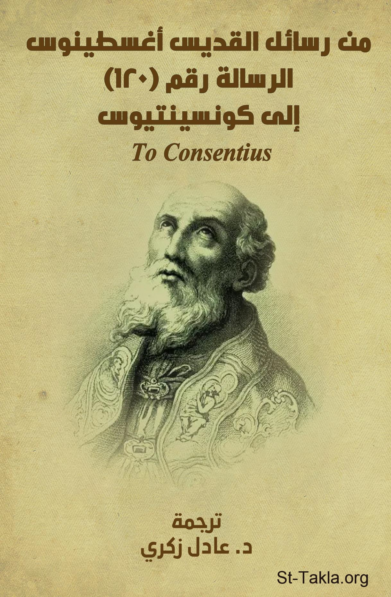

# الرسالة رقم (120): إلى كونسينتيوس - القديس أغسطينوس

**المؤلف / Author:** ترجمة: د. عادل زكري
**المصدر / Source:** [st-takla.org](https://st-takla.org/books/adel-zekri/augustine-consentius-120/index.html)
**الموضوعات / Topics:** —

📘 **[Download EPUB / تحميل الكتاب](augustine-consentius-120.epub)**

## نبذة

نشكر د. عادل زكري على السماح لنا في موقع الأنبا تكلا هيمانوت بوضع هذا الكتاب هنا.

## الفصول / Chapters (12)

1. [توطئة](chapters/01-introduction/)
2. [نص الرسالة](chapters/02-text/)
3. [الإيمان الساعي إلى الفهم](chapters/03-faith-seeking-understanding/)
4. [دور العقل في الإيمان](chapters/04-role-of-reason-in-faith/)
5. [الإيمان يتفق مع الاستدلال العقلي السليم](chapters/05-faith/)
6. [الفكر المادي يجعل الله وثنًا](chapters/06-materialistic-thought/)
7. [المنطق السليم مع الإيمان مُفضل عن المنطق المغلوط](chapters/07-sound-vs-faulty-reasoning/)
8. [ثلاث فئات من الموجودات](chapters/08-three/)
9. [الجوهر ليس أقنومًا رابعًا](chapters/09-fourth-hypostasis/)
10. [استبعاد المعاني الحسية عن الله](chapters/10-sensory-meanings-from-god/)
11. [الثالوث جوهر واحد وكينونة واحدة](chapters/11-trinity/)
12. [الله هو البر ذاته](chapters/12-god-is-righteousness/)

---
*هذا الكتاب مجاني للنشر والتوزيع لخلاص كل نفس. This book is free to share and distribute for the salvation of every soul.*
