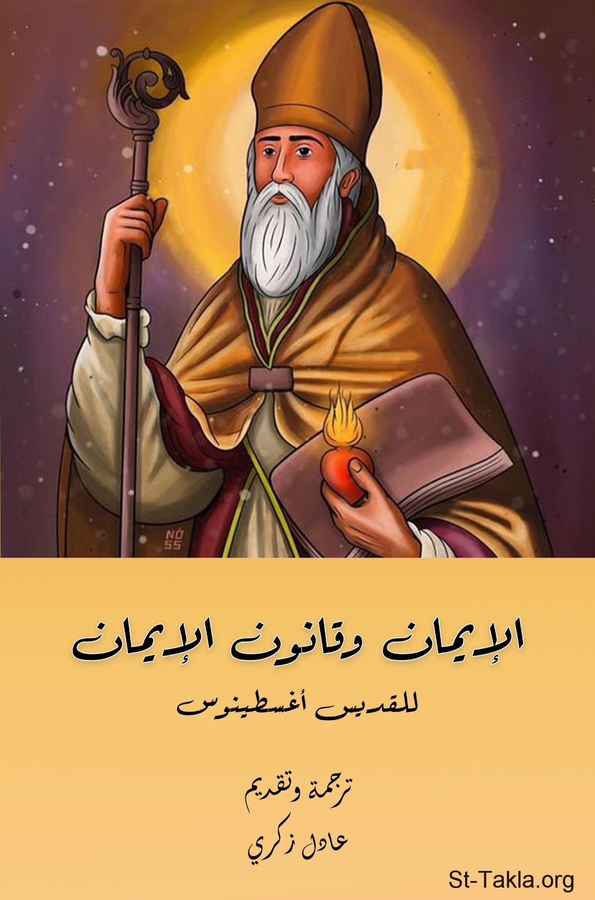

# الإيمان وقانون الإيمان - القديس أغسطينوس

**المؤلف / Author:** ترجمة: د. عادل زكري
**المصدر / Source:** [st-takla.org](https://st-takla.org/books/adel-zekri/augustine-faith/index.html)
**الموضوعات / Topics:** —

📘 **[Download EPUB / تحميل الكتاب](augustine-faith.epub)**

## نبذة

نشكر د. عادل زكري على السماح لنا في موقع الأنبا تكلا هيمانوت بوضع هذا الكتاب هنا.

## الفصول / Chapters (21)

1. [مقدمة للمترجم](chapters/01-introduction/)
2. [نص الرسالة](chapters/02-text/)
3. [أهمية الشرح الصحيح لقانون الإيمان](chapters/03-law-of-faith/)
4. [الله الآب البانطوكراتور](chapters/04-pantocrator/)
5. [الابن الوحيد كلمة الله](chapters/05-only-begotten-son/)
6. [الفصل (4)](chapters/06-chapter4/)
7. [الابن الخالق ليس مخلوقًا](chapters/07-son-is-not-created/)
8. [الابن المتجسد بلا تغيير](chapters/08-incarnate-son-without-change/)
9. [تجسد الكلمة تشريف للجنسين](chapters/09-the-word/)
10. [صلب المسيح حقيقة تاريخية](chapters/10-crucifixion-of-christ/)
11. [صعود المسيح بجسد نوراني](chapters/11-ascension-of-christ/)
12. [الجلوس على اليمين لا يُفهم ماديًا](chapters/12-sitting-on-the-right/)
13. [السيد المسيح سيأتي من السماء ويدين الأحياء والأموات](chapters/13-christ-will-come/)
14. [الفصل (9)](chapters/14-chapter-9/)
15. [نماذج توضيحية لشرح الثالوث القدوس](chapters/15-holy-trinity/)
16. [الابن ليس أدنى من الآب](chapters/16-the-son/)
17. [الروح القدس عطية الله](chapters/17-the-holy-spirit/)
18. [الروح القدس أقنوم](chapters/18-holy-spirit-hypostasis/)
19. [الفصل (10)](chapters/19-chapter-10/)
20. [مواصفات الكنيسة الجامعة الرسولية](chapters/20-universal-apostolic-church/)
21. [الفرق بين الجسد والجسم](chapters/21-body/)

---
*هذا الكتاب مجاني للنشر والتوزيع لخلاص كل نفس. This book is free to share and distribute for the salvation of every soul.*
