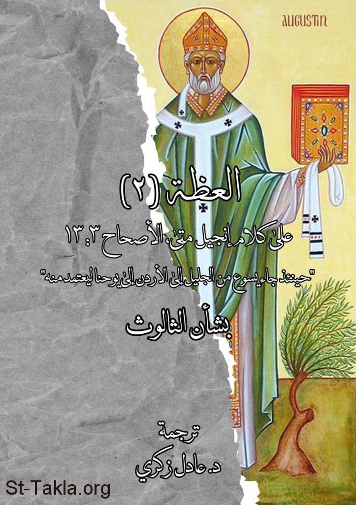

# العظة (2) على كلام إنجيل [متى 3: 13]: "حينئذ جاء يسوع من الجليل إلى الأردن إلى يوحنا ليعتمد منه" بشان الثالوث، للقديس أغسطينوس

**المؤلف / Author:** ترجمة د. عادل زكري
**المصدر / Source:** [st-takla.org](https://st-takla.org/books/adel-zekri/augustine-matthew-3-13/index.html)
**الموضوعات / Topics:** —

📘 **[Download EPUB / تحميل الكتاب](augustine-matthew-3-13.epub)**

## نبذة

نشكر د. عادل زكري على السماح لنا في موقع الأنبا تكلا هيمانوت بوضع هذا الكتاب هنا. والاسم بالإنجليزية هو:

## الفصول / Chapters (10)

1. [نص العظة - كتاب العظة (2) بشان الثالوث، للقديس أغسطينوس](chapters/01-sermon/)
2. [استعلان الثالوث في معمودية يسوع - كتاب العظة (2) بشان الثالوث، للقديس أغسطينوس](chapters/02-trinity-in-the-baptism/)
3. [تمايز الأقانيم - كتاب العظة (2) بشان الثالوث، للقديس أغسطينوس](chapters/03-hypostases/)
4. [صعوبة السؤال: هل التجسد والفداء والقيامة هو عمل الابن فقط؟ - كتاب العظة (2) بشان الثالوث، للقديس أغسطينوس](chapters/04-father-and-son/)
5. [تجسد الابن هو عمل الثالوث - كتاب العظة (2) بشان الثالوث، للقديس أغسطينوس](chapters/05-work-of-the-trinity/)
6. [الفداء عمل الثالوث - كتاب العظة (2) بشان الثالوث، للقديس أغسطينوس](chapters/06-redemption-trinity/)
7. [الألوهة لا تنحصر في مكان - كتاب العظة (2) بشان الثالوث، للقديس أغسطينوس](chapters/07-divinity-not-limited/)
8. [البحث عن بصمات الثالوث في الخليقة - كتاب العظة (2) بشان الثالوث، للقديس أغسطينوس](chapters/08-trinity-in-creation/)
9. [قصور التشبيهات المستخدمة في شرح الثالوث - كتاب العظة (2) بشان الثالوث، للقديس أغسطينوس](chapters/09-explain-the-trinity/)
10. [النموذج السيكولوجي لشرح الثالوث - كتاب العظة (2) بشان الثالوث، للقديس أغسطينوس](chapters/10-psychological-model/)

---
*هذا الكتاب مجاني للنشر والتوزيع لخلاص كل نفس. This book is free to share and distribute for the salvation of every soul.*
