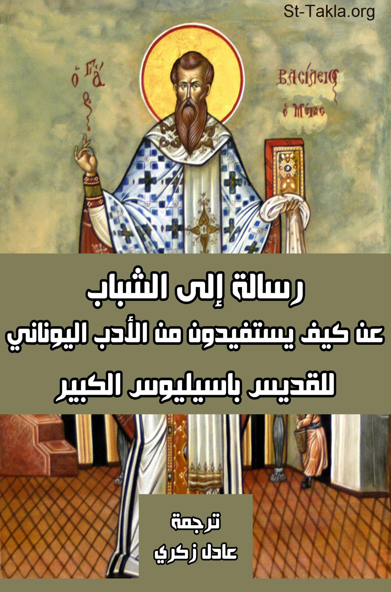

# رسالة إلى الشباب عن كيفية الاستفادة من الأدب اليوناني، للقديس باسيليوس الكبير

**المؤلف / Author:** ترجمة د. عادل زكري
**المصدر / Source:** [st-takla.org](https://st-takla.org/books/adel-zekri/basil-greek-literature/index.html)
**الموضوعات / Topics:** —

📘 **[Download EPUB / تحميل الكتاب](basil-greek-literature.epub)**

## نبذة

نشكر د. عادل زكري على السماح لنا في موقع الأنبا تكلا هيمانوت بوضع هذا الكتاب هنا. والاسم بالإنجليزية هو:

## الفصول / Chapters (10)

1. [نص الرسالة](chapters/01-text/)
2. [خبرة الكبار للأحداث](chapters/02-experience/)
3. [كيف تتحدد قيمة الأشياء؟](chapters/03-value/)
4. [جودة التعليم بثماره في النفس - كتاب عن دينونة الله، القديس باسليوس الكبير](chapters/04-education/)
5. [إيجابيات وسلبيات الأدب اليوناني](chapters/05-good-bad/)
6. [البحث عن الفضيلة في الأدب اليوناني](chapters/06-virtue/)
7. [تشابهات مع وصايا إنجيلية](chapters/07-biblical/)
8. [التمييز بين ما هو نافع وضار](chapters/08-distinction/)
9. [الاهتمام بالنفس وعدم تدليل الجسد](chapters/09-care/)
10. [الفضيلة هي زاد الرحلة](chapters/10-journey/)

---
*هذا الكتاب مجاني للنشر والتوزيع لخلاص كل نفس. This book is free to share and distribute for the salvation of every soul.*
