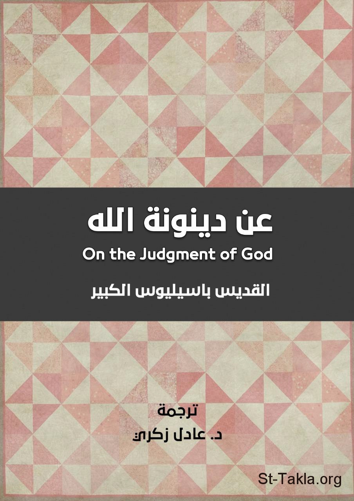

# عن دينونة الله، القديس باسليوس الكبير

**المؤلف / Author:** ترجمة د. عادل زكري
**المصدر / Source:** [st-takla.org](https://st-takla.org/books/adel-zekri/basil-judgment-of-god/index.html)
**الموضوعات / Topics:** —

📘 **[Download EPUB / تحميل الكتاب](basil-judgment-of-god.epub)**

## نبذة

نشكر د. عادل زكري على السماح لنا في موقع الأنبا تكلا هيمانوت بوضع هذا الكتاب هنا. والاسم بالإنجليزية هو:

## الفصول / Chapters (8)

1. [مقدمة للمترجم](chapters/01-introduction/)
2. [نص الكتاب](chapters/02-text/)
3. [خلافات القادة في الكنيسة وتأثيرها](chapters/03-disagreements/)
4. [الخضوع للملك الواحد](chapters/04-obedience/)
5. [ضرورة التآلف بين أعضاء جسد المسيح](chapters/05-harmony/)
6. [أمثلة لعصيان الله في العهد القديم](chapters/06-disobeying-old-testament/)
7. [أمثلة للعصيان في العهد الجديد](chapters/07-disobeying-new-testament/)
8. [الرب صادق في وعوده وتهديداته](chapters/08-true/)

---
*هذا الكتاب مجاني للنشر والتوزيع لخلاص كل نفس. This book is free to share and distribute for the salvation of every soul.*
