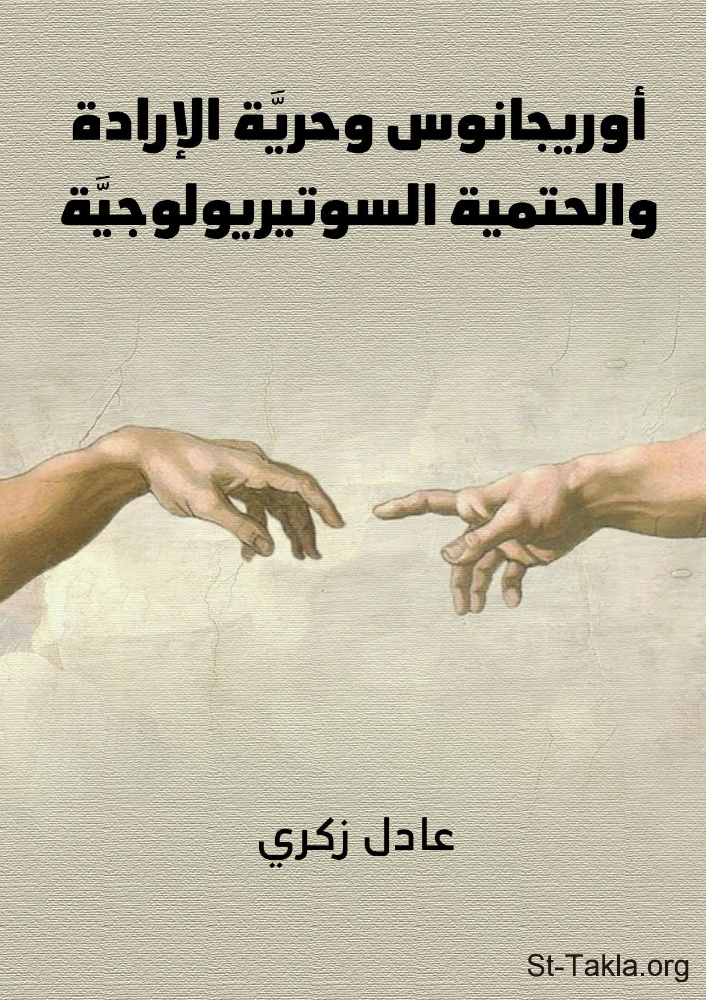

# أوريجانوس وحرية الإرادة والحتمية السوتيريولوجية

**المؤلف / Author:** د. عادل زكري
**المصدر / Source:** [st-takla.org](https://st-takla.org/books/adel-zekri/origen-free-will/index.html)
**الموضوعات / Topics:** —

📘 **[Download EPUB / تحميل الكتاب](origen-free-will.epub)**

## نبذة

نشكر د. عادل زكري على السماح لنا في موقع الأنبا تكلا هيمانوت بوضع هذا الكتاب هنا.

## الفصول / Chapters (21)

1. [توطئة](chapters/01-introduction/)
2. [مقدمة](chapters/02-preface/)
3. [لماذا يكتب أوريجانوس عن حرية الإرادة؟](chapters/03-freedom-of-will/)
4. [الغنوصية ونظرية الطبائع](chapters/04-gnosticism/)
5. [العوالم المتعاقبة وحرية الإرادة](chapters/05-successive-worlds/)
6. [الأبوكتاستاسيس وحرية الإرادة](chapters/06-apocatastasis/)
7. [حتمية النجوم](chapters/07-stars/)
8. [أوريجانوس وحرية الاختيار](chapters/08-freedom-of-choice/)
9. [الحجج الفلسفية لشرح موضوع حرية الاختيار](chapters/09-philosophical-arguments/)
10. [الشروحات الكتابية لشرح موضوع حرية الاختيار](chapters/10-biblical-explanations/)
11. [أوريجانوس وتفسيره لرسالة رومية: (رو 9)](chapters/11-romans-9/)
12. [لماذا رُفض إسرائيل؟](chapters/12-israel-rejected/)
13. [لماذا أحب الله يعقوب، أبغض عيسو؟](chapters/13-love-jacob-hate-esau/)
14. [مَن يتكلم؟ بولس أم أحد المعارضين في (رو 9: 14- 21)](chapters/14-opponent/)
15. [هل هناك أهمية للسعي؟](chapters/15-striving/)
16. [لماذا تقسى قلب فرعون؟](chapters/16-harden-pharaohs-heart/)
17. [كيف أصير آنية للكرامة](chapters/17-vessel-for-dignity/)
18. [آنية غضب وآنية رحمة](chapters/18-vessels-of-wrath-mercy/)
19. [أعمال بر الله](chapters/19-acts-of-gods-righteousness/)
20. [خاتمة](chapters/20-conclusion/)
21. [المراجع الأجنبية والعربية](chapters/21-references/)

---
*هذا الكتاب مجاني للنشر والتوزيع لخلاص كل نفس. This book is free to share and distribute for the salvation of every soul.*
