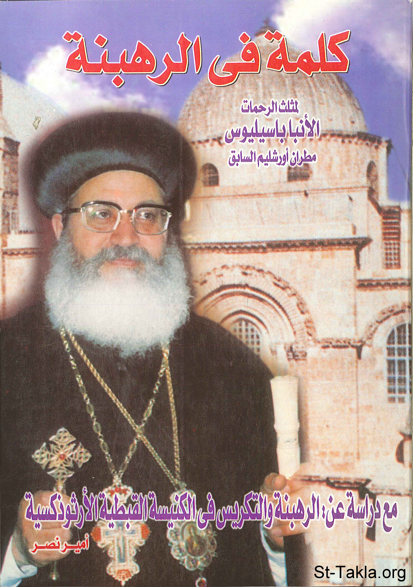

# كلمة في الرهبنة - الأنبا باسيليوس مطران أورشليم

**المؤلف / Author:** إعداد: أ. أمير نصر
**المصدر / Source:** [st-takla.org](https://st-takla.org/books/amir-nasr/monasticism/index.html)
**الموضوعات / Topics:** —

📘 **[Download EPUB / تحميل الكتاب](monasticism.epub)**

## نبذة

نشكر الأستاذ أمير نصر (مدرس التاريخ بالكلية الإكليريكية) على السماح لنا في موقع الأنبا تكلا بوضع هذا الكتاب هنا. وهو جزء من "كتاب كوكب البرية: القديس الأنبا أنطونيوس" لنيافة الأنبا باسيليوس مطران أورشليم الصادر سنة 1950 م.، مع إضافات أخرى للأستاذ أمير نصر .

## الفصول / Chapters (31)

1. [هذا الكتاب - كتاب كلمة في الرهبنة](chapters/01-preface/)
2. [الأنبا باسيليوس مطران الكرسي الأورشليمي والشرق الأدنى (1959-1991 م.) - كتاب كلمة في الرهبنة](chapters/02-bishop-basil/)
3. [القسم الأول: كلمة في الرهبنة - كتاب كلمة في الرهبنة](chapters/03-section1/)
4. [ماهية الرهبنة ونشأتها - كتاب كلمة في الرهبنة](chapters/04-what/)
5. [الرهبنة قبل أنطونيوس - كتاب كلمة في الرهبنة](chapters/05-before-anthony/)
6. [الرهبنة الأنطونية - كتاب كلمة في الرهبنة](chapters/06-st-anthony/)
7. [الرهبنة الاشتراكية: حياة الشركة - كتاب كلمة في الرهبنة](chapters/07-cenobitic/)
8. [الحياة الديرية - كتاب كلمة في الرهبنة](chapters/08-monastic-life/)
9. [الرهبنة بين النساء - كتاب كلمة في الرهبنة](chapters/09-women/)
10. [الرهبنة في خارج الديار المصرية - كتاب كلمة في الرهبنة](chapters/10-outside-egypt/)
11. [أركان الرهبنة الأساسية - كتاب كلمة في الرهبنة](chapters/11-fundamentals/)
12. [أركان الرهبنة - كتاب كلمة في الرهبنة](chapters/12-main/)
13. [ثبات الرهبنة - كتاب كلمة في الرهبنة](chapters/13-stability/)
14. [الأدلة الكتابية على فكرة الرهبنة - كتاب كلمة في الرهبنة](chapters/14-proofs-biblical/)
15. [الأدلة التاريخية على فكرة الرهبنة - كتاب كلمة في الرهبنة](chapters/15-proofs-historical/)
16. [الأدلة النقلية على فكرة الرهبنة - كتاب كلمة في الرهبنة](chapters/16-proofs-traditional/)
17. [الرد على الاعتراضات الموجهة ضد الرهبنة - كتاب كلمة في الرهبنة](chapters/17-answering/)
18. [آية "اثمروا وأكثروا واملأوا الأرض"، هل هي ضد الرهبنة والبتولية؟ - كتاب كلمة في الرهبنة](chapters/18-chastity-vs-marriage/)
19. [هل البتولية مضرة بالصحة؟ - كتاب كلمة في الرهبنة](chapters/19-chastity-and-health/)
20. [هل أضرت الرهبنة بالمجموع ولم تساعد على انتشار الخير العام كالزواج؟ - كتاب كلمة في الرهبنة](chapters/20-matrimony/)
21. [الرهبنة والتكريس في الكنيسة القبطية الأرثوذكسية - كتاب كلمة في الرهبنة](chapters/21-section2/)
22. [الرهبنة القبطية - كتاب كلمة في الرهبنة](chapters/22-coptic/)
23. [نشأة الرهبنة - كتاب كلمة في الرهبنة](chapters/23-start/)
24. [خصائص الرهبنة المصرية - كتاب كلمة في الرهبنة](chapters/24-characteristics/)
25. [الرهبنة والعمل الكنسي - كتاب كلمة في الرهبنة](chapters/25-clerical/)
26. [الرهبنة والأجيال الجديدة - كتاب كلمة في الرهبنة](chapters/26-new-generations/)
27. [بيان بعدد الرهبان الجدد في بعض الأديرة القبطية (1990–1995) - كتاب كلمة في الرهبنة](chapters/27-new-monks/)
28. [التكريس في الكنيسة - كتاب كلمة في الرهبنة](chapters/28-consecration/)
29. [صور التكريس في الكنيسة - كتاب كلمة في الرهبنة](chapters/29-consecration-church/)
30. [خدمة المكرسين في الكنيسة - كتاب كلمة في الرهبنة](chapters/30-consecration-services/)
31. [مراجع الدراسة - كتاب كلمة في الرهبنة](chapters/31-references/)

---
*هذا الكتاب مجاني للنشر والتوزيع لخلاص كل نفس. This book is free to share and distribute for the salvation of every soul.*
