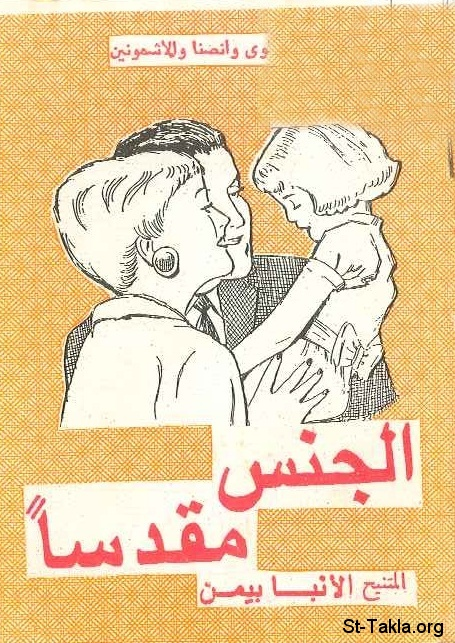

# الجنس مقدسًا

**المؤلف / Author:** الأنبا بيمن
**المصدر / Source:** [st-takla.org](https://st-takla.org/Full-Free-Coptic-Books/FreeCopticBooks-011-Late-Bishop-Bemen/001-Al-Gens-Mokadasan/Sacred-Sex__00-index.html)
**الموضوعات / Topics:** —

📘 **[Download EPUB / تحميل الكتاب](al-gens-mokadasan.epub)**

## نبذة

نشكر نيافة الحبر الجليل الأنبا ديمتريوس مطران ملوي وإنصنا لسماحه لموقع الأنبا تكلاهيمانوت بوضع هذا الكتاب هنا (من تأليف نيافة الحبر الجليل الأنبا بيمن أسقف ملوي ).

## الفصول / Chapters (36)

1. [الجنس مقدسًا](chapters/01-Sacred-Sex__01-intro/)
2. [لماذا خلق الله الإنسان ذكرًا وأنثى؟](chapters/02-Sacred-Sex__02-Male-n-Female/)
3. [ملكوت الله في الأسرة المقدسة](chapters/03-Sacred-Sex__03-Heaven/)
4. [الحب الزيجي](chapters/04-Sacred-Sex__04-Marital-Love/)
5. [الثقة والوقار في الأسرة](chapters/05-Sacred-Sex__05-Family/)
6. [البتولية امتداد مقدس](chapters/06-Sacred-Sex__06-Chastity/)
7. [الإنجاب وبداية الحياة](chapters/07-Sacred-Sex__07-Giving-Birth/)
8. [العرفان بجميل الأم](chapters/08-Sacred-Sex__08-Mother/)
9. [ذخيرة الحياة](chapters/09-Sacred-Sex__09-Life-Supply/)
10. [البذار الحية](chapters/10-Sacred-Sex__10-Seeds/)
11. [طور المراهقة](chapters/11-Sacred-Sex__11-Adolescence/)
12. [نقل الحياة](chapters/12-Sacred-Sex__12-Life-Exchange/)
13. [الدافع الجنسي في الإنسان](chapters/13-Sacred-Sex__13-Sexual-Motive/)
14. [سمات الدافع الجنسي عند الإنسان: الدوافع الحيوية](chapters/14-Sacred-Sex__14-Biological/)
15. [الفارق بين مخ الإنسان والحيوان في السيطرة على الأفعال اللاإرادية والغرائز](chapters/15-Sacred-Sex__15-Animal/)
16. [العواطف الراقية](chapters/16-Sacred-Sex__16-Passion/)
17. [انحرافات الدافع الجنسي عند الإنسان](chapters/17-Sacred-Sex__17-Deviation/)
18. [العادة الجنسية](chapters/18-Sacred-Sex__18-Sexual-Habbit/)
19. [الزنا](chapters/19-Sacred-Sex__19-Adultery/)
20. [الكبت، القمع، الوسوسة](chapters/20-Sacred-Sex__20-Supression/)
21. [معنى حياة الطهارة](chapters/21-Sacred-Sex__21-Purity/)
22. [لماذا أحيا طاهرًا؟ فوائد حياة الطهارة](chapters/22-Sacred-Sex__22-Purity-Why/)
23. [الطهارة متطلب روحي](chapters/23-Sacred-Sex__23-Spiritual/)
24. [الطهارة متطلب إنساني](chapters/24-Sacred-Sex__24-Humane/)
25. [الطهارة متطلب اجتماعي](chapters/25-Sacred-Sex__25-Social/)
26. [كيف أحيا طاهرًا؟](chapters/26-Sacred-Sex__26-How/)
27. [مقومات الحياة الداخلية الجديدة وعلاقتها بحياة الطهارة والتعفف](chapters/27-Sacred-Sex__27-New-Life/)
28. [سر التوبة وحياة التعفف](chapters/28-Sacred-Sex__28-Repentance/)
29. [الإفخارستيا وحياة الطهارة](chapters/29-Sacred-Sex__29-Eucharist/)
30. [الصلاة بالروح وحياة العفة](chapters/30-Sacred-Sex__30-Prayer/)
31. [فاعلية الإنجيل وحياة الطهارة](chapters/31-Sacred-Sex__31-Bible/)
32. [الصوم المقبول وحياة الطهارة](chapters/32-Sacred-Sex__32-Fasting/)
33. [تدريب الحواس على الطهارة](chapters/33-Sacred-Sex__33-Senses/)
34. [تدريب محاربة الأفكار الشريرة](chapters/34-Sacred-Sex__34-Thoughts/)
35. [تدريب استخدام الطاقة فيما هو بنّاء](chapters/35-Sacred-Sex__35-Power/)
36. [الرياضة النافعة للطهارة](chapters/36-Sacred-Sex__36-Exercise/)

---
*هذا الكتاب مجاني للنشر والتوزيع لخلاص كل نفس. This book is free to share and distribute for the salvation of every soul.*
