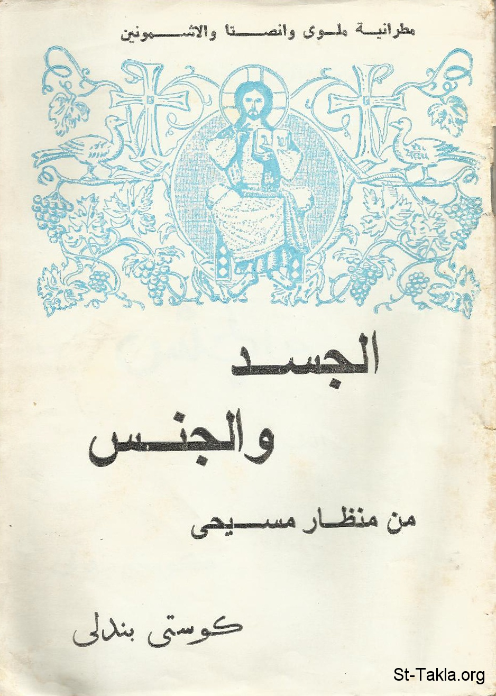

# الجسد والجنس من منظار مسيحي - تأليف: كوستي بندلي

**المؤلف / Author:** إعداد: الأنبا بيمن
**المصدر / Source:** [st-takla.org](https://st-takla.org/books/anba-bimen/body-sex/index.html)
**الموضوعات / Topics:** —

📘 **[Download EPUB / تحميل الكتاب](body-sex.epub)**

## نبذة

نشكر نيافة الحبر الجليل الأنبا ديمتريوس مطران ملوي لسماحه لموقع الأنبا تكلاهيمانوت بوضع هذا الكتاب هنا (من إعداد نيافة الحبر الجليل الأنبا بيمن أسقف ملوي )، ومؤلفه هو Costi Bendaly.

## الفصول / Chapters (16)

1. [مقدمة - كتاب الجسد والجنس من منظار مسيحي](chapters/01-introduction/)
2. [المحاضرة الأولى: المسيحية والجنس - كتاب الجسد والجنس من منظار مسيحي](chapters/02-lecture-a/)
3. [الجنس - كتاب الجسد والجنس من منظار مسيحي](chapters/03-sex/)
4. [أسئلة - كتاب الجسد والجنس من منظار مسيحي](chapters/04-questions/)
5. [المحاضرة الثانية: الجسد والجنس - كتاب الجسد والجنس من منظار مسيحي](chapters/05-lecture-b/)
6. [المفهوم الحديث للجسد - كتاب الجسد والجنس من منظار مسيحي](chapters/06-new/)
7. [ارتباط الجنس بالجسد - كتاب الجسد والجنس من منظار مسيحي](chapters/07-both/)
8. [ارتباط الجنس بالجسم البيولوجي - كتاب الجسد والجنس من منظار مسيحي](chapters/08-biology/)
9. [ارتباط الجنس بالجسد ككل - كتاب الجسد والجنس من منظار مسيحي](chapters/09-all/)
10. [موقف الجسد الجنسي من الوجود - كتاب الجسد والجنس من منظار مسيحي](chapters/10-existence/)
11. [فشل الجسد الجنسي المندلق - كتاب الجسد والجنس من منظار مسيحي](chapters/11-failure/)
12. [الجسد الجنسي لا يبلغ غايته إلا بالحب - كتاب الجسد والجنس من منظار مسيحي](chapters/12-love/)
13. [الخلاص هو في انفتاح الجسد الجنسي لا في محاولة إلغائه - كتاب الجسد والجنس من منظار مسيحي](chapters/13-salvations/)
14. [العفة المكرسة - كتاب الجسد والجنس من منظار مسيحي](chapters/14-chastity/)
15. [ملخص الكتاب - كتاب الجسد والجنس من منظار مسيحي](chapters/15-summary/)
16. [خاتمة - كتاب الجسد والجنس من منظار مسيحي](chapters/16-epilogue/)

---
*هذا الكتاب مجاني للنشر والتوزيع لخلاص كل نفس. This book is free to share and distribute for the salvation of every soul.*
