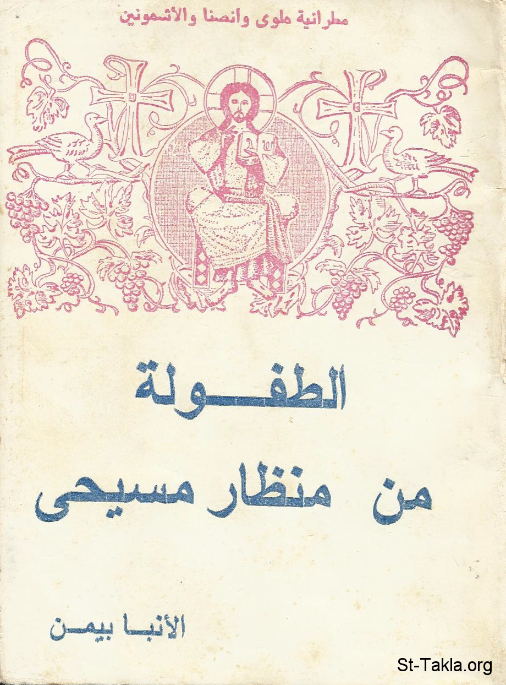

# الطفولة من منظار مسيحي

**المؤلف / Author:** الأنبا بيمن أسقف ملوي
**المصدر / Source:** [st-takla.org](https://st-takla.org/books/anba-bimen/childhood/index.html)
**الموضوعات / Topics:** —

📘 **[Download EPUB / تحميل الكتاب](childhood.epub)**

## نبذة

نشكر نيافة الحبر الجليل الأنبا ديمتريوس مطران ملوي لسماحه لموقع الأنبا تكلاهيمانوت بوضع هذا الكتاب هنا (من تأليف نيافة الحبر الجليل الأنبا بيمن أسقف ملوي ).

## الفصول / Chapters (14)

1. [تقديم](chapters/01-introduction/)
2. [مدخل الدراسة](chapters/02-preface/)
3. [الطفولة سيكولوجيًا](chapters/03-psychological/)
4. [سيكولوجية الطفل ومراحل النمو](chapters/04-gerw/)
5. [الطفل والبيئة](chapters/05-environment/)
6. [تربية الأطفال](chapters/06-bring-up/)
7. [مشكلات تربية الأطفال](chapters/07-issues/)
8. [الطفولة كتابيًّا](chapters/08-biblical/)
9. [الكتاب المقدس والطفولة](chapters/09-bible/)
10. [مثل ولد](chapters/10-child/)
11. [الطفولة كنسيًا](chapters/11-ecclesiastical/)
12. [التربية الكنسية والطفل في سنواته الأولى](chapters/12-early-years/)
13. [خاتمة](chapters/13-epilogue/)
14. [مراجع للاستزادة من الدراسة](chapters/14-references/)

---
*هذا الكتاب مجاني للنشر والتوزيع لخلاص كل نفس. This book is free to share and distribute for the salvation of every soul.*
