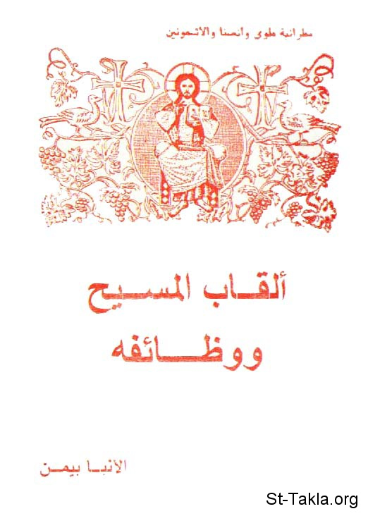

# ألقاب المسيح ووظائفه

**المؤلف / Author:** الأنبا بيمن أسقف ملوي
**المصدر / Source:** [st-takla.org](https://st-takla.org/books/anba-bimen/christ-titles/index.html)
**الموضوعات / Topics:** —

📘 **[Download EPUB / تحميل الكتاب](christ-titles.epub)**

## نبذة

نشكر نيافة الحبر الجليل الأنبا ديمتريوس أسقف ملوي لسماحه لموقع الأنبا تكلاهيمانوت بوضع هذا الكتاب هنا (1) (من تأليف نيافة الحبر الجليل الأنبا بيمن أسقف ملوي ).

## الفصول / Chapters (27)

1. [تقديم](chapters/01-introduction/)
2. [المسيح: إبن الله الكلمة](chapters/02-son-of-god/)
3. [لقب إبن الله في الأناجيل](chapters/03-sonship/)
4. [المسيح: الكلمة](chapters/04-the-word/)
5. [التزامات لقب "ابن الله" نحونا](chapters/05-the-son/)
6. [المسيح رئيس كهنتنا الأعظم](chapters/06-high-priest/)
7. [عظمة كهنوت المسيح](chapters/07-priesthood-of-christ/)
8. [كهنوت المسيح وكهنوت الكنيسة](chapters/08-priesthood-of-the-church/)
9. [رأس الكنيسة التي هي جسد المسيح](chapters/09-head-of-the-church/)
10. [يسوع المخلص](chapters/10-savior/)
11. [المسيا: المسيح الذي جاء مرة وسيأتي مرة أخرى](chapters/11-messiah/)
12. [أنا هو الكرمة الحقيقية](chapters/12-true-vine/)
13. [المسيح: العريس السمائي](chapters/13-heavenly-bridegroom/)
14. [المسيح: الراعي الصالح](chapters/14-good-shepherd/)
15. [المسيح: الطبيب الإلهي](chapters/15-divine-physician/)
16. [المسيح هو نور العالم](chapters/16-light-of-the-world/)
17. [المسيح هو النور والحياة](chapters/17-light-life/)
18. [المسيح هو حجر الزاوية](chapters/18-cornerstone/)
19. [المسيح هو خبز الحياة](chapters/19-bread-of-life/)
20. [أنا هو الطريق](chapters/20-way/)
21. [أنا هو الحق](chapters/21-truth/)
22. [أنا هو الحياة](chapters/22-life/)
23. [المسيح هو الحمل](chapters/23-lamb/)
24. [المسيح هو ملك المجد](chapters/24-king-of-glory/)
25. [المسيح هو ابن الإنسان](chapters/25-son-of-man/)
26. [المسيح هو الألف والياء](chapters/26-alpha-and-the-omega/)
27. [المسيح هو الديان العادل](chapters/27-just-judge/)

---
*هذا الكتاب مجاني للنشر والتوزيع لخلاص كل نفس. This book is free to share and distribute for the salvation of every soul.*
