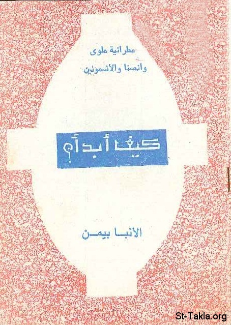

# كيف أبدأ؟

**المؤلف / Author:** الأنبا بيمن أسقف ملوي
**المصدر / Source:** [st-takla.org](https://st-takla.org/books/anba-bimen/how-to-start/index.html)
**الموضوعات / Topics:** —

📘 **[Download EPUB / تحميل الكتاب](how-to-start.epub)**

## نبذة

نشكر نيافة الحبر الجليل الأنبا ديمتريوس مطران ملوي لسماحه لموقع الأنبا تكلاهيمانوت بوضع هذا الكتاب هنا (من تأليف نيافة الحبر الجليل الأنبا بيمن أسقف ملوي ).

## الفصول / Chapters (5)

1. [مقدمة](chapters/01-introduction/)
2. [الله يقرع والاختيار لك](chapters/02-knock/)
3. [لماذا لا أبدأ الآن؟](chapters/03-now/)
4. [بدايات خاطئة: الناموس الخلقي - الغيرة الطائفية](chapters/04-wrong-beginnings/)
5. [ما هي علامات البداية الصحيحة](chapters/05-right-beginnings/)

---
*هذا الكتاب مجاني للنشر والتوزيع لخلاص كل نفس. This book is free to share and distribute for the salvation of every soul.*
