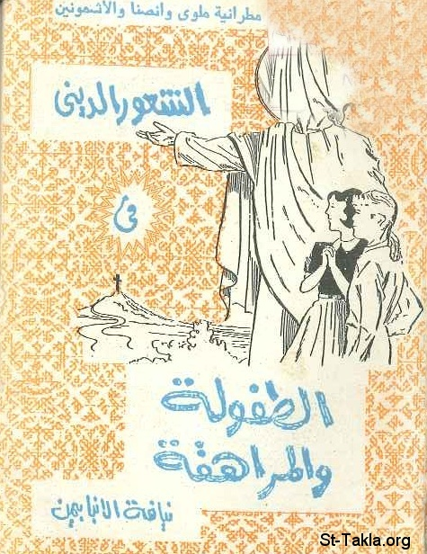

# الشعور الديني في الطفولة والمراهقة

**المؤلف / Author:** الأنبا بيمن أسقف ملوي
**المصدر / Source:** [st-takla.org](https://st-takla.org/books/anba-bimen/religious-sense/index.html)
**الموضوعات / Topics:** —

📘 **[Download EPUB / تحميل الكتاب](religious-sense.epub)**

## نبذة

نشكر نيافة الحبر الجليل الأنبا ديمتريوس مطران ملوي لسماحه لموقع الأنبا تكلاهيمانوت بوضع هذا الكتاب هنا (من تأليف نيافة الحبر الجليل الأنبا بيمن أسقف ملوي ).

## الفصول / Chapters (14)

1. [مقدمة: التربية والسيكولوجية والمسيحية](chapters/01-introduction/)
2. [الأسس والتوجيهات العامة لخدمة الطفولة والمراهقة](chapters/02-directions/)
3. [التوجيه الكنسي لخدمة الطفولة والمراهقة](chapters/03-direction-church/)
4. [التوجيه الروحي لخدمة الطفولة والمراهقة](chapters/04-direction-spiritual/)
5. [التوجه الاجتماعي لخدمة الطفولة والمراهقة](chapters/05-direction-social/)
6. [التوجه القومي لخدمة الطفولة والمراهقة](chapters/06-direction-patriotic/)
7. [التوجه الفكري والنفسي لخدمة الطفولة والمراهقة](chapters/07-direction-psychological/)
8. [الشعور الديني في المراحل المختلفة](chapters/08-stages/)
9. [الشعور الديني في مرحلة سُنى المهد](chapters/09-stages-babies/)
10. [الشعور الديني لمرحلة طفل الحضانة](chapters/10-stages-kindergarten/)
11. [الشعور الديني في مرحلة طفل المدرسة الابتدائية](chapters/11-stages-primary/)
12. [الشعور الديني في مرحلة فتى المرحلة الإعدادية](chapters/12-stages-preparatory/)
13. [الشعور الديني في مرحلة شاب المرحلة الثانوية](chapters/13-stages-secondary/)
14. [الخاتمة](chapters/14-epilogue/)

---
*هذا الكتاب مجاني للنشر والتوزيع لخلاص كل نفس. This book is free to share and distribute for the salvation of every soul.*
