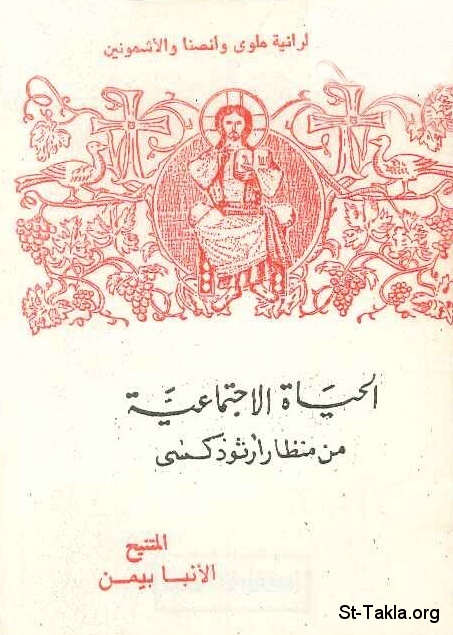

# الحياة الاجتماعية من منظار أرثوذكسي

**المؤلف / Author:** الأنبا بيمن أسقف ملوي
**المصدر / Source:** [st-takla.org](https://st-takla.org/books/anba-bimen/social-life/index.html)
**الموضوعات / Topics:** —

📘 **[Download EPUB / تحميل الكتاب](social-life.epub)**

## نبذة

نشكر نيافة الحبر الجليل الأنبا ديمتريوس مطران ملوي لسماحه لموقع الأنبا تكلاهيمانوت بوضع هذا الكتاب هنا (من تأليف نيافة الحبر الجليل الأنبا بيمن أسقف ملوي ).

## الفصول / Chapters (10)

1. [مقدمة](chapters/01-introduction/)
2. [الآخر في حياة الأرثوذكسي](chapters/02-the-other/)
3. [بين العزلة المنغلقة والعزلة المنفتحة](chapters/03-solitude/)
4. [المسيح الذي يملأ الكون](chapters/04-christ-fills/)
5. [الحس الاجتماعي المسيحي](chapters/05-sense/)
6. [معايير التعامل مع مؤسسات المجتمع وأنشطته](chapters/06-organizations/)
7. [انحرافات اجتماعية](chapters/07-perversion/)
8. [بين التسلط والانقيادية](chapters/08-authority-vs-compliance/)
9. [بين السلبية والانسياق وراء التيار](chapters/09-negativity/)
10. [التعصبات بكافة صورها](chapters/10-bigotry/)

---
*هذا الكتاب مجاني للنشر والتوزيع لخلاص كل نفس. This book is free to share and distribute for the salvation of every soul.*
