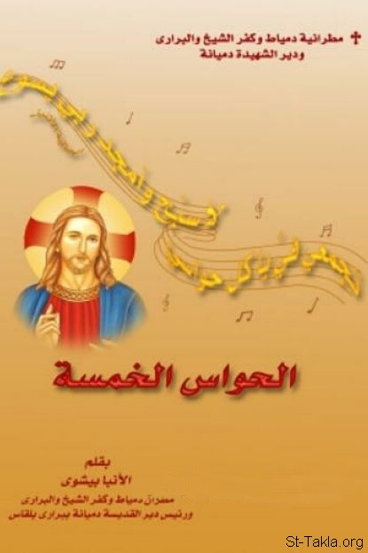

# الحواس الخمسة

**المؤلف / Author:** الأنبا بيشوي
**المصدر / Source:** [st-takla.org](https://st-takla.org/books/anba-bishoy/five-senses/index.html)
**الموضوعات / Topics:** —

📘 **[Download EPUB / تحميل الكتاب](five-senses.epub)**

## نبذة

نشكر نيافة الحبر الجليل الأنبا بيشوي على السماح لنا في موقع الأنبا تكلا هيمانوت بوضع هذا الكتاب هنا.

## الفصول / Chapters (31)

1. [مقدمة](chapters/01-introduction/)
2. [حواس الجسد](chapters/02-body-senses/)
3. [الحواس منافذ الجسد](chapters/03-outlets-of-the-body/)
4. [اليمين واليسار](chapters/04-right-and-left/)
5. [الصوم بين الجسد والروح](chapters/05-fasting/)
6. [الصوم وتعطيل حواس الجسد](chapters/06-disabling-bodys-senses/)
7. [الاعتكاف والصوم: نادوا باعتكاف](chapters/07-seclusion/)
8. [كيف تنشغل الحواس بالله؟](chapters/08-occupied-with-god/)
9. [العصر الذي نحيا فيه](chapters/09-current-times/)
10. [ولادة الحواس: كيف تتواجد الحواس الروحية في الإنسان؟](chapters/10-birth-of-senses/)
11. [حاسة البصر الروحية](chapters/11-spiritual-sense-of-sight/)
12. [المولود من الروح هو روح](chapters/12-born-of-the-spirit/)
13. [إن كانت عينك بسيطة: ما بين استنارة الجسد وحاسة النظر](chapters/13-simple-eyes/)
14. [البصيرة الروحية ونقاوة القلب](chapters/14-spiritual-insight/)
15. [رؤية الإعلانات السمائية](chapters/15-see-heavenly-declarations/)
16. [معاينة محبة الله](chapters/16-seeing-gods-love/)
17. [معاينة نور المسيح](chapters/17-seeing-the-light-of-christ/)
18. [حاسة السمع الروحية](chapters/18-spiritual-sense-of-hearing/)
19. [إني أسمع ما يتكلم به الرب الإله](chapters/19-hear-what-the-lord-speaks/)
20. [كيف نميّز صوت الله؟](chapters/20-recognize-gods-voice/)
21. [الإنصات والاستجابة](chapters/21-listen-and-respond/)
22. [تكلم يا رب لأن عبدك سامع](chapters/22-speak-lord/)
23. [الأذن الروحية وسماع الصوت الإلهي](chapters/23-spiritual-ear/)
24. [من له أذن فليسمع](chapters/24-he-who-has-an-ear/)
25. [الامتلاء من الروح](chapters/25-fullness-of-the-spirit/)
26. [حاسة الشم الروحية](chapters/26-spiritual-sense-of-smell/)
27. [رائحة المسيح الذكية](chapters/27-sweet-scent-of-christ/)
28. [حاسة اللمس الروحية](chapters/28-spiritual-sense-of-touch/)
29. [حاسة التذوق الروحية](chapters/29-spiritual-sense-of-taste/)
30. [الحواس والمصابيح](chapters/30-senses-and-lamps/)
31. [حاسب نفسك](chapters/31-accountable/)

---
*هذا الكتاب مجاني للنشر والتوزيع لخلاص كل نفس. This book is free to share and distribute for the salvation of every soul.*
