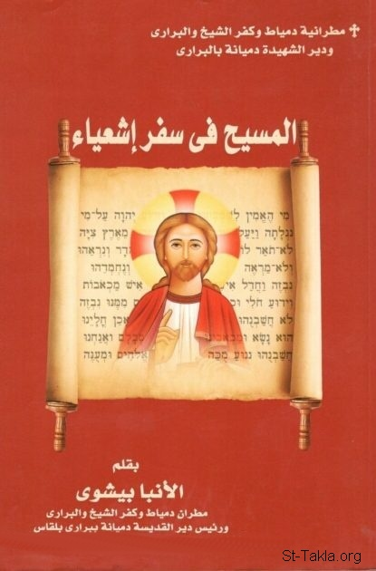

# المسيح في سفر إشعياء

**المؤلف / Author:** الأنبا بيشوي
**المصدر / Source:** [st-takla.org](https://st-takla.org/books/anba-bishoy/isaiah/index.html)
**الموضوعات / Topics:** —

📘 **[Download EPUB / تحميل الكتاب](isaiah.epub)**

## نبذة

نشكر نيافة الحبر الجليل الأنبا بيشوي على السماح لنا في موقع الأنبا تكلا هيمانوت بوضع هذا الكتاب هنا.

## الفصول / Chapters (15)

1. [مقدمة](chapters/01-intro/)
2. [مقدمة تاريخية عن السفر ومخطوطاته](chapters/02-historical/)
3. [ظهور الابن الوحيد في سفر ﺇشعياء](chapters/03-son/)
4. [نبوات عن ميلاد السيد المسيح وتجسده](chapters/04-birth/)
5. [نبوات عن معمودية السيد المسيح وبداية خدمته في الجليل](chapters/05-baptism/)
6. [نبوات عن آلام السيد المسيح وصلبه](chapters/06-passion/)
7. [نبوات عن موت المسيح المحيي وقبره](chapters/07-death/)
8. [نبوات عن ذبيحة الابن الوحيد وقبولها لدى الآب](chapters/08-sacrifice/)
9. [نبوات عن القيامة والصعود](chapters/09-resurrection/)
10. [المسيح هو الخلاص وهو العهد](chapters/10-salvation/)
11. [المسيح الحق الصادق الآمين](chapters/11-true/)
12. [حضور الرب المرهب وعظمة أعماله](chapters/12-fearful/)
13. [المسيح الإله الوحيد الأزلي والكائن](chapters/13-only/)
14. [الكنيسة المحروسة تتبع المسيح](chapters/14-church/)
15. [أورشليم السمائية وأفراح الأبدية](chapters/15-jerusalem/)

---
*هذا الكتاب مجاني للنشر والتوزيع لخلاص كل نفس. This book is free to share and distribute for the salvation of every soul.*
