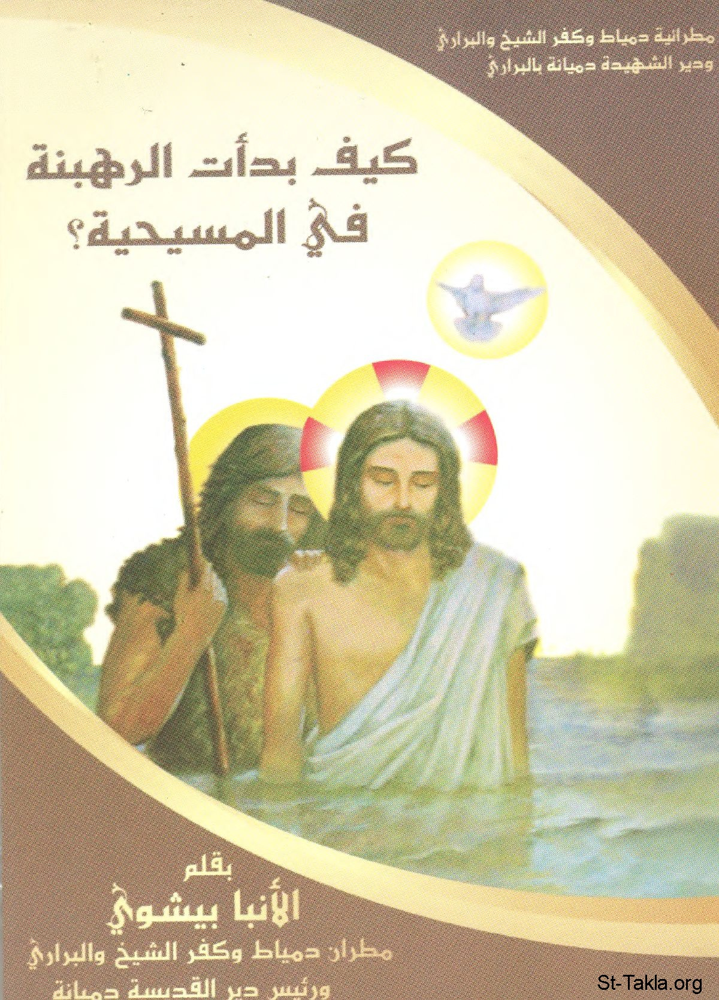

# كيف بدأت الرهبنة في المسيحية

**المؤلف / Author:** الأنبا بيشوي
**المصدر / Source:** [st-takla.org](https://st-takla.org/books/anba-bishoy/monasticism/index.html)
**الموضوعات / Topics:** —

📘 **[Download EPUB / تحميل الكتاب](monasticism.epub)**

## نبذة

نشكر نيافة الحبر الجليل الأنبا بيشوي على السماح لنا في موقع الأنبا تكلا هيمانوت بوضع هذا الكتاب هنا.

## الفصول / Chapters (22)

1. [مقدمة](chapters/01-introduction/)
2. [الرهبنة في المسيحية](chapters/02-monasticism/)
3. [يوحنا المعمدان](chapters/03-baptist/)
4. [إشراقة للرهبنة في فجر المسيحية](chapters/04-start/)
5. [السيد المسيح المثل الأعلى للبشرية](chapters/05-jesus/)
6. [بتولية السيدة العذراء](chapters/06-mary/)
7. [نشأة الرهبنة في المسيحية](chapters/07-beginning/)
8. [الأسينيون](chapters/08-essenes/)
9. [السيد المسيح والبرية](chapters/09-desert/)
10. [إيليا النبي لازال يعيش الحياة الرهبانية](chapters/10-elijah/)
11. [ما فائدة الرهبنة؟](chapters/11-benefits/)
12. [بولس الرسول وثلاث سنوات في البرية](chapters/12-paul/)
13. [بولس الرسول يتسلم من الرب نفسه في البرية](chapters/13-receive/)
14. [دور الصحراء والبرية في المسيحية](chapters/14-wilderness/)
15. [الرهبنة](chapters/15-monastic/)
16. [هل بدأت الرهبنة بالقديس أنطونيوس](chapters/16-anthony/)
17. [ما فائدة الرهبان](chapters/17-monks/)
18. [أمثلة لأهمية وضرورة الصلاة](chapters/18-prayer/)
19. [حياة الرهبنة ليست حياة سلبية](chapters/19-positive/)
20. [هل الرهبنة سلبية؟](chapters/20-negative/)
21. [الرهبنة هي سر قوة الكنيسة](chapters/21-church/)
22. [الأربعة وعشرون قسيسًا والأربعة أحياء حاملي العرش](chapters/22-24/)

---
*هذا الكتاب مجاني للنشر والتوزيع لخلاص كل نفس. This book is free to share and distribute for the salvation of every soul.*
