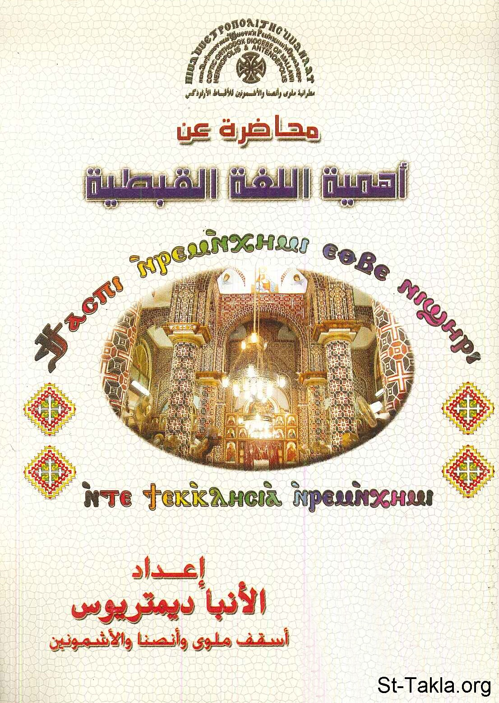

# محاضرة عن أهمية اللغة القبطية لأبناء الكنيسة القبطية

**المؤلف / Author:** الأنبا ديمتريوس أسقف ملوي
**المصدر / Source:** [st-takla.org](https://st-takla.org/books/anba-demetrius/coptic-language-importance/index.html)
**الموضوعات / Topics:** —

📘 **[Download EPUB / تحميل الكتاب](coptic-language-importance.epub)**

## نبذة

نشكر نيافة الحبر الجليل الأنبا ديمتريوس على السماح لنا في موقع الأنبا تكلا هيمانوت بوضع هذا الكتاب هنا. وقد تم كتابة نص الكتاب ببعض التصرف لتحويل بعض الكلمات العامية للفصحى، كما تم وضع بعض العناوين الداخلية من قِبَل الموقع.

## الفصول / Chapters (15)

1. [مقدمة - كتاب أهمية اللغة القبطية](chapters/01-introduction/)
2. [أقسام البحث - كتاب أهمية اللغة القبطية](chapters/02-sections/)
3. [اللغة القبطية معين في فهم الكتاب المقدس - كتاب أهمية اللغة القبطية](chapters/03-bible/)
4. [مثال: ما بين "في البدء خلق الله" و"في البدء كان الكلمة" - كتاب أهمية اللغة القبطية](chapters/04-example-in-the-beginning/)
5. [مثال: "خبزنا الذي للغد" أم "خبزنا كفافنا"؟ - كتاب أهمية اللغة القبطية](chapters/05-example-daily-bread/)
6. [مثال: "أنزل الأعزاء عن الكراسي ورفع المتضعين" - كتاب أهمية اللغة القبطية](chapters/06-example-thrones/)
7. [مثال: "آمن فقط فتخلص" - كتاب أهمية اللغة القبطية](chapters/07-example-faith/)
8. [مثال: "الذي ضرب المصريين مع أبكارهم" - كتاب أهمية اللغة القبطية](chapters/08-example-hit-egyptians/)
9. [مثال: "قد قام" - كتاب أهمية اللغة القبطية](chapters/09-example-risen/)
10. [مثال: "سفر يونان" - كتاب أهمية اللغة القبطية](chapters/10-example-jonah/)
11. [مثال من صلوات البصخة - كتاب أهمية اللغة القبطية](chapters/11-example-pascha/)
12. [اللغة القبطية مُعين في فهم العقيدة الأرثوذكسية - كتاب أهمية اللغة القبطية](chapters/12-dogma/)
13. [اللغة القبطية مُعين في فهم الليتورجية - كتاب أهمية اللغة القبطية](chapters/13-liturgy/)
14. [اللغة القبطية مُعين في تحقيق التاريخ الكنسي - كتاب أهمية اللغة القبطية](chapters/14-history/)
15. [اللغة القبطية لغة سهلة جدًا - كتاب أهمية اللغة القبطية](chapters/15-easy/)

---
*هذا الكتاب مجاني للنشر والتوزيع لخلاص كل نفس. This book is free to share and distribute for the salvation of every soul.*
