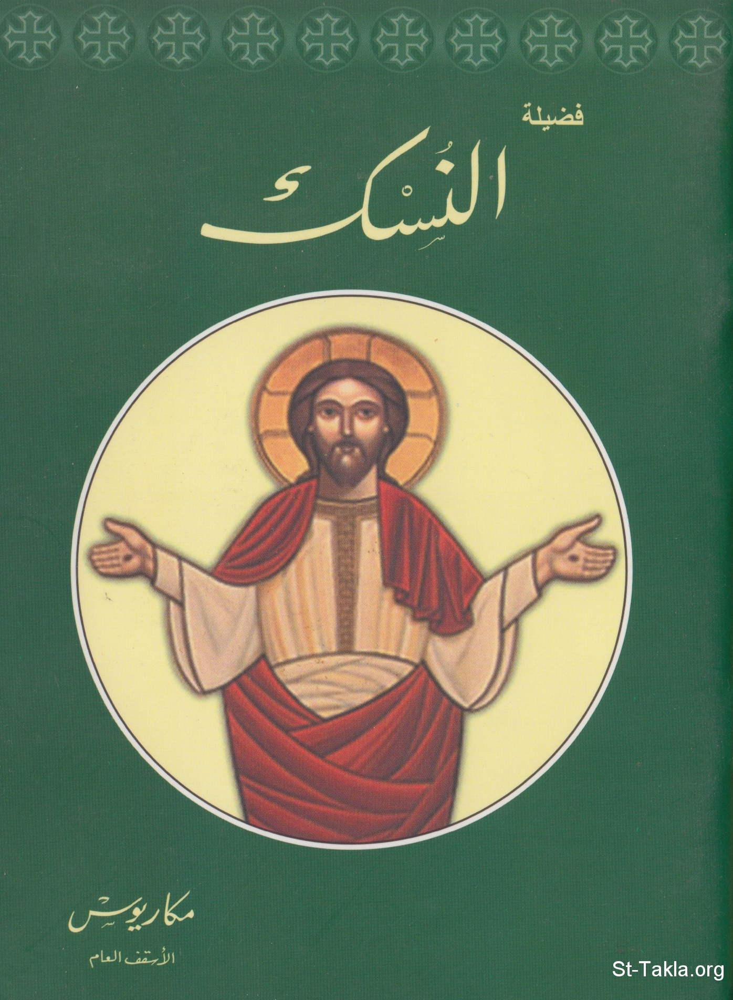

# فضيلة النسك

**المؤلف / Author:** الأنبا مكاريوس الأسقف العام بالمنيا
**المصدر / Source:** [st-takla.org](https://st-takla.org/books/anba-macarious/asceticism/index.html)
**الموضوعات / Topics:** —

📘 **[Download EPUB / تحميل الكتاب](asceticism.epub)**

## نبذة

نشكر نيافة الحبر الجليل الأنبا مكاريوس الأسقف العام في المنيا على السماح لنا في موقع الأنبا تكلا هيمانوت بوضع هذا الكتاب هنا.

## الفصول / Chapters (10)

1. [مقدمة](chapters/01-intro/)
2. [الصوم والنسك](chapters/02-fasting/)
3. [الرهبنة الفردية أقوى من الرهبنة الجماعية](chapters/03-solitaire/)
4. [أنواع النسك](chapters/04-kinds/)
5. [النسك في المعرفة](chapters/05-knowledge/)
6. [النسك في السلوك](chapters/06-conduct/)
7. [النسك في محبة الآخرين لنا](chapters/07-love/)
8. [حب القنية](chapters/08-acquisition/)
9. [طرق الله معنا في الاحتياج](chapters/09-need/)
10. [أخيرًا](chapters/10-finally/)

---
*هذا الكتاب مجاني للنشر والتوزيع لخلاص كل نفس. This book is free to share and distribute for the salvation of every soul.*
