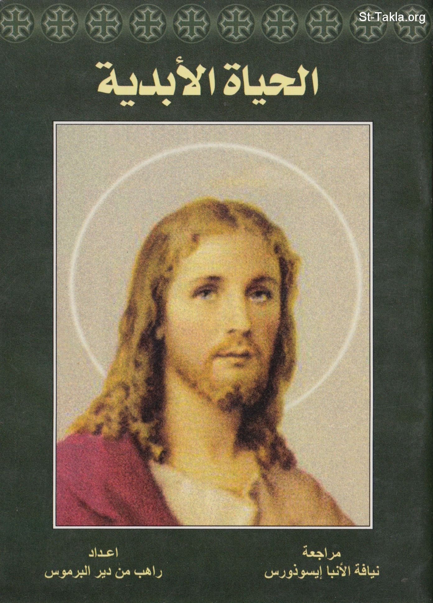

# الحياة الأبدية

**المؤلف / Author:** الأنبا مكاريوس الأسقف العام بالمنيا
**المصدر / Source:** [st-takla.org](https://st-takla.org/books/anba-macarious/eternal-life/index.html)
**الموضوعات / Topics:** —

📘 **[Download EPUB / تحميل الكتاب](eternal-life.epub)**

## نبذة

نشكر نيافة الحبر الجليل الأنبا مكاريوس الأسقف العام في المنيا على السماح لنا في موقع الأنبا تكلا هيمانوت بوضع هذا الكتاب هنا.

## الفصول / Chapters (17)

1. [مقدمة عن الحياة الأبدية](chapters/01-intro/)
2. [الحياة التي نحياها الآن](chapters/02-now/)
3. [الموت الجسداني](chapters/03-death/)
4. [يوم الدينونة](chapters/04-judgement/)
5. [الفصل بين الفريقين](chapters/05-division/)
6. [بر الإنسان لا ينفع أخيه](chapters/06-own/)
7. [هل تتفق دينونة الله للناس مع محبته للبشر؟](chapters/07-love/)
8. [الملكوت](chapters/08-heaven/)
9. [في بيت أبي منازل كثيرة](chapters/09-homes/)
10. [هل هُناك مِن حَسَد أو غيرة؟](chapters/10-jealousy/)
11. [الملكوت: يُوهَب أم يُغتصب؟](chapters/11-given/)
12. [نار الأبدية](chapters/12-fire/)
13. [التفاوت في العقاب](chapters/13-punishment/)
14. [هل يتنافى ذلك مع محبة الله ورأفته؟](chapters/14-care/)
15. [مذاقة الملكوت على الأرض](chapters/15-earth/)
16. [الإفخارستيا عَربون الحياة الأبدية](chapters/16-eucharist/)
17. [أخيرًا](chapters/17-outro/)

---
*هذا الكتاب مجاني للنشر والتوزيع لخلاص كل نفس. This book is free to share and distribute for the salvation of every soul.*
