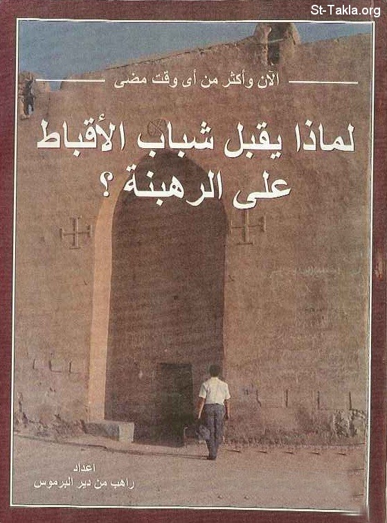

# لماذا يقبل شباب الأقباط على الرهبنة؟

**المؤلف / Author:** الأنبا مكاريوس الأسقف العام
**المصدر / Source:** [st-takla.org](https://st-takla.org/Full-Free-Coptic-Books/FreeCopticBooks-006-His-Grace-Bishop-Makarios/005-Lematha-Yokbel-Shabab-3ala-El-Rahbana/Coptic-Youth-Monasticism-00-index.html)
**الموضوعات / Topics:** —

📘 **[Download EPUB / تحميل الكتاب](lematha-yokbel-shabab-3ala-el-rahbana.epub)**

## نبذة

نشكر نيافة الحبر الجليل الأنبا مكاريوس الأسقف العام في المنيا على السماح لنا في موقع الأنبا تكلا هيمانوت بوضع هذا الكتاب هنا.

## الفصول / Chapters (37)

1. [لماذا يقبل شباب الأقباط على الرهبنة؟](chapters/01-Coptic-Youth-Monasticism-01-Intro/)
2. [الحركة الرهبانية بين الماضي والحاضر](chapters/02-Coptic-Youth-Monasticism-02-Movement/)
3. [فكرة الرهبنة وكيف نشأت بين الشباب المسيحي](chapters/03-Coptic-Youth-Monasticism-03-Thought/)
4. [بستان الرهبان لبيلاديوس](chapters/04-Coptic-Youth-Monasticism-04-Book/)
5. [انتشار الإباحية وتفشي الانحلال الأخلاقي](chapters/05-Coptic-Youth-Monasticism-05-Licentiousness/)
6. [الرهبنة طريق استثنائي](chapters/06-Coptic-Youth-Monasticism-06-Road/)
7. [ظهور الكهنة غير المتزوجين](chapters/07-Coptic-Youth-Monasticism-07-Priests/)
8. [أسباب ودوافع خلف الرهبنة](chapters/08-Coptic-Youth-Monasticism-08-Reasons/)
9. [كثرة الحديث عن الرهبنة والرهبان](chapters/09-Coptic-Youth-Monasticism-09-Talk/)
10. [تواجد الرهبان في الحقل الرعائي](chapters/10-Coptic-Youth-Monasticism-10-Field/)
11. [نشر سير القديسين](chapters/11-Coptic-Youth-Monasticism-11-Hagiography/)
12. [رهبنة مئات من المثقفين وأصحاب الدرجات العلمية العُليا](chapters/12-Coptic-Youth-Monasticism-12-High-Level/)
13. [الرحلات إلى الأديرة](chapters/13-Coptic-Youth-Monasticism-13-Visits/)
14. [بيوت الخلوة](chapters/14-Coptic-Youth-Monasticism-14-Retreat/)
15. [دور الأب البطريرك شنوده الثالث](chapters/15-Coptic-Youth-Monasticism-15-Pope/)
16. [أناس ترهّبوا دون دافع معروف](chapters/16-Coptic-Youth-Monasticism-16-Unknown/)
17. [عوامل دفع لا تناسب](chapters/17-Coptic-Youth-Monasticism-17-Wrong/)
18. [شخص مريض بمرض مزمن](chapters/18-Coptic-Youth-Monasticism-18-Sick/)
19. [الهوس الديني](chapters/19-Coptic-Youth-Monasticism-19-Maniac/)
20. [النذر الخاطئ](chapters/20-Coptic-Youth-Monasticism-20-Wrong-Vows/)
21. [الذين يعانون من متاعب زوجية أو أسرية أو معيشية](chapters/21-Coptic-Youth-Monasticism-21-Family/)
22. [الذين يحضرون عقب صدمات عاطفية](chapters/22-Coptic-Youth-Monasticism-22-Emotional/)
23. [الذين يرغبون في الإقامة دون رهبنة](chapters/23-Coptic-Youth-Monasticism-23-Stay/)
24. [ليس صحيحًا ما يُقال عن أن الرهبنة تُغري الكسالى وراغبي الوظائف الكنسية](chapters/24-Coptic-Youth-Monasticism-24-Lazy/)
25. [إغراء الرفاهية والمدنية في الأديرة](chapters/25-Coptic-Youth-Monasticism-25-Easy/)
26. [المشكوك في أمرهم](chapters/26-Coptic-Youth-Monasticism-26-Doubt/)
27. [قوانين وخبرات شخصية لبعض الأديرة القبطية الأرثوذكسية](chapters/27-Coptic-Youth-Monasticism-27-Laws/)
28. [قوانين الرهبنة وقوانين كل دير](chapters/28-Coptic-Youth-Monasticism-28-Each/)
29. [الوحيد بين شقيقات](chapters/29-Coptic-Youth-Monasticism-29-Lonely/)
30. [وكثيرون -في المقابل- قرر الدير قبولهم فلم يأتوا](chapters/30-Coptic-Youth-Monasticism-30-Didnt-Come/)
31. [لماذا يترك البعض الرهبنة؟](chapters/31-Coptic-Youth-Monasticism-31-Leave/)
32. [الحروب والتحديات التي تواجه الراهب في الطريق](chapters/32-Coptic-Youth-Monasticism-32-Wars/)
33. [عرض مختصر لطقس الرهبنة](chapters/33-Coptic-Youth-Monasticism-33-Summary/)
34. [عند لبس القلنسوة والمنطقة للرهبان](chapters/34-Coptic-Youth-Monasticism-34-Wearing/)
35. [وصية الراهب](chapters/35-Coptic-Youth-Monasticism-35-Commandment/)
36. [نهاية طقس رسامة الرهبان](chapters/36-Coptic-Youth-Monasticism-36-Ritual/)
37. [مَنْ هو الراهب؟](chapters/37-Coptic-Youth-Monasticism-37-Who/)

---
*هذا الكتاب مجاني للنشر والتوزيع لخلاص كل نفس. This book is free to share and distribute for the salvation of every soul.*
