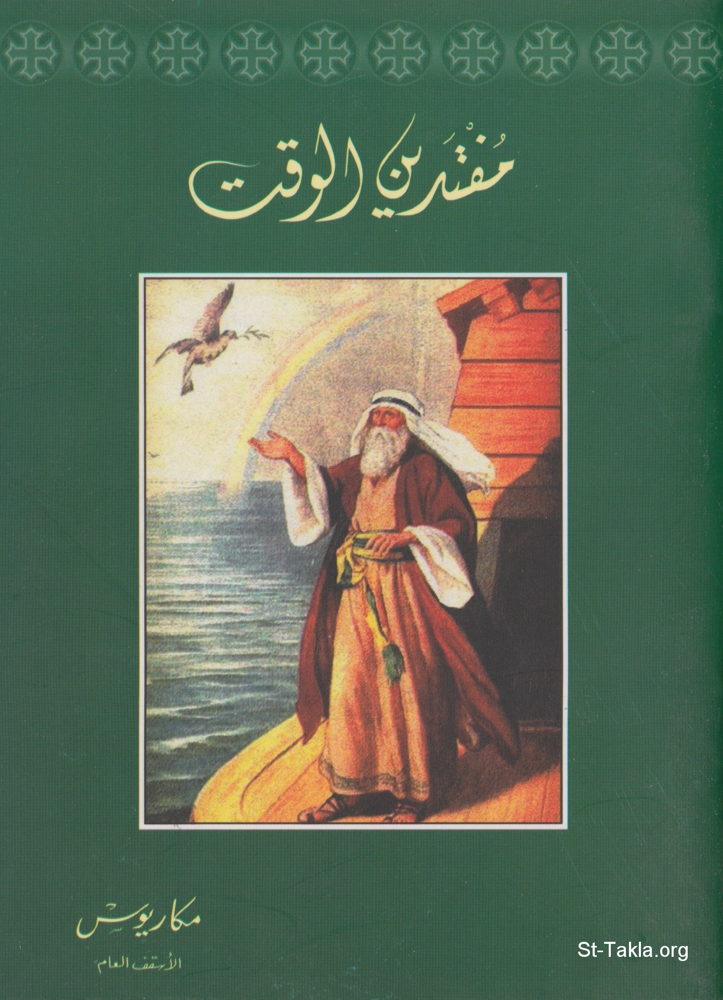

# مفتدين الوقت

**المؤلف / Author:** الأنبا مكاريوس
**المصدر / Source:** [st-takla.org](https://st-takla.org/Full-Free-Coptic-Books/FreeCopticBooks-006-His-Grace-Bishop-Makarios/001-Moftadeen-El-Wakt_Redeeming-the-Time/00-Moftadin-El-Wa2t_Index.html)
**الموضوعات / Topics:** —

📘 **[Download EPUB / تحميل الكتاب](moftadeen-el-wakt-redeeming-the-time.epub)**

## نبذة

نشكر نيافة الحبر الجليل الأنبا مكاريوس الأسقف العام بالمنيا على السماح لنا في موقع الأنبا تكلا هيمانوت بوضع هذا الكتاب هنا.

## الفصول / Chapters (26)

1. [مفتدين الوقت](chapters/01-00-Moftadin-El-Wa2t_Introduction/)
2. [اليقظة](chapters/02-01-Al-Yakaza/)
3. [بين النظرة البسيطة العابرة والنظرة الثابتة الفاحصة](chapters/03-02-Al-Nazar/)
4. [النظرة البعيدة](chapters/04-03-Al-Nazra-Al-Ba3ida/)
5. [الاسترشاد](chapters/05-04-Al-Estershad/)
6. [النظر الجيِّد وإصابة الهدف](chapters/06-05-Al-Nazar-Al-Gayed/)
7. [العين المختونة](chapters/07-06-Al-3ein-Al-Makhtoona/)
8. [السلوك](chapters/08-07-Al-Soluk/)
9. [اختيار الطريق](chapters/09-08-Ekhteiar-Al-Tareek/)
10. [السلوك بيقظة](chapters/10-09-Al-Solook-Be-Yakaza/)
11. [المثابرة في الطريق](chapters/11-10-El-Mothabra-Fel-Tareek/)
12. [أسعى لعلي أدرك](chapters/12-11-As3a-Le-3aly-Odrek/)
13. [ولكن، مَنْ هو الطريق؟!](chapters/13-12-Wa-Laken-Ma-Howa-Al-Tareek/)
14. [ما بين المسيرة والسيرة](chapters/14-13-Ma-Bein-El-Maseera-Wal-Seera/)
15. [التدقيق](chapters/15-14-Al-Tadkeek/)
16. [الفضائل وأشباه الفضائل](chapters/16-15-Al-Fada2el-Wa-Ashbah-El-Fadael/)
17. [الثعالب الصغيرة](chapters/17-16-Al-Tha3aleb-Al-Shagheera/)
18. [المُدَقِّق الحقيقي هو المدقق مع نفسه](chapters/18-17-Al-Modakek-Al-Hakeeky/)
19. [افتداء الوقت](chapters/19-18-Efteda2-Al-Wakt/)
20. [قيمة الوقت](chapters/20-19-Kimat-Al-Wakt/)
21. [كيف نجد الوقت؟](chapters/21-20-Kaifa-Naged-Al-Wa2t/)
22. [النوم وافتداء الوقت](chapters/22-21-Al-Noum-Wa-Efteda2-Al-Wakt/)
23. [سكان الجحيم والوقت](chapters/23-22-Sokan-El-Ghaheem-Wal-Wakt/)
24. [الأيام شريرة](chapters/24-23-Al-Ayam-Shereera/)
25. [أنتم ملح الأرض، أنتم نور العالم](chapters/25-24-Antom-Melh-El-Ard/)
26. [الأيام صالحة](chapters/26-25-Al-Ayam-Saleha/)

---
*هذا الكتاب مجاني للنشر والتوزيع لخلاص كل نفس. This book is free to share and distribute for the salvation of every soul.*
