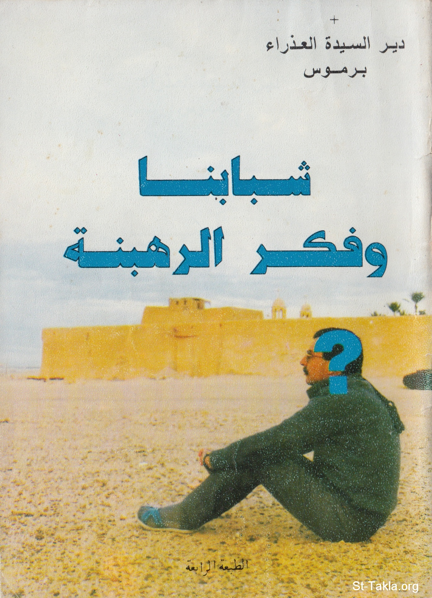

# شبابنا وفكر الرهبنة

**المؤلف / Author:** الأنبا مكاريوس الأسقف العام
**المصدر / Source:** [st-takla.org](https://st-takla.org/Full-Free-Coptic-Books/FreeCopticBooks-006-His-Grace-Bishop-Makarios/004-Shababna-We-Fekr-El-Rahbana/Monastic-Though-00-index.html)
**الموضوعات / Topics:** —

📘 **[Download EPUB / تحميل الكتاب](shababna-we-fekr-el-rahbana.epub)**

## نبذة

نشكر نيافة الحبر الجليل الأنبا مكاريوس الأسقف العام في المنيا على السماح لنا في موقع الأنبا تكلا هيمانوت بوضع هذا الكتاب هنا.

## الفصول / Chapters (37)

1. [مقدمة](chapters/01-Monastic-Though-01-Preface/)
2. [شبابنا وفكر الرهبنة](chapters/02-Monastic-Though-02-Intro/)
3. [الرهبنة هي أحد الوسائط](chapters/03-Monastic-Though-03-One/)
4. [دوافع غير سليمة وراء الرغبة في الرهبنة](chapters/04-Monastic-Though-04-Wrong/)
5. [عدم انسجام الشاب مع أفراد أسرته](chapters/05-Monastic-Though-05-Family/)
6. [عدم اقتناع الشاب بنوعية العمل الذي يباشره](chapters/06-Monastic-Though-06-Work/)
7. [مشاكل نفسية وعدم المقدرة على مواجهة المجتمع](chapters/07-Monastic-Though-07-Society/)
8. [الفشل في مشروع زواج](chapters/08-Monastic-Though-08-Marriage/)
9. [التعثر في الدراسة](chapters/09-Monastic-Though-09-Study/)
10. [الإصابة بعاهة مستديمة](chapters/10-Monastic-Though-10-Disability/)
11. [عدم الاقتناع بالخدمة ومشكلاتها](chapters/11-Monastic-Though-11-Service/)
12. [تأثر وقتي](chapters/12-Monastic-Though-12-Effect/)
13. [هل الرهبان في راحة؟!](chapters/13-Monastic-Though-13-Happy/)
14. [الرغبة في وظيفة كنسية أو مركز قيادي!](chapters/14-Monastic-Though-14-Rank/)
15. [انتقام من الأسرة](chapters/15-Monastic-Though-15-Revenge/)
16. [النذر الخاطئ بالترهب](chapters/16-Monastic-Though-16-Vow/)
17. [التفكير في الرهبنة يجب أن يكون بإرشاد ومشورة](chapters/17-Monastic-Though-17-Thinking/)
18. [إذا كانت الرهبنة هي طريقي فكيف أعرف؟](chapters/18-Monastic-Though-18-How/)
19. [أب الاعتراف ودوره في الإرشاد](chapters/19-Monastic-Though-19-Role/)
20. [حروب تواجه الراغبين في الرهبنة](chapters/20-Monastic-Though-20-Wars/)
21. [حرب التأجيل](chapters/21-Monastic-Though-21-Postponement/)
22. [الروابط الأسرية](chapters/22-Monastic-Though-22-Bonds/)
23. [تخوفات المستقبل](chapters/23-Monastic-Though-23-Future/)
24. [هموم الخدمة](chapters/24-Monastic-Though-24-Worry/)
25. [الخروج من العالم](chapters/25-Monastic-Though-25-World/)
26. [اختيار الراغبين في سلك الرهبنة](chapters/26-Monastic-Though-26-Choose/)
27. [كيفية الاختيار](chapters/27-Monastic-Though-27-Choosing/)
28. [خداع](chapters/28-Monastic-Though-28-Deception/)
29. [وضوح الهدف](chapters/29-Monastic-Though-29-Aim/)
30. [أرغب في الالتحاق بسلك الرهبنة ولكن..](chapters/30-Monastic-Though-30-But/)
31. [الكهنوت أم الرهبنة](chapters/31-Monastic-Though-31-Priesthood/)
32. [تجاوز السن المناسب للرهبنة](chapters/32-Monastic-Though-32-Age/)
33. [شاب ذهب لعدة أديرة للرهبنة ولم يقبلوه](chapters/33-Monastic-Though-33-Monasteries/)
34. [العودة للدير بعد تركه](chapters/34-Monastic-Though-34-Back/)
35. [معارضة الأهل للترهب بالرغم من رغبة الشاب](chapters/35-Monastic-Though-35-Stand-Against/)
36. [شهوة شبابية مسيطرة](chapters/36-Monastic-Though-36-Lust/)
37. [أخيرًا](chapters/37-Monastic-Though-37-Finally/)

---
*هذا الكتاب مجاني للنشر والتوزيع لخلاص كل نفس. This book is free to share and distribute for the salvation of every soul.*
