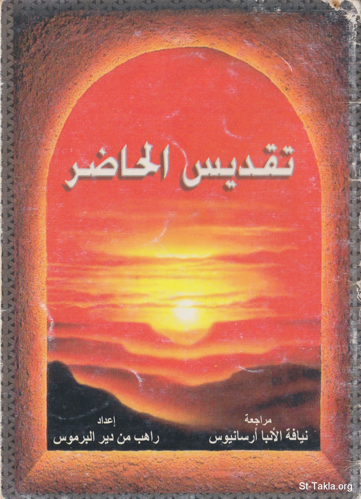

# تقديس الحاضر

**المؤلف / Author:** الأنبا مكاريوس الأسقف العام بالمنيا
**المصدر / Source:** [st-takla.org](https://st-takla.org/Full-Free-Coptic-Books/FreeCopticBooks-006-His-Grace-Bishop-Makarios/002-Takdis-El-7ader/Sanctifying-the-Present_00-index.html)
**الموضوعات / Topics:** —

📘 **[Download EPUB / تحميل الكتاب](takdis-el-7ader.epub)**

## نبذة

نشكر نيافة الحبر الجليل الأنبا مكاريوس الأسقف العام في المنيا على السماح لنا في موقع الأنبا تكلا هيمانوت بوضع هذا الكتاب هنا.

## الفصول / Chapters (8)

1. [ما بين الماضي والمستقبل، قد يضيع الحاضر](chapters/01-Sanctifying-the-Present_01-Al-Hader/)
2. [المستقبل بالنسبة لنا](chapters/02-Sanctifying-the-Present_02-Al-Mostakbal/)
3. [تقديس الحاضر](chapters/03-Sanctifying-the-Present_03-Al-Takdees/)
4. [الأبيقورية](chapters/04-Sanctifying-the-Present_04-Al-Abikoreya/)
5. [مذاقة الأبدية على الأرض](chapters/05-Sanctifying-the-Present_05-Al-Abadeya/)
6. [خلاص الحاضر](chapters/06-Sanctifying-the-Present_06-Khalas-Al-Hader/)
7. [مفتدين الوقت](chapters/07-Sanctifying-the-Present_07-Moftadeen-Al-Wakt/)
8. [ليكن يومك أفضل من الأمس، وغدك أفضل من اليوم](chapters/08-Sanctifying-the-Present_08-outro/)

---
*هذا الكتاب مجاني للنشر والتوزيع لخلاص كل نفس. This book is free to share and distribute for the salvation of every soul.*
