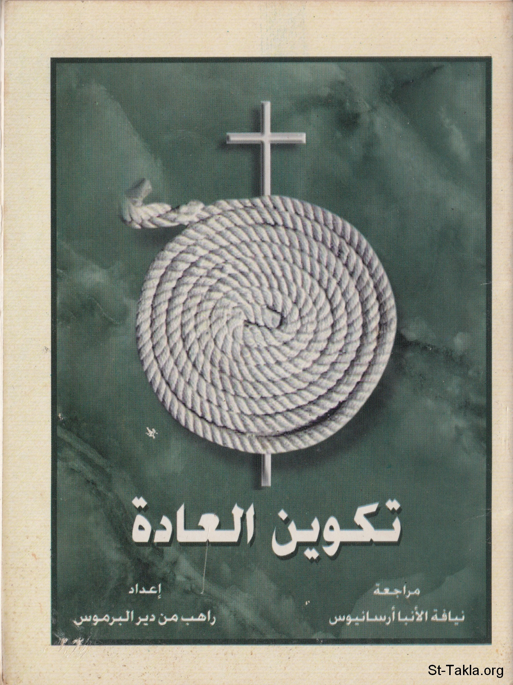

# تكوين العادة

**المؤلف / Author:** الأنبا مكاريوس
**المصدر / Source:** [st-takla.org](https://st-takla.org/Full-Free-Coptic-Books/FreeCopticBooks-006-His-Grace-Bishop-Makarios/003-Takween-El-3ada/Building-the-Habbit-00-index.html)
**الموضوعات / Topics:** —

📘 **[Download EPUB / تحميل الكتاب](takween-el-3ada.epub)**

## نبذة

أولًا، نشكر نيافة الحبر الجليل الأنبا مكاريوس الأسقف العام في المنيا على السماح لنا في موقع الأنبا تكلا هيمانوت بوضع هذا الكتاب هنا.

## الفصول / Chapters (10)

1. [مقدمة عن تكوين العادات](chapters/01-Building-the-Habbit-01-intro/)
2. [كيف تتكوَّن العادة](chapters/02-Building-the-Habbit-02-How/)
3. [هذه هي العادة](chapters/03-Building-the-Habbit-03-Definition/)
4. [التكرار وتكوين العادات](chapters/04-Building-the-Habbit-04-Repetition/)
5. [خطورة العادة](chapters/05-Building-the-Habbit-05-Dangers-1/)
6. [أمثلة للعادة](chapters/06-Building-the-Habbit-06-Examples/)
7. [خطورة العادات العامة والمشتركة](chapters/07-Building-the-Habbit-07-Dangers-2/)
8. [بعض العادات المفيدة والإيجابية](chapters/08-Building-the-Habbit-08-Good/)
9. [كيف نتخلَّص من العادة الضارة](chapters/09-Building-the-Habbit-09-Getting-Rid-of-Bad-Ones/)
10. [العادة الجيدة والملل](chapters/10-Building-the-Habbit-10-Boredom/)

---
*هذا الكتاب مجاني للنشر والتوزيع لخلاص كل نفس. This book is free to share and distribute for the salvation of every soul.*
