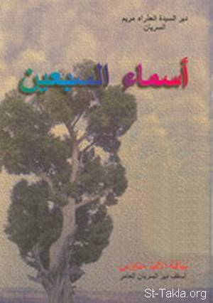

# أسماء السبعين رسولا

**المؤلف / Author:** الأنبا متاؤس أسقف دير السريان
**المصدر / Source:** [st-takla.org](https://st-takla.org/Full-Free-Coptic-Books/FreeCopticBooks-013-His-Grace-Bishop-Metaos/001-Asmaa2l-Al-Rosol-Sab3in/Names-of-Seventy-Apostles-00-index.html)
**الموضوعات / Topics:** —

📘 **[Download EPUB / تحميل الكتاب](asmaa2l-al-rosol-sab3in.epub)**

## نبذة

نشكر نيافة الحبر الجليل الأنبا متاؤس أسقف دير السريان على السماح لنا في موقع الأنبا تكلا هيمانوت بوضع هذا الكتاب هنا.

## الفصول / Chapters (73)

1. [مقدمة الطبعة الأولى - كتاب أسماء السبعين رسولًا](chapters/01-Names-of-Seventy-Apostles-01-Intro-1/)
2. [مقدمة الطبعة الثانية - كتاب أسماء السبعين رسولًا](chapters/02-Names-of-Seventy-Apostles-02-Intro-2/)
3. [الأماكن التي ذُكِرَ فيها السبعون - كتاب أسماء السبعين رسولًا](chapters/03-Names-of-Seventy-Apostles-03-Places/)
4. [القديس مرقس الإنجيلي الرسول - كتاب أسماء السبعين رسولًا](chapters/04-Names-of-Seventy-Apostles-04-Saint-Apostle-Mark/)
5. [القديس برنابا الرسول - كتاب أسماء السبعين رسولًا](chapters/05-Names-of-Seventy-Apostles-05-Saint-Apostle-Bernaba/)
6. [القديس لوقا الإنجيلي الرسول - كتاب أسماء السبعين رسولًا](chapters/06-Names-of-Seventy-Apostles-06-Saint-Apostle-Loka/)
7. [القديس متياس الرسول - كتاب أسماء السبعين رسولًا](chapters/07-Names-of-Seventy-Apostles-07-Saint-Apostle-Metias/)
8. [القديس يوسف الملقب يسطس الرسول - كتاب أسماء السبعين رسولًا](chapters/08-Names-of-Seventy-Apostles-08-Saint-Apostle-Youssef/)
9. [القديس كليوباس الرسول - كتاب أسماء السبعين رسولًا](chapters/09-Names-of-Seventy-Apostles-09-Saint-Apostle-Kolbas/)
10. [القديس استفانوس الرسول والشماس - كتاب أسماء السبعين رسولًا](chapters/10-Names-of-Seventy-Apostles-10-Saint-Apostle-Estafanous/)
11. [القديس فيلبس الشماس والرسول - كتاب أسماء السبعين رسولًا](chapters/11-Names-of-Seventy-Apostles-11-Saint-Apostle-Filobbos/)
12. [القديس بروخورس الرسول والشماس - كتاب أسماء السبعين رسولًا](chapters/12-Names-of-Seventy-Apostles-12-Saint-Apostle-Brokhoros/)
13. [القديس نيكانور الشماس والرسول - كتاب أسماء السبعين رسولًا](chapters/13-Names-of-Seventy-Apostles-13-Saint-Apostle-Nikanor/)
14. [القديس تيمون الشماس والرسول - كتاب أسماء السبعين رسولًا](chapters/14-Names-of-Seventy-Apostles-14-Saint-Apostle-Timon/)
15. [القديس برميناس الشماس والرسول - كتاب أسماء السبعين رسولًا](chapters/15-Names-of-Seventy-Apostles-15-Saint-Apostle-Berminas/)
16. [نيقولاس الشماس المبتدع - كتاب أسماء السبعين رسولًا](chapters/16-Names-of-Seventy-Apostles-16-Saint-Apostle-Nikolawos/)
17. [القديس حنانيا الرسول - كتاب أسماء السبعين رسولًا](chapters/17-Names-of-Seventy-Apostles-17-Saint-Apostle-Hanania/)
18. [القديس لعازر الرسول حبيب الرب - كتاب أسماء السبعين رسولًا](chapters/18-Names-of-Seventy-Apostles-18-Saint-Apostle-Leaazar/)
19. [القديس أندرونيكوس الرسول - كتاب أسماء السبعين رسولًا](chapters/19-Names-of-Seventy-Apostles-19-Saint-Apostle-Andronikos/)
20. [القديس يونياس الرسول - كتاب أسماء السبعين رسولًا](chapters/20-Names-of-Seventy-Apostles-20-Saint-Apostle-Yonias/)
21. [القديس أرستوبولوس الرسول - كتاب أسماء السبعين رسولًا](chapters/21-Names-of-Seventy-Apostles-21-Saint-Apostle-Arestobolos/)
22. [القديس فرسكا الرسول - كتاب أسماء السبعين رسولًا](chapters/22-Names-of-Seventy-Apostles-22-Saint-Apostle-Fresca/)
23. [القديس يهوذا الملقب برسابا الرسول - كتاب أسماء السبعين رسولًا](chapters/23-Names-of-Seventy-Apostles-23-Saint-Apostle-Yahooza/)
24. [القديس سلوانس الرسول - كتاب أسماء السبعين رسولًا](chapters/24-Names-of-Seventy-Apostles-24-Saint-Apostle-Selwanos/)
25. [القديس أولمباس الرسول - كتاب أسماء السبعين رسولًا](chapters/25-Names-of-Seventy-Apostles-25-Saint-Apostle-Olempas/)
26. [القديس تيطس الرسول - كتاب أسماء السبعين رسولًا](chapters/26-Names-of-Seventy-Apostles-26-Saint-Apostle-Titas/)
27. [القديس أغابوس الرسول - كتاب أسماء السبعين رسولًا](chapters/27-Names-of-Seventy-Apostles-27-Saint-Apostle-Aghabos/)
28. [القديس فورس الرسول - كتاب أسماء السبعين رسولًا](chapters/28-Names-of-Seventy-Apostles-28-Saint-Apostle-Foros/)
29. [القديس كاربوس الرسول - كتاب أسماء السبعين رسولًا](chapters/29-Names-of-Seventy-Apostles-29-Saint-Apostle-Karbos/)
30. [القديس أبفراس الرسول - كتاب أسماء السبعين رسولًا](chapters/30-Names-of-Seventy-Apostles-30-Saint-Apostle-Abefras/)
31. [القديس أبفرودتس الرسول - كتاب أسماء السبعين رسولًا](chapters/31-Names-of-Seventy-Apostles-31-Saint-Apostle-Abefrodets/)
32. [القديس مناسون الرسول - كتاب أسماء السبعين رسولًا](chapters/32-Names-of-Seventy-Apostles-32-Saint-Apostle-Menason/)
33. [القديس أمبلياس الرسول - كتاب أسماء السبعين رسولًا](chapters/33-Names-of-Seventy-Apostles-33-Saint-Apostle-Ambilias/)
34. [القديس أوربانوس الرسول - كتاب أسماء السبعين رسولًا](chapters/34-Names-of-Seventy-Apostles-34-Saint-Apostle-Orbanos/)
35. [القديس سمعان الدباغ الرسول - كتاب أسماء السبعين رسولًا](chapters/35-Names-of-Seventy-Apostles-35-Saint-Apostle-Samaan-Dabbagh/)
36. [القديس إستاخيس الرسول - كتاب أسماء السبعين رسولًا](chapters/36-Names-of-Seventy-Apostles-36-Saint-Apostle-Astakhees/)
37. [القديس أبلس الرسول - كتاب أسماء السبعين رسولًا](chapters/37-Names-of-Seventy-Apostles-37-Saint-Apostle-Apaullos/)
38. [القديس أبينتوس الرسول - كتاب أسماء السبعين رسولًا](chapters/38-Names-of-Seventy-Apostles-38-Saint-Apostle-Abentinos/)
39. [القديس هيروديون الرسول - كتاب أسماء السبعين رسولًا](chapters/39-Names-of-Seventy-Apostles-39-Saint-Apostle-Hirodion/)
40. [القديس قدراطس الرسول - كتاب أسماء السبعين رسولًا](chapters/40-Names-of-Seventy-Apostles-40-Saint-Apostle-Kedrates/)
41. [القديس أسينكريتس الرسول - كتاب أسماء السبعين رسولًا](chapters/41-Names-of-Seventy-Apostles-41-Saint-Apostle-Asinkrits/)
42. [القديس فليغون الرسول - كتاب أسماء السبعين رسولًا](chapters/42-Names-of-Seventy-Apostles-42-Saint-Apostle-Flighoon/)
43. [القديس غايس الرسول - كتاب أسماء السبعين رسولًا](chapters/43-Names-of-Seventy-Apostles-43-Saint-Apostle-Ghayos/)
44. [القديس أرسترخس الرسول - كتاب أسماء السبعين رسولًا](chapters/44-Names-of-Seventy-Apostles-44-Saint-Apostle-Aresterkhes/)
45. [القديس أفتيخوس الرسول - كتاب أسماء السبعين رسولًا](chapters/45-Names-of-Seventy-Apostles-45-Saint-Apostle-Aftikhos/)
46. [القديس سمعان كلوبا الرسول - كتاب أسماء السبعين رسولًا](chapters/46-Names-of-Seventy-Apostles-46-Saint-Apostle-Saman-Kloba/)
47. [القديس مناين الرسول - كتاب أسماء السبعين رسولًا](chapters/47-Names-of-Seventy-Apostles-47-Saint-Apostle-Menian/)
48. [القديس هرماس الرسول - كتاب أسماء السبعين رسولًا](chapters/48-Names-of-Seventy-Apostles-48-Saint-Apostle-Hermas/)
49. [القديس لينس الرسول - كتاب أسماء السبعين رسولًا](chapters/49-Names-of-Seventy-Apostles-49-Saint-Apostle-Lins/)
50. [القديس كوارتس الرسول - كتاب أسماء السبعين رسولًا](chapters/50-Names-of-Seventy-Apostles-50-Saint-Apostle-Quarts/)
51. [القديس بتروباس الرسول - كتاب أسماء السبعين رسولًا](chapters/51-Names-of-Seventy-Apostles-51-Saint-Apostle-Betrobas/)
52. [القديس زيناس الناموسي الرسول - كتاب أسماء السبعين رسولًا](chapters/52-Names-of-Seventy-Apostles-52-Saint-Apostle-Zinas/)
53. [القديس سوستانيس الرسول - كتاب أسماء السبعين رسولًا](chapters/53-Names-of-Seventy-Apostles-53-Saint-Apostle-Sostanees/)
54. [القديس فليمون الرسول - كتاب أسماء السبعين رسولًا](chapters/54-Names-of-Seventy-Apostles-54-Saint-Apostle-Flemoun/)
55. [القديس أرخبس الرسول - كتاب أسماء السبعين رسولًا](chapters/55-Names-of-Seventy-Apostles-55-Saint-Apostle-Arkhebbos/)
56. [القديس أنتيباس الرسول - كتاب أسماء السبعين رسولًا](chapters/56-Names-of-Seventy-Apostles-56-Saint-Apostle-Antibas/)
57. [القديس ترتيوس الرسول - كتاب أسماء السبعين رسولًا](chapters/57-Names-of-Seventy-Apostles-57-Saint-Apostle-Tertios/)
58. [القديس لوكيوس القيرواني الرسول - كتاب أسماء السبعين رسولًا](chapters/58-Names-of-Seventy-Apostles-58-Saint-Apostle-Lokios/)
59. [القديس أنسيفورس الرسول - كتاب أسماء السبعين رسولًا](chapters/59-Names-of-Seventy-Apostles-59-Saint-Apostle-Ansiforos/)
60. [القديس تيخيكوس الرسول - كتاب أسماء السبعين رسولًا](chapters/60-Names-of-Seventy-Apostles-60-Saint-Apostle-Tikhikos/)
61. [القديس نركيسوس الرسول - كتاب أسماء السبعين رسولًا](chapters/61-Names-of-Seventy-Apostles-61-Saint-Apostle-Narkisos/)
62. [القديس أخائيكوس الرسول - كتاب أسماء السبعين رسولًا](chapters/62-Names-of-Seventy-Apostles-62-Saint-Apostle-Akhaeikos/)
63. [القديس أرتيماس الرسول - كتاب أسماء السبعين رسولًا](chapters/63-Names-of-Seventy-Apostles-63-Saint-Apostle-Artimas/)
64. [القديس بوديس الرسول - كتاب أسماء السبعين رسولًا](chapters/64-Names-of-Seventy-Apostles-64-Saint-Apostle-Bodees/)
65. [القديس تروفيمس الرسول - كتاب أسماء السبعين رسولًا](chapters/65-Names-of-Seventy-Apostles-65-Saint-Apostle-Trofeemos/)
66. [القديس سوباترس الرسول - كتاب أسماء السبعين رسولًا](chapters/66-Names-of-Seventy-Apostles-66-Saint-Apostle-Sobatres/)
67. [القديس فرتوناتوس الرسول - كتاب أسماء السبعين رسولًا](chapters/67-Names-of-Seventy-Apostles-67-Saint-Apostle-Feronatos/)
68. [القديس نيروس الرسول - كتاب أسماء السبعين رسولًا](chapters/68-Names-of-Seventy-Apostles-68-Saint-Apostle-Niros/)
69. [القديس أرسطوس الرسول - كتاب أسماء السبعين رسولًا](chapters/69-Names-of-Seventy-Apostles-69-Saint-Apostle-Aristos/)
70. [القديس أكيلا الرسول - كتاب أسماء السبعين رسولًا](chapters/70-Names-of-Seventy-Apostles-70-Saint-Apostle-Akila/)
71. [القديس ألكسندروس الرسول - كتاب أسماء السبعين رسولًا](chapters/71-Names-of-Seventy-Apostles-71-Saint-Apostle-Alexandros/)
72. [القديس روفس الرسول - كتاب أسماء السبعين رسولًا](chapters/72-Names-of-Seventy-Apostles-72-Saint-Apostle-Rofos/)
73. [القديس ياسون الرسول - كتاب أسماء السبعين رسولًا](chapters/73-Names-of-Seventy-Apostles-73-Saint-Apostle-Yason/)

---
*هذا الكتاب مجاني للنشر والتوزيع لخلاص كل نفس. This book is free to share and distribute for the salvation of every soul.*
