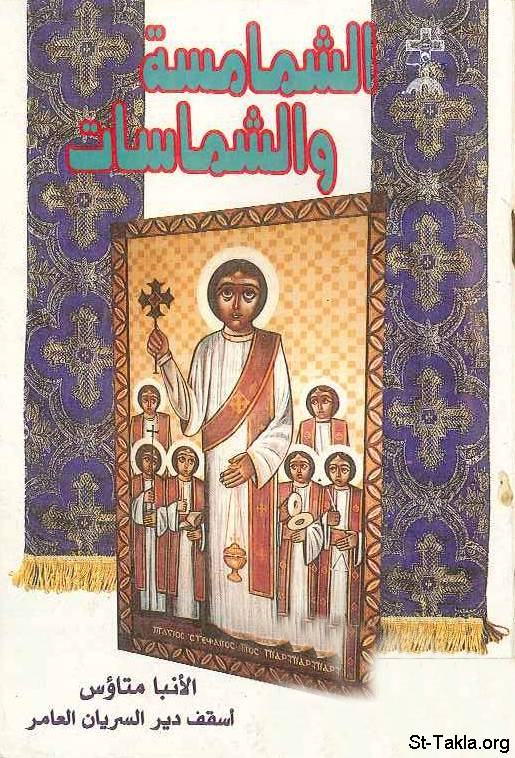

# الشمامسة والشماسات

**المؤلف / Author:** الأنبا متاؤس
**المصدر / Source:** [st-takla.org](https://st-takla.org/books/anba-metaos/deacons-and-deaconesses/index.html)
**الموضوعات / Topics:** —

📘 **[Download EPUB / تحميل الكتاب](deacons-and-deaconesses.epub)**

## نبذة

نشكر نيافة الحبر الجليل الأنبا متاؤس أسقف دير السريان على السماح لنا في موقع الأنبا تكلا هيمانوت بوضع هذا الكتاب هنا.

## الفصول / Chapters (12)

1. [مقدمة الطبعة الأولى](chapters/01-introduction-1/)
2. [مقدمة الطبعة الثانية](chapters/02-introduction-2/)
3. [كلمة عن سر الكهنوت](chapters/03-priesthood/)
4. [رتبة الشماسية](chapters/04-rank-of-a-deacon/)
5. [الابصالتس](chapters/05-epsaltos/)
6. [الأناغنوستيس](chapters/06-anaghnostos/)
7. [الإيبودياكون](chapters/07-epodeacon/)
8. [الدياكون](chapters/08-deacon/)
9. [بعض الواجبات الطقسية والروحية الخاصة بالشمامسة](chapters/09-duties/)
10. [الأرشيدياكون](chapters/10-archdeacon/)
11. [الشماسات في الكنيسة](chapters/11-deaconess/)
12. [آداب الحضور إلي الكنيسة](chapters/12-attending-church/)

---
*هذا الكتاب مجاني للنشر والتوزيع لخلاص كل نفس. This book is free to share and distribute for the salvation of every soul.*
