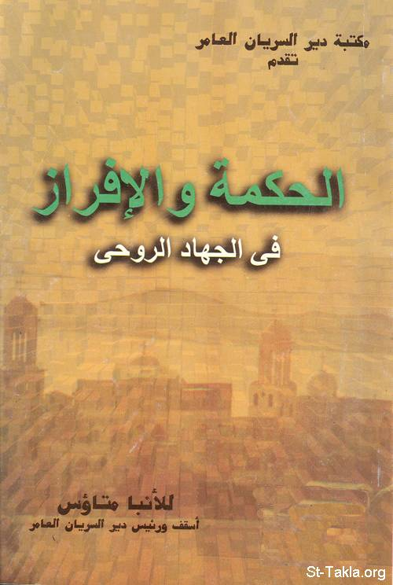

# الحكمة والإفراز في الجهاد الروحي

**المؤلف / Author:** نيافة الحبر الجليل الأنبا متاؤس أسقف دير السريان
**المصدر / Source:** [st-takla.org](https://st-takla.org/Full-Free-Coptic-Books/FreeCopticBooks-013-His-Grace-Bishop-Metaos/003-El-Hekma/Wisdom-in-Spiritual-Life-00-index.html)
**الموضوعات / Topics:** —

📘 **[Download EPUB / تحميل الكتاب](el-hekma.epub)**

## نبذة

نشكر نيافة الحبر الجليل الأنبا متاؤس أسقف دير السريان على السماح لنا في موقع الأنبا تكلا هيمانوت بوضع هذا الكتاب هنا.

## الفصول / Chapters (16)

1. [الحكمة والإفراز في الجهاد الروحي](chapters/01-Wisdom-in-Spiritual-Life-01-Intro/)
2. [أهمية الأفراز في الممارسات الروحية](chapters/02-Wisdom-in-Spiritual-Life-02-Importance/)
3. [الحكمة الروحية والبساطة](chapters/03-Wisdom-in-Spiritual-Life-03-Simplicity/)
4. [الفضيلة ما بين التطرف اليميني والشمالي](chapters/04-Wisdom-in-Spiritual-Life-04-Virtue/)
5. [فِلاحة النفس وثمار الفضائل](chapters/05-Wisdom-in-Spiritual-Life-05-Fruits/)
6. [أشجار الفضائل ما بين التفليح والإهمال](chapters/06-Wisdom-in-Spiritual-Life-06-Trees/)
7. [النمو الروحي](chapters/07-Wisdom-in-Spiritual-Life-07-Growth/)
8. [عوائق النمو الروحي](chapters/08-Wisdom-in-Spiritual-Life-08-Problems/)
9. [التربة الجيدة للنمو الروحي](chapters/09-Wisdom-in-Spiritual-Life-09-Soil/)
10. [المناخ المناسب للنمو الروحي](chapters/10-Wisdom-in-Spiritual-Life-10-Climate/)
11. [الغذاء المناسب للنمو الروحي](chapters/11-Wisdom-in-Spiritual-Life-11-Food-1/)
12. [أصناف الأطعمة الروحية](chapters/12-Wisdom-in-Spiritual-Life-12-Food-2-Kinds/)
13. [الماء الروحي اللازم للنمو](chapters/13-Wisdom-in-Spiritual-Life-13-Water/)
14. [التفليح الدائم للنفس](chapters/14-Wisdom-in-Spiritual-Life-14-Cultivation/)
15. [مكافحة الآفات الروحية](chapters/15-Wisdom-in-Spiritual-Life-15-Blight/)
16. [الحراسة الدائمة والسهر الروحي](chapters/16-Wisdom-in-Spiritual-Life-16-Watchfulness/)

---
*هذا الكتاب مجاني للنشر والتوزيع لخلاص كل نفس. This book is free to share and distribute for the salvation of every soul.*
