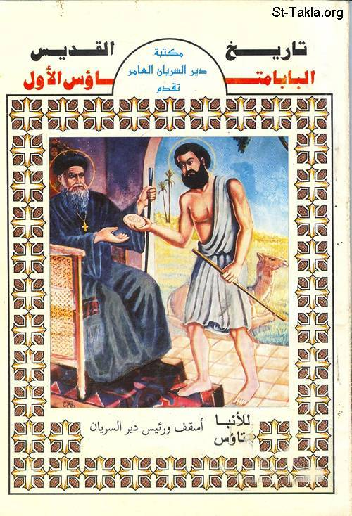

# تاريخ القديس البابا متاؤس الأول

**المؤلف / Author:** الأنبا متاؤس
**المصدر / Source:** [st-takla.org](https://st-takla.org/books/anba-metaos/pope-mattheos/index.html)
**الموضوعات / Topics:** —

📘 **[Download EPUB / تحميل الكتاب](pope-mattheos.epub)**

## نبذة

نشكر نيافة الحبر الجليل الأنبا متاؤس أسقف دير السريان على السماح لنا في موقع الأنبا تكلا هيمانوت بوضع هذا الكتاب هنا.

## الفصول / Chapters (38)

1. [مقدمة](chapters/01-intro/)
2. [طفولة القديس متاؤس](chapters/02-childhood/)
3. [ميله إلى الرهبنة منذ حداثة سنه](chapters/03-monasticism/)
4. [انتصاره على أول تجربة حلت به](chapters/04-trial/)
5. [رسامة الشاب متى الراهب قسًا](chapters/05-priest/)
6. [هربه إلى دير القديس أنطونيوس بالبرية](chapters/06-abbey/)
7. [رحلة القس متى إلى أورشليم](chapters/07-jerusalem/)
8. [عودة القس متى إلى دير انطونيوس العظيم](chapters/08-anthony/)
9. [اضطهاد القس متى والشيخ مرقس الأنطوني من دير القديس انطونيوس](chapters/09-mark/)
10. [القس متى في دير المحرق بجبل قسقام](chapters/10-koskam/)
11. [ترشيح القس متى للبطريركية](chapters/11-patriarchate/)
12. [رسامة القس متى بطريركا متاؤس الأول](chapters/12-pope/)
13. [توجيه خدامه نحو تأدية فروض الصلوات وإعانة المساكين والراهبات والرهبان](chapters/13-services/)
14. [درس في الاعتماد على الله بدلا من المال](chapters/14-god/)
15. [مقاومة البابا للمجاعة ومكافحة الغلاء بالهام الروح القدس](chapters/15-spirit/)
16. [الرحمة تثمر ثمارا جيدة](chapters/16-mercy/)
17. [نصائح واحكام البابا متاؤس بإرشاد الروح القدس الحال فيه](chapters/17-advise/)
18. [زيارة البابا متاؤس الأول البطريرك 87 لدير القديس العظيم الأنبا أنطونيوس](chapters/18-visit/)
19. [تجديد عهد السلام بين مصر وملوك الحبشة](chapters/19-ethiopia-egypt/)
20. [هدايا الملوك للبابا متاؤس لتجديد المحبة والصلح والسلام على يديه](chapters/20-gifts/)
21. [حلم البابا متاؤس وصفحه عن خصومه وانتصاره عليهم](chapters/21-dream/)
22. [فشل سعى العامة لهدم كنيسة العذراء المعلقة بمصر ونجاتها](chapters/22-mary-church/)
23. [فشل مؤامرة المعاندين في أمر هدم دير شهران](chapters/23-shahran/)
24. [خلع السلطان برقوق ونفيه إلى الكرك](chapters/24-barkouk/)
25. [أضطهاد الأميرين منطاش ويلبغا للبابا متاؤس](chapters/25-mentash/)
26. [عودة السلطان برقوق إلى الحكم](chapters/26-back/)
27. [القضاء على ثورة الشام وأسر الأمير منطاش](chapters/27-sham/)
28. [قيام تيمور لنك بغزو الشرق](chapters/28-timur-lank/)
29. [وفاة السلطان برقوق، وقيام ابنه السلطان فرج](chapters/29-farag/)
30. [خلاص البابا متاؤس من الاضطهاد والسجن الذي وقع فيهما بعد موت السلطان برقوق](chapters/30-prison/)
31. [قيام الأمراء باضطهاد البابا متاؤس الأول وفشلهم في أيام السلطان الناصر فرج](chapters/31-princes/)
32. [مواهب الشفاء التي منحها الله للبابا متاؤس الأول وإقامة الموتى](chapters/32-heal/)
33. [قيام البابا متاؤس بإعانة ذوى الضيقات وخلاص الذين في الشدة وإظهار السرقات ومرتكبيها والمخالفين](chapters/33-help/)
34. [كشف البابا متاؤس لخطايا شعبه وخفايا الأمور](chapters/34-sins/)
35. [انتقال البابا متاؤس الأول من هذا العالم](chapters/35-death/)
36. [وصيته قبل نياحته](chapters/36-will/)
37. [الاحتفال بجنازته](chapters/37-funeral/)
38. [العجايب التي أظهرها بعد دفنه](chapters/38-miracles/)

---
*هذا الكتاب مجاني للنشر والتوزيع لخلاص كل نفس. This book is free to share and distribute for the salvation of every soul.*
