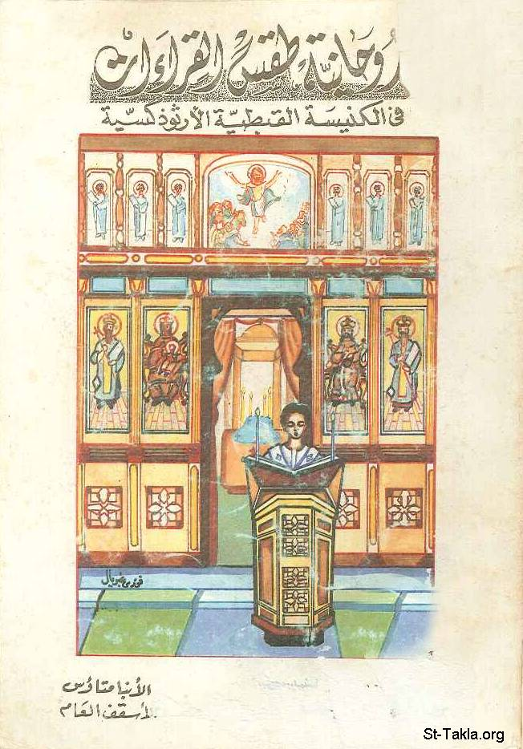

# روحانية طقس القراءات في الكنيسة القبطية الأرثوذكسية

**المؤلف / Author:** الأنبا متاؤس
**المصدر / Source:** [st-takla.org](https://st-takla.org/books/anba-metaos/readings/index.html)
**الموضوعات / Topics:** —

📘 **[Download EPUB / تحميل الكتاب](readings.epub)**

## نبذة

نشكر نيافة الحبر الجليل الأنبا متاؤس أسقف دير السريان على السماح لنا في موقع الأنبا تكلا هيمانوت بوضع هذا الكتاب هنا.

## الفصول / Chapters (42)

1. [مقدمة](chapters/01-intro/)
2. [تمهيد عن القراءات الكنسية](chapters/02-preface/)
3. [القطمارس السنوي الدوار](chapters/03-annual/)
4. [تقديم عن قراءات الآحاد السنوية](chapters/04-readings/)
5. [قراءات الآحاد السنوية: النصف الأول](chapters/05-first/)
6. [محبة الله الآب للبشر](chapters/06-love/)
7. [نعمة الابن الوحيد ربنا وإلهنا ومخلصنا يسوع المسيح](chapters/07-grace/)
8. [قراءات آحاد النصف الثاني من السنة القبطية](chapters/08-second/)
9. [شركة ومواهب الروح القدس](chapters/09-company/)
10. [قراءات الأيام السنوية الخاصة والمُحالة](chapters/10-days/)
11. [أمثلة للقراءات الخاصة والمحالة (المستلفة منها)](chapters/11-examples/)
12. [يوم 29 من كل شهر قبطي](chapters/12-29/)
13. [صوم يونان](chapters/13-jonah/)
14. [قراءات الأيام في الصوم الكبير](chapters/14-lent/)
15. [نظام النبوات في الصوم الكبير](chapters/15-prophecies/)
16. [طقس جمعة ختام الصوم](chapters/16-rituals/)
17. [قراءات جمعة ختام الصوم](chapters/17-firday/)
18. [قراءات آحاد الصوم الكبير](chapters/18-sundays/)
19. [ترتيب وأسماء آحاد الصوم الكبير](chapters/19-names/)
20. [قراءات أسبوع البصخة](chapters/20-week/)
21. [ملحوظة هامة في قراءات أسبوع البسخة](chapters/21-note/)
22. [قراءات سبت لعازر](chapters/22-lazarus/)
23. [في إثر خطواته في أيام أسبوع الآلام](chapters/23-steps/)
24. [قراءات يوم أحد الشعانين](chapters/24-palm/)
25. [الجناز العام](chapters/25-funeral/)
26. [قراءات الساعة التاسعة عن دخول المسيح أورشليم والحادية عشرة](chapters/26-jerusalem/)
27. [سواعي يوم الإثنين من البصخة (يوم السلطان)](chapters/27-monday/)
28. [قراءات ليلة الاثنين من البصخة المقدسة](chapters/28-power/)
29. [سواعي ليلة الثلاثاء (مساء الاثنين) من البصخة](chapters/29-tuesday/)
30. [سواعي يوم الثلاثاء من البصخة (يوم الصدام)](chapters/30-clash/)
31. [سواعي ليلة الأربعاء (مساء الثلاثاء) من البصخة](chapters/31-wednesday/)
32. [سواعي يوم الأربعاء من البصخة (يوم التآمر)](chapters/32-plotting/)
33. [سواعي ليلة الخميس من البصخة (مساء الأربعاء)](chapters/33-thursday/)
34. [سواعي يوم خميس العهد (يوم الوداع)](chapters/34-farewell/)
35. [قراءات اللقان يوم خميس العهد](chapters/35-lakan/)
36. [قداس خميس العهد](chapters/36-mass/)
37. [سواعي ليلة الجمعة العظيمة](chapters/37-hours/)
38. [قراءات يوم الجمعة العظيمة (يوم الصلب)](chapters/38-friday/)
39. [سبت الفرح (يوم الرجاء)](chapters/39-saturday/)
40. [قراءات آحاد الخماسين المقدسة](chapters/40-fifties/)
41. [قراءات الأيام في الخماسين المقدسة](chapters/41-50/)
42. [بعض ملاحظات على القراءات الكنسية](chapters/42-reading/)

---
*هذا الكتاب مجاني للنشر والتوزيع لخلاص كل نفس. This book is free to share and distribute for the salvation of every soul.*
