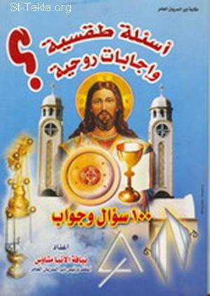

# أسئلة طقسية وإجابات روحية: 100 سؤال وجواب

**المؤلف / Author:** الأنبا متاؤس
**المصدر / Source:** [st-takla.org](https://st-takla.org/books/anba-metaos/ritual-questions/index.html)
**الموضوعات / Topics:** —

📘 **[Download EPUB / تحميل الكتاب](ritual-questions.epub)**

## نبذة

نشكر نيافة الحبر الجليل الأنبا متاؤس أسقف دير السريان على السماح لنا في موقع الأنبا تكلا هيمانوت بوضع هذا الكتاب هنا.

## الفصول / Chapters (101)

1. [مقدمة - كتاب أسئلة طقسية وإجابات روحية](chapters/01-introduction/)
2. [ما الداعي أن نصلي رفع بخور عشية وباكر ونكرر الصلوات؟ - كتاب أسئلة طقسية وإجابات روحية](chapters/02-01/)
3. [ما هي الصلوات الأساسية في رفع بخور عشية وباكر وإلى ماذا ترمز صلاة عشية وباكر؟ - كتاب أسئلة طقسية وإجابات روحية](chapters/03-02/)
4. [ما هو حُق البخور؟ وما هو نوع البخور المستعمل في الكنيسة؟ - كتاب أسئلة طقسية وإجابات روحية](chapters/04-03/)
5. [لماذا يُستعمل البخور في رفع البخور والقداس؟ - كتاب أسئلة طقسية وإجابات روحية](chapters/05-04/)
6. [ما هي الشورية وما هي أجزاؤها؟ وإلى أي شيء ترمز؟ - كتاب أسئلة طقسية وإجابات روحية](chapters/06-05/)
7. [ماذا يقول الكاهن في دورة البخور؟ - كتاب أسئلة طقسية وإجابات روحية](chapters/07-06/)
8. [هل يمسك الشماس الصليب والبشارة في دورة البخور؟ أم الصليب فقط؟ - كتاب أسئلة طقسية وإجابات روحية](chapters/08-07/)
9. [هل الشورية في يد الكاهن لها اتجاه معين؟ ولماذا؟ - كتاب أسئلة طقسية وإجابات روحية](chapters/09-08/)
10. [كم مرة يضع الكاهن بخورًا في الشورية أثناء الدورات؟ - كتاب أسئلة طقسية وإجابات روحية](chapters/10-09/)
11. [ماذا يُسَمَّي الكتاب الذي تقرأ فيه القراءات الكنسية؟ وأي القراءات تُقرأ في صلوات رفع البخور والقداس؟ - كتاب أسئلة طقسية وإجابات روحية](chapters/11-10/)
12. [لماذا لا نصلي قداسات في المساء تناسب كل الناس بدلًا من الاستيقاظ مبكرًا؟ - كتاب أسئلة طقسية وإجابات روحية](chapters/12-11/)
13. [ما هي صلوات الاستعداد التي يصليها الكاهن قبل القداس وإلى أي شيء ترمز؟ - كتاب أسئلة طقسية وإجابات روحية](chapters/13-12/)
14. [ما هو وعاء الذخيرة؟ ولماذا يكون بالمذبح؟ - كتاب أسئلة طقسية وإجابات روحية](chapters/14-13/)
15. [ما هي الأواني وأدوات المذبح التي تُستخدم في القداس؟ وإلى أي شيء يرمز كل منها وكيف يفتحها الكاهن؟ - كتاب أسئلة طقسية وإجابات روحية](chapters/15-14/)
16. [ما هي القوارير الموجودة بالمذبح ولأي شيء ترمز؟ - كتاب أسئلة طقسية وإجابات روحية](chapters/16-15/)
17. [لماذا نصلي أوشية المرضى والمسافرين في بعض الأيام، وأيام أخرى نصلي أوشية المرضى والقرابين؟ - كتاب أسئلة طقسية وإجابات روحية](chapters/17-16/)
18. [متى نصلي أوشية الراقدين؟ وماذا يستفيد الراقدون من أوشية الراقدين أو من الصلاة من أجلهم عمومًا؟ - كتاب أسئلة طقسية وإجابات روحية](chapters/18-17/)
19. [ما هي الملابس التي يستخدمها الكاهن في القداس الإلهي؟ وإلى أي شيء ترمز؟ وهل هناك فرق بين ملابس الكاهن المتزوج والكاهن الراهب؟ - كتاب أسئلة طقسية وإجابات روحية](chapters/19-18/)
20. [ما هي ملابس الشمامسة؟ ولماذا نجد البطرشيل (أي الوشاح الأحمر) متغيرًا من شماس لآخر؟ - كتاب أسئلة طقسية وإجابات روحية](chapters/20-19/)
21. [لماذا يزين الكاهن المذبح بالمفارش؟ وماذا يقول أثناء ذلك؟ وإلى أي شيء ترمز المفارش (أو اللفائف) وأي ترتيب يلتزم به الكاهن وهو يفرش المذبح؟ وما هي قطع المفارش؟ - كتاب أسئلة طقسية وإجابات روحية](chapters/21-20/)
22. [ماذا يقول الكاهن وهو يلبس التونية؟ - كتاب أسئلة طقسية وإجابات روحية](chapters/22-21/)
23. [ما هو الحمل؟ ولماذا يسمون المكان الذي يُصنع فيه القربان بيت لحم؟ - كتاب أسئلة طقسية وإجابات روحية](chapters/23-22/)
24. [لماذا يُوضع خمير في القربان؟ - كتاب أسئلة طقسية وإجابات روحية](chapters/24-23/)
25. [لماذا تصلى صلوات السواعي قبل تقديم الحمل؟ وأي الصلوات تُصلى في كل يوم؟ - كتاب أسئلة طقسية وإجابات روحية](chapters/25-24/)
26. [لماذا يغسل الكاهن يديه قبل أن يمسك الحمل؟ - كتاب أسئلة طقسية وإجابات روحية](chapters/26-25/)
27. [تقديم الحمل يختلف حسب اليوم؟ ففي بعض الأيام يقدم الحمل بزفة من الخارج بينما في الأيام العادية يبدأون أمام المذبح مباشرة لماذا؟ - كتاب أسئلة طقسية وإجابات روحية](chapters/27-26/)
28. [ماذا يقول الكاهن وهو يرشم الحمل؟ وعلى أي أساس يختار الحمل؟ - كتاب أسئلة طقسية وإجابات روحية](chapters/28-27/)
29. [ماذا يقول الكاهن وهو يرشم الحمل؟ وعلى أي أساس يختار الحمل؟ - كتاب أسئلة طقسية وإجابات روحية](chapters/29-28/)
30. [لماذا يسمح الكاهن للواقفين حوله بشم قارورة الأباركة وماذا يقولون؟ ولماذا؟ - كتاب أسئلة طقسية وإجابات روحية](chapters/30-29/)
31. [لماذا يأخذ الكاهن الأباركة ويباركها ثم يبارك بها الحمل؟ - كتاب أسئلة طقسية وإجابات روحية](chapters/31-30/)
32. [لماذا يأخذ الكاهن الماء ويبلل به الحمل الذي اختاره؟ وماذا يقول حينئذ؟ - كتاب أسئلة طقسية وإجابات روحية](chapters/32-31/)
33. [لماذا يلف الكاهن الحمل بلفافة بيضاء؟ وما هي الطريقة المثلى للفها؟ - كتاب أسئلة طقسية وإجابات روحية](chapters/33-32/)
34. [لماذا يضع الكاهن الصليب على الحمل بالمقلوب ويرفعه على رأسه؟ - كتاب أسئلة طقسية وإجابات روحية](chapters/34-33/)
35. [لماذا يلف الكاهن ووراءه الشماس بالحمل على رأسه؟ - كتاب أسئلة طقسية وإجابات روحية](chapters/35-34/)
36. [ما هي الدورات التي يقوم بها الكاهن في القداس؟ وإلى أي شيء ترمز؟ - كتاب أسئلة طقسية وإجابات روحية](chapters/36-35/)
37. [في أي اتجاه يجب أن يسير الكاهن في الكنيسة أثناء الدورة؟ - كتاب أسئلة طقسية وإجابات روحية](chapters/37-36/)
38. [إن كان هناك أجساد قديسين في اتجاهات مختلفة في الكنيسة ففي أي مسار يسير الكاهن بالشورية؟ - كتاب أسئلة طقسية وإجابات روحية](chapters/38-37/)
39. [ما الذي يجب على الناس أن يفعلوه أثناء دورة البخور في الكنيسة وماذا يقولون؟ ولماذا يجب أن يقفوا؟ - كتاب أسئلة طقسية وإجابات روحية](chapters/39-38/)
40. [ما الهدف من قراءة القراءات الكنسية في كل قداس؟ ولماذا تُقال ألحان في بعض الأحيان ولا تقال ألحان في أحيان أخرى؟ - كتاب أسئلة طقسية وإجابات روحية](chapters/40-39/)
41. [لماذا يُقرأ السنكسار أحيانًا ولا يُقرأ في أحيان أخرى؟ - كتاب أسئلة طقسية وإجابات روحية](chapters/41-40/)
42. [لماذا يقال الإنجيل فقط باللحن الجميل الذي نسمعه؟ - كتاب أسئلة طقسية وإجابات روحية](chapters/42-41/)
43. [لماذا يمسك شماسان شمعتين حول المنجلية أثناء قراءة الإنجيل المقدس؟ - كتاب أسئلة طقسية وإجابات روحية](chapters/43-42/)
44. [ما هي الأجزاء الرئيسية في القداس؟ - كتاب أسئلة طقسية وإجابات روحية](chapters/44-43/)
45. [كيف يعرف الناس أن الكاهن انتقل من صلاة الصلح إلى الجزء الذي يليه وهكذا؟ - كتاب أسئلة طقسية وإجابات روحية](chapters/45-44/)
46. [لماذا يحرك الكاهن اللفائف عندما يقول الرب مع جميعكم، ثم يحركها مرة أخرى عندما يقول أجيوس؟ - كتاب أسئلة طقسية وإجابات روحية](chapters/46-45/)
47. [ما السبب في أن الكاهن عندما يقول أوكيريوس يبدأ برشم الشعب وعندما يقول أجيوس يبدأ برشم نفسه؟ - كتاب أسئلة طقسية وإجابات روحية](chapters/47-46/)
48. [الشمامسة والشمعة أثناء التقديس - كتاب أسئلة طقسية وإجابات روحية](chapters/48-47/)
49. [لماذا يقرع الكاهن على صدره عندما يقول يعطي كل واحد حسب أعماله؟ وهل لها طريقة أو عدد معين؟ - كتاب أسئلة طقسية وإجابات روحية](chapters/49-48/)
50. [لماذا تتكرر الأواشي في رفع البخور والقداس عدة مرات؟ - كتاب أسئلة طقسية وإجابات روحية](chapters/50-49/)
51. [هل هناك أجزاء معينة في القداس لا بُد أن تُصلى باللغة القبطية؟ - كتاب أسئلة طقسية وإجابات روحية](chapters/51-50/)
52. [لماذا يحرك الكاهن الكأس في كل الاتجاهات أثناء صلوات التقديس؟ كيف ولماذا؟ - كتاب أسئلة طقسية وإجابات روحية](chapters/52-51/)
53. [ماذا يقول الكاهن في سر التحول؟ وما هي اللحظات الحاسمة التي يحل فيها الروح القدس على الأسرار؟ - كتاب أسئلة طقسية وإجابات روحية](chapters/53-52/)
54. [لماذا لا يبارك الكاهن الشعب بالصليب بعد حلول الروح القدس عندما يقول سلام لجميعكم؟ - كتاب أسئلة طقسية وإجابات روحية](chapters/54-53/)
55. [كيف يقسم الكاهن الجسد وإلى ماذا يرمز هذا التقسيم؟ - كتاب أسئلة طقسية وإجابات روحية](chapters/55-54/)
56. [ما هي القسمة المناسبة لكل الأوقات التي من الممكن أن يقولها الكاهن؟ - كتاب أسئلة طقسية وإجابات روحية](chapters/56-55/)
57. [ما هو الاعتراف الذي يقوله الكاهن؟ وكذلك الشماس؟ - كتاب أسئلة طقسية وإجابات روحية](chapters/57-56/)
58. [لماذا تتغير الألحان أثناء التناول من مناسبة إلى أخرى؟ - كتاب أسئلة طقسية وإجابات روحية](chapters/58-57/)
59. [عندما يذهب الكاهن إلى بيت لمناولة مريض، هل يجب أن يكون معه شماس لم يصرف المناولة، وماذا يفعل الشماس أثناء مناولة المريض؟ - كتاب أسئلة طقسية وإجابات روحية](chapters/59-58/)
60. [هل لا بُد أن يصلي الكاهن التحليل قبل مناولة المريض أم يصليه لكل من في البيت؟ - كتاب أسئلة طقسية وإجابات روحية](chapters/60-59/)
61. [ماذا يفعل الكاهن إذا كان المريض لا يستطيع الاعتراف قبل التناول؟ - كتاب أسئلة طقسية وإجابات روحية](chapters/61-60/)
62. [ماذا يفعل الكاهن إذا وجد المريض الذي هو ذاهب ليناوله قد فارق الحياة؟ - كتاب أسئلة طقسية وإجابات روحية](chapters/62-61/)
63. [هل يصرف الكاهن ملاك الذبيحة ثانية بعد مناولة المريض؟ أم أنه فعل ذلك في الكنيسة ويكفي؟ وهل هناك ملاكان للذبيحة؟ - كتاب أسئلة طقسية وإجابات روحية](chapters/63-62/)
64. [إذا وقع عيد سيدي كبير أو صغير يوم أحد هل تُقرأ قراءات العيد أم الأحد؟ - كتاب أسئلة طقسية وإجابات روحية](chapters/64-63/)
65. [إذا وقع عيد للعذراء أو الملائكة أو الرسل أو الشهداء أو القديسين يوم أحد هل تُقرأ قراءات الأحد أم الخاصة باليوم؟ - كتاب أسئلة طقسية وإجابات روحية](chapters/65-64/)
66. [في أعياد العذراء والقديسين في الصوم الكبير والخماسين هل تُقرأ فيها القراءات الخاصة بها؟ - كتاب أسئلة طقسية وإجابات روحية](chapters/66-65/)
67. [إذا لم يكن في شهر كيهك 4 آحاد سابقة للبرامون ماذا يكون العمل؟ - كتاب أسئلة طقسية وإجابات روحية](chapters/67-66/)
68. [ماذا يحدث للقراءات لو وقع عيد النيروز يوم أحد؟ - كتاب أسئلة طقسية وإجابات روحية](chapters/68-67/)
69. [ماذا يحدث للقراءات لو وقع عيد الميلاد 28 كيهك؟ - كتاب أسئلة طقسية وإجابات روحية](chapters/69-68/)
70. [ماذا يحدث للقراءات لو وقع برامون الميلاد في 27 كيهك؟ - كتاب أسئلة طقسية وإجابات روحية](chapters/70-69/)
71. [ماذا يحدث للقراءات لو وقع برامون الميلاد أو الغطاس يوم أحد؟ - كتاب أسئلة طقسية وإجابات روحية](chapters/71-70/)
72. [كيف تكون القراءات لو كان برامون الميلاد أو الغطاس يومين أو ثلاثة؟ - كتاب أسئلة طقسية وإجابات روحية](chapters/72-71/)
73. [إذا جاء عيد الميلاد يوم سبت فماذا تكون قراءات الأحد الذي يليه 29 أو 30 كيهك؟ - كتاب أسئلة طقسية وإجابات روحية](chapters/73-72/)
74. [إذا جاء عيد الغطاس يوم سبت، فماذا تكون قراءات الأحد ثاني يوم الغطاس؟ - كتاب أسئلة طقسية وإجابات روحية](chapters/74-73/)
75. [ما هي قراءات الاحتفال الشهري بأعياد البشارة والميلاد والقيامة (29 من كل شهر قبطي)؟ - كتاب أسئلة طقسية وإجابات روحية](chapters/75-74/)
76. [ماذا يكون الموقف إذا جاء عيد البشارة (29 برمهات) في المدة من جمعة ختام الصوم إلى اثنين شم النسيم؟ - كتاب أسئلة طقسية وإجابات روحية](chapters/76-75/)
77. [ماذا يكون الوضع إذا جاء عيد دخول المسيح الهيكل (8 أمشير) خلال أيام صوم يونان أو الصوم الكبير؟ - كتاب أسئلة طقسية وإجابات روحية](chapters/77-76/)
78. [كيف يتم الاحتفال بعيدي الصليب في 17 توت، 10 برمهات؟ - كتاب أسئلة طقسية وإجابات روحية](chapters/78-77/)
79. [في حالة وجود الأب الأسقف في الكنيسة أثناء القداس وهو غير خادم. ماذا يقول الأب الأسقف في هذه الحالة، وما موقف الكاهن من الرشومات الموجودة في القداس. الرجاء إلقاء بعض الضوء على ذلك؟ - كتاب أسئلة طقسية وإجابات روحية](chapters/79-78/)
80. [عندما يقول الكاهن وقسّمه وأعطاه... هل ينفخ في القربانة أم يقبلها وكذلك الكأس عندما يقول وذاق وأعطاه - كتاب أسئلة طقسية وإجابات روحية](chapters/80-79/)
81. [هل يجوز الرشم بالزيت قبل التناول وبعده في نفس يوم التناول أم لا؟ - كتاب أسئلة طقسية وإجابات روحية](chapters/81-80/)
82. [ما هو ترتيب دورة الشماس بالبخور بعد المجمع وما هو طقسها؟ - كتاب أسئلة طقسية وإجابات روحية](chapters/82-81/)
83. [اختلفت الآراء حول طقس سبت لعازر بعضهم يقول سنوي وبعضهم يقول شعانين فما رأيكم؟ - كتاب أسئلة طقسية وإجابات روحية](chapters/83-82/)
84. [ما مدى مسئولية الكاهن الذي يهمل في التقاط الجواهر من الصينية وما موقف شماس المذبح؟ - كتاب أسئلة طقسية وإجابات روحية](chapters/84-83/)
85. [هل يجوز لغير الشماس التصريف (شرب الماء) من الصينية بعد التناول؟ - كتاب أسئلة طقسية وإجابات روحية](chapters/85-84/)
86. [في الفترة من الميلاد إلى الختان: هل يصام الأربعاء والجمعة انقطاعي وتضرب الميطانيات وتصلى الساعة التاسعة في القداس أم لا؟ - كتاب أسئلة طقسية وإجابات روحية](chapters/86-85/)
87. [إذا جاء إنسان محتال منتحلًا شخصية كاهن أو جاء كاهن موقوف أو مشلوح وصلى قداسًا هل يتحول الخبز إلى جسد المسيح والخمر إلى دم المسيح وما هو موقف المصلين وخصوصًا المتناولين؟ - كتاب أسئلة طقسية وإجابات روحية](chapters/87-86/)
88. [عند تقسيم القربانة (الجسد) هل الرأس هو الذي من ناحية الكرسي الموضوع به الكأس أم الذي من ناحية صدر الكاهن؟ - كتاب أسئلة طقسية وإجابات روحية](chapters/88-87/)
89. [ما هي المزامير التي يصليها الكاهن الخديم أثناء القداس الإلهي؟ - كتاب أسئلة طقسية وإجابات روحية](chapters/89-88/)
90. [ما الموقف إذا جاء يوم 29 من كل شهر (تذكار البشارة والميلاد والقيامة) يوم أربعاء أو جمعة، ولماذا لا يحتفل بهذا التذكار في بعض الشهور وما هي؟ وماذا لو جاء عيد سيدي صغير يوم أربعاء أو جمعة؟ - كتاب أسئلة طقسية وإجابات روحية](chapters/90-89/)
91. [ما رأيكم في بعض الكتيبات المنتشرة في أيامنا هذه مثل سبله الحكيمة وغيرها؟ - كتاب أسئلة طقسية وإجابات روحية](chapters/91-90/)
92. [ما هو المحلل والمحرم من المأكولات في العهد القديم وفي العهد الجديد؟ ولماذا؟ - كتاب أسئلة طقسية وإجابات روحية](chapters/92-91/)
93. [ما هو طقس توزيع أحد الشعانين وخميس العهد ولماذا يعمل الترحيم في قداس أبوغالمسيس؟ - كتاب أسئلة طقسية وإجابات روحية](chapters/93-92/)
94. [متى يُحتفل بأحد توما؟ هل يوم السبت الذي بعد القيامة وصباح الأحد أو يوم الأحد وصباح الاثنين؟ - كتاب أسئلة طقسية وإجابات روحية](chapters/94-93/)
95. [هل كل ما يُقال في أيام الصوم الكبير يُقال في أيام صوم يونان مثل (نيف سينتي وإكلينومين تاوناطا وشاري افنوتي والإبصاليات والقسمة)؟ - كتاب أسئلة طقسية وإجابات روحية](chapters/95-94/)
96. [من المعروف أن البخور والصلوات الطقسية لا يجوز أن يستخدمها غير الكاهن فما تفسيركم لبعض المواقف المُخَالِفة لذلك - كتاب أسئلة طقسية وإجابات روحية](chapters/96-95/)
97. [هل لا بُد من أن يتم رفع بخور عشية وباكر بالزي الكهنوتي الأبيض أم لا، ولماذا؟ وهل ما ينطبق على ذلك ينطبق أيضًا على كل صلاة طقسية أخرى سواء في الكنيسة أو في المترل مثل الإكليل والخطوبة وصلاة المنتقل والثالث وخلافه؟ - كتاب أسئلة طقسية وإجابات روحية](chapters/97-96/)
98. [هل لبس الطاقية للشماس أثناء الخدمة شيء طقسي ولماذا أُبطل في هذه الأيام؟ - كتاب أسئلة طقسية وإجابات روحية](chapters/98-97/)
99. [ما الفرق بين دورة بخور البولس ودورة بخور الإبركسيس؟ - كتاب أسئلة طقسية وإجابات روحية](chapters/99-98/)
100. [لماذا لا يوجد دورة بخور للكاثوليكون؟ - كتاب أسئلة طقسية وإجابات روحية](chapters/100-99/)
101. [لماذا يجب أن تكون القربانة مستديرة الشكل وإلى ماذا يرمز الإسباديكون والخمسة ثقوب التي بها؟ - كتاب أسئلة طقسية وإجابات روحية](chapters/101-100/)

---
*هذا الكتاب مجاني للنشر والتوزيع لخلاص كل نفس. This book is free to share and distribute for the salvation of every soul.*
