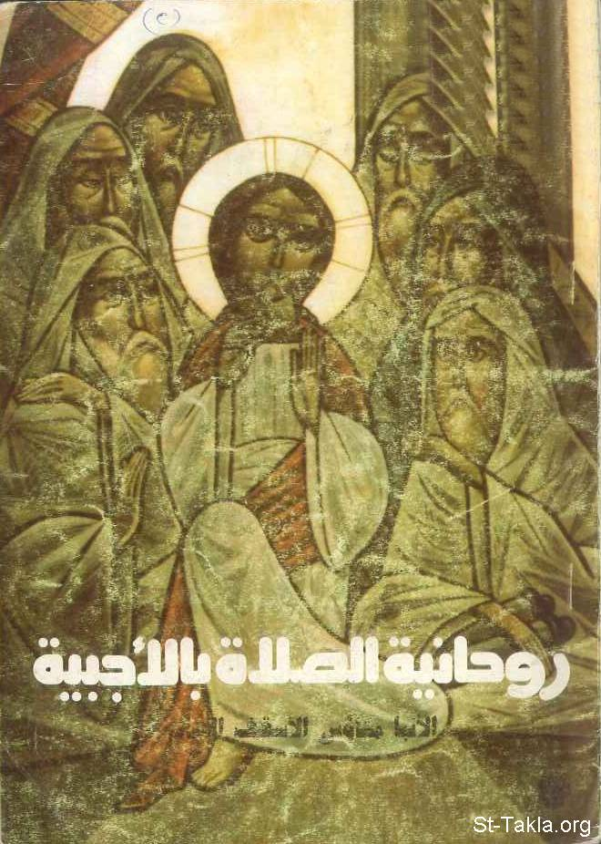

# روحانية الصلاة بالأجبية

**المؤلف / Author:** الأنبا متاؤس أسقف دير السريان
**المصدر / Source:** [st-takla.org](https://st-takla.org/Full-Free-Coptic-Books/FreeCopticBooks-013-His-Grace-Bishop-Metaos/002-Rohaneyat-Al-Sala-Bel-Agbeya/Spirituality-of-Agbia-Prayer__00-index.html)
**الموضوعات / Topics:** —

📘 **[Download EPUB / تحميل الكتاب](rohaneyat-al-sala-bel-agbeya.epub)**

## نبذة

نشكر نيافة الحبر الجليل الأنبا متاؤس أسقف دير السريان على السماح لنا في موقع الأنبا تكلا هيمانوت بوضع هذا الكتاب هنا.

## الفصول / Chapters (55)

1. [روحانية الصلاة بالأجبية](chapters/01-Spirituality-of-Agbia-Prayer__01-Intro-1/)
2. [الأجبية](chapters/02-Spirituality-of-Agbia-Prayer__02-Intro-2/)
3. [حكمة الكنيسة في ترتيب صلوات الأجبية](chapters/03-Spirituality-of-Agbia-Prayer__03-Wisdom/)
4. [صلاة باكر](chapters/04-Spirituality-of-Agbia-Prayer__04-Prime/)
5. [صلاة الساعة الثالثة](chapters/05-Spirituality-of-Agbia-Prayer__05-Terce/)
6. [صلاة الساعة السادسة](chapters/06-Spirituality-of-Agbia-Prayer__06-Sext/)
7. [صلاة الساعة التاسعة](chapters/07-Spirituality-of-Agbia-Prayer__07-None/)
8. [صلاة الغروب](chapters/08-Spirituality-of-Agbia-Prayer__08-Vespers/)
9. [صلاة النوم](chapters/09-Spirituality-of-Agbia-Prayer__09-Compline/)
10. [صلاة نصف الليل](chapters/10-Spirituality-of-Agbia-Prayer__10-Midnight-Intro/)
11. [الخدمة الأولى من صلاة نصف الليل](chapters/11-Spirituality-of-Agbia-Prayer__11-Midnight-1/)
12. [الخدمة الثانية من صلاة نصف الليل](chapters/12-Spirituality-of-Agbia-Prayer__12-Midnight-2/)
13. [الخدمة الثالثة من صلاة نصف الليل](chapters/13-Spirituality-of-Agbia-Prayer__13-Midnight-3/)
14. [إطالة الوجود في حضرة الله](chapters/14-Spirituality-of-Agbia-Prayer__14-Time/)
15. [تشمل كل أنواع الصلاة](chapters/15-Spirituality-of-Agbia-Prayer__15-All/)
16. [عنصر الشكر](chapters/16-Spirituality-of-Agbia-Prayer__16-Thanks/)
17. [عنصر التوبة والانسحاق](chapters/17-Spirituality-of-Agbia-Prayer__17-Repentance/)
18. [عنصر التمجيد والتسبيح](chapters/18-Spirituality-of-Agbia-Prayer__18-Praise/)
19. [عنصر الطلب](chapters/19-Spirituality-of-Agbia-Prayer__19-Asking/)
20. [حفظ تذكارات مقدسة](chapters/20-Spirituality-of-Agbia-Prayer__20-Memories/)
21. [طلب الرحمة بلجاجة](chapters/21-Spirituality-of-Agbia-Prayer__21-Mercy/)
22. [صلوات حسب مشيئة الله](chapters/22-Spirituality-of-Agbia-Prayer__22-God-s-Will/)
23. [درس في تعليم طريقة الصلاة](chapters/23-Spirituality-of-Agbia-Prayer__23-Lesson/)
24. [عنصر الوعظ](chapters/24-Spirituality-of-Agbia-Prayer__24-Preaching/)
25. [شغل النهار كله روحيًا](chapters/25-Spirituality-of-Agbia-Prayer__25-Busy/)
26. [وجبة روحية دسمة](chapters/26-Spirituality-of-Agbia-Prayer__26-Meal/)
27. [حديث مُتبادَل مع الله](chapters/27-Spirituality-of-Agbia-Prayer__27-Conversation/)
28. [شكر لله على خلاص المسيح على الصليب](chapters/28-Spirituality-of-Agbia-Prayer__28-Salvation/)
29. [للصلاة بالأجبية فوائد روحية عديدة](chapters/29-Spirituality-of-Agbia-Prayer__29-Benefits/)
30. [التسبيح بالمزامير بداية حياتنا في السماء](chapters/30-Spirituality-of-Agbia-Prayer__30-Heaven/)
31. [قراءة الكتاب المقدس والصلاة هما شهيق وزفير](chapters/31-Spirituality-of-Agbia-Prayer__31-Bible/)
32. [أهمية معرفة المؤمن لمعاني المزامير](chapters/32-Spirituality-of-Agbia-Prayer__32-Meaning/)
33. [تلاوة المزامير بروح العهد الجديد](chapters/33-Spirituality-of-Agbia-Prayer__33-New-Testament/)
34. [يا لروعة الصلاة بالمزامير](chapters/34-Spirituality-of-Agbia-Prayer__34-Great/)
35. [الأسباب التي دعت الكنيسة إلى استخدام المزامير في الصلاة](chapters/35-Spirituality-of-Agbia-Prayer__35-Reasons/)
36. [فائدة الصلاة حسب نظام معين موضوع](chapters/36-Spirituality-of-Agbia-Prayer__36-Use/)
37. [الرب يسوع المسيح هو مثلنا الأعلى في الصلاة وترتيبها](chapters/37-Spirituality-of-Agbia-Prayer__37-Jesus/)
38. [اهتمام الكنيسة الأولى بصلوات الساعات](chapters/38-Spirituality-of-Agbia-Prayer__38-Church/)
39. [أقوال الآباء القديسين في أهمية صلوات السواعي](chapters/39-Spirituality-of-Agbia-Prayer__39-Patrology/)
40. [الطريقة المُثلى للصلاة بالأجبية 1](chapters/40-Spirituality-of-Agbia-Prayer__40-Way-1/)
41. [أفضل طريقة للصلاة بالأجبية 2](chapters/41-Spirituality-of-Agbia-Prayer__41-Way-2/)
42. [العذراء القديسة مريم في الأجبية](chapters/42-Spirituality-of-Agbia-Prayer__42-St-Mary/)
43. [العذراء في قطعة صلاة باكر](chapters/43-Spirituality-of-Agbia-Prayer__43-St-Mary-Baker/)
44. [العذراء في قطعة السلام لكِ](chapters/44-Spirituality-of-Agbia-Prayer__44-St-Mary-El-Salam/)
45. [العذراء في مقدمة قانون الإيمان](chapters/45-Spirituality-of-Agbia-Prayer__45-St-Mary-Canon/)
46. [العذراء في قطع الساعة الثالثة](chapters/46-Spirituality-of-Agbia-Prayer__46-St-Mary-Talta/)
47. [العذراء في قطع الساعة السادسة](chapters/47-Spirituality-of-Agbia-Prayer__47-St-Mary-Satta/)
48. [العذراء في قطع الساعة التاسعة](chapters/48-Spirituality-of-Agbia-Prayer__48-St-Mary-Tas3a/)
49. [العذراء في قطع الغروب](chapters/49-Spirituality-of-Agbia-Prayer__49-St-Mary-Ghroub/)
50. [العذراء في قطع النوم](chapters/50-Spirituality-of-Agbia-Prayer__50-St-Mary-Noum/)
51. [العذراء في قطع الخدمة الأولى من صلاة نصف الليل](chapters/51-Spirituality-of-Agbia-Prayer__51-St-Mary-Nos-El-Leil-1/)
52. [العذراء في قطع الخدمة الثانية من صلاة نصف الليل](chapters/52-Spirituality-of-Agbia-Prayer__52-St-Mary-Nos-El-Leil-2/)
53. [العذراء في قطع الخدمة الثالثة من صلاة نصف الليل](chapters/53-Spirituality-of-Agbia-Prayer__53-St-Mary-Nos-El-Leil-3/)
54. [العذراء في تحليل صلاة نصف الليل](chapters/54-Spirituality-of-Agbia-Prayer__54-St-Mary-Nos-El-Leil-Ta7lil/)
55. [المراجع](chapters/55-Spirituality-of-Agbia-Prayer__55-References/)

---
*هذا الكتاب مجاني للنشر والتوزيع لخلاص كل نفس. This book is free to share and distribute for the salvation of every soul.*
