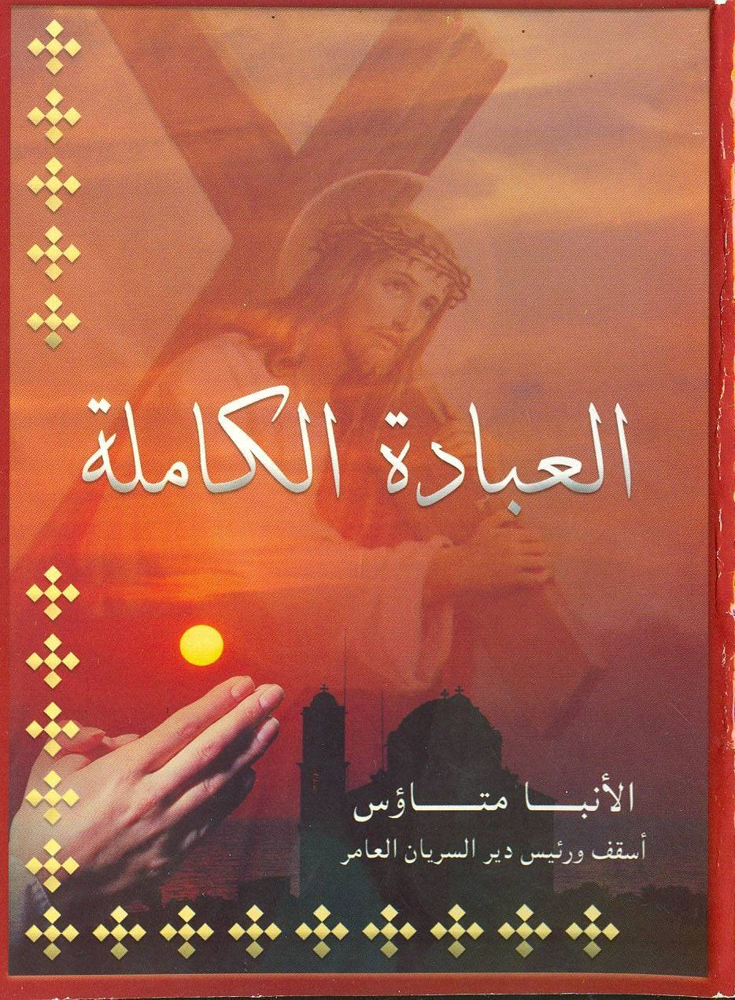

# العبادة الكاملة

**المؤلف / Author:** الأنبا متاؤس
**المصدر / Source:** [st-takla.org](https://st-takla.org/books/anba-metaos/worship/index.html)
**الموضوعات / Topics:** —

📘 **[Download EPUB / تحميل الكتاب](worship.epub)**

## نبذة

نشكر نيافة الحبر الجليل الأنبا متاؤس أسقف دير السريان على السماح لنا في موقع الأنبا تكلا هيمانوت بوضع هذا الكتاب هنا.

## الفصول / Chapters (10)

1. [مقدمة](chapters/01-intro/)
2. [العطاء المقبول](chapters/02-giving/)
3. [عظمة الصدقة وبركات العطاء](chapters/03-greatness/)
4. [أنواع الصدقة](chapters/04-kinds/)
5. [كيف نقدم عطاءنا؟](chapters/05-how/)
6. [الصلاة المقبولة](chapters/06-pray/)
7. [شروط جسدية تساعد على ضبط الفكر أثناء الصلاة](chapters/07-though/)
8. [الصوم المقبول ومعناه](chapters/08-fasting/)
9. [شروط الصوم المقبول](chapters/09-conditions/)
10. [تطهير الحواس الباطنية أثناء الصوم](chapters/10-senses/)

---
*هذا الكتاب مجاني للنشر والتوزيع لخلاص كل نفس. This book is free to share and distribute for the salvation of every soul.*
