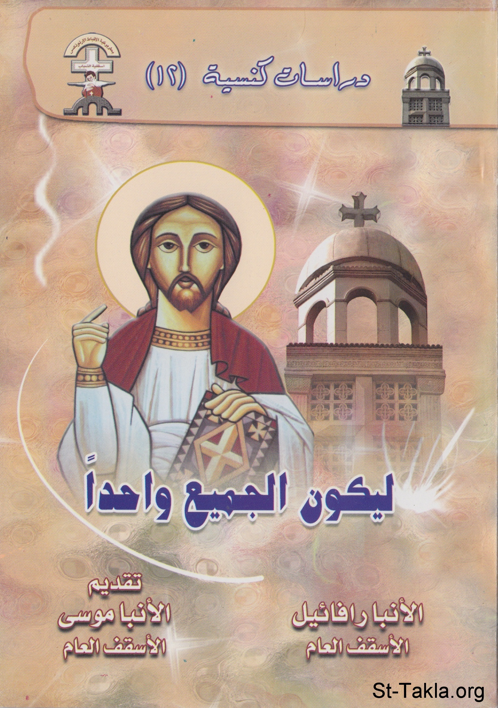

# ليكون الجميع واحدًا

**المؤلف / Author:** الأنبا رافائيل الأسقف العام لكنائس وسط القاهرة
**المصدر / Source:** [st-takla.org](https://st-takla.org/books/anba-raphael/all-may-be-one/index.html)
**الموضوعات / Topics:** —

📘 **[Download EPUB / تحميل الكتاب](all-may-be-one.epub)**

## نبذة

نشكر نيافة الحبر الجليل الأنبا رافائيل الأسقف العام لكنائس وسط القاهرة على السماح لنا في موقع الأنبا تكلا هيمانوت بوضع هذا الكتاب هنا.

## الفصول / Chapters (21)

1. [تقديم](chapters/01-introduction/)
2. [مقدمة](chapters/02-preface/)
3. [وحدة الكنيسة](chapters/03-oneness/)
4. [تمهيد: من أجل هذا أتيت](chapters/04-come/)
5. [آدم القديم.. وفساد الطبيعة](chapters/05-old-adam/)
6. [القصة من البداية الفردوسية](chapters/06-start/)
7. [التجسد يُعالج المشكلة](chapters/07-incarnation/)
8. [العهد القديم يُمهِّد للتجسد الإلهي](chapters/08-paving/)
9. [السيد المسيح (آدم الجديد) وتجديد الطبيعة البشرية](chapters/09-new-adam/)
10. [تعليم السيد المسيح عن الحب والوحدة](chapters/10-love-unity/)
11. [السيد المسيح يُصلي من أجل وحدة الكنيسة](chapters/11-sacraments/)
12. [السيد المسيح يؤسس الكنيسة ليجمع فيها أبناءه بالأسرار المقدسة](chapters/12-holy-spirit/)
13. [الأسرار الكنسية قنوات الروح القدس](chapters/13-ways/)
14. [سر المعمودية المقدس - كتاب ليكون الجميع واحدً](chapters/14-baptism/)
15. [سر الميرون المقدس](chapters/15-oil/)
16. [سر التوبة والاعتراف](chapters/16-confession/)
17. [سر مسحة المرضى](chapters/17-unction/)
18. [سر الكهنوت](chapters/18-priesthood/)
19. [سر الإفخارستيا](chapters/19-eucharist/)
20. [سر الزيجة](chapters/20-matrimony/)
21. [الحرب ضد الهرطقات](chapters/21-war-against-heresies/)

---
*هذا الكتاب مجاني للنشر والتوزيع لخلاص كل نفس. This book is free to share and distribute for the salvation of every soul.*
