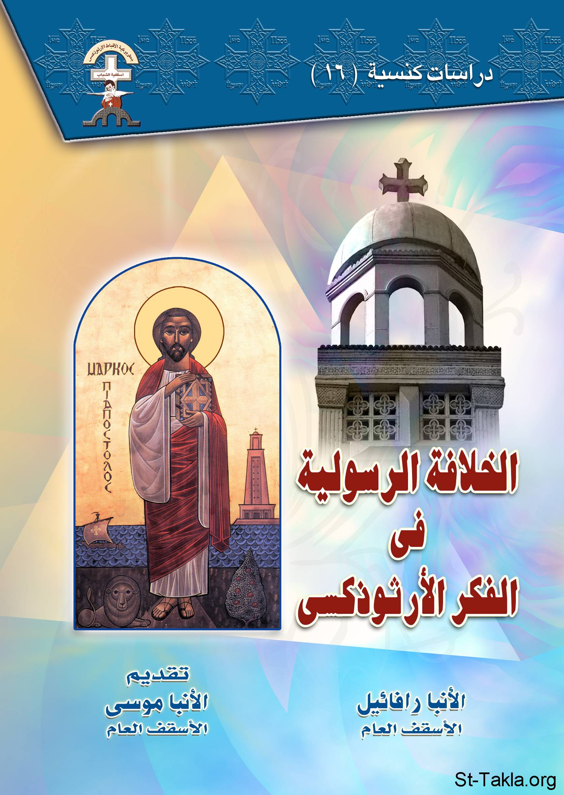

# الخلافة الرسولية في الفكر الأرثوذكسي

**المؤلف / Author:** الأنبا رافائيل الأسقف العام لكنائس وسط القاهرة
**المصدر / Source:** [st-takla.org](https://st-takla.org/books/anba-raphael/apostolic-succession/index.html)
**الموضوعات / Topics:** —

📘 **[Download EPUB / تحميل الكتاب](apostolic-succession.epub)**

## نبذة

نشكر نيافة الحبر الجليل الأنبا رافائيل الأسقف العام لكنائس وسط القاهرة على السماح لنا في موقع الأنبا تكلا هيمانوت بوضع هذا الكتاب هنا. وهو من سلسلة "دراسات كنسيَّة" (16).

## الفصول / Chapters (16)

1. [تقديم](chapters/01-introduction/)
2. [مقدمة](chapters/02-preface/)
3. [الخلفية التاريخية للخلافة الرسولية](chapters/03-history/)
4. [السيد المسيح يُقيم رسلًا للخدمة](chapters/04-christ/)
5. [الكنيسة في أيام الآباء الرسل](chapters/05-church/)
6. [الآباء الرسل يُقيمون أساقفة](chapters/06-apostles/)
7. [الوضع بعد انتقال الرسل إلى الفردوس](chapters/07-apostles-death/)
8. [الخلفية الكتابية للخلافة الرسولية وتسلسل الكهنوت](chapters/08-priesthood/)
9. [إجراءات السيامة الكهنوتية](chapters/09-ordination/)
10. [خطورة عدم وجود خلافة رسولية](chapters/10-dangers/)
11. [مواقف من التاريخ الكنسي عن الخلافة الرسولية](chapters/11-events/)
12. [السيمونية](chapters/12-simonism/)
13. [القديس كليمندس أسقف روما](chapters/13-clement/)
14. [القديس أغناطيوس أسقف أنطاكية](chapters/14-ignatius/)
15. [مشكلة ملاتيوس أسقف أسيوط](chapters/15-melatios/)
16. [هل إثبات التسلسل الرسولي الكهنوتي كافٍ وحده لإثبات شرعية أي كاهن؟](chapters/16-legitimac/)

---
*هذا الكتاب مجاني للنشر والتوزيع لخلاص كل نفس. This book is free to share and distribute for the salvation of every soul.*
