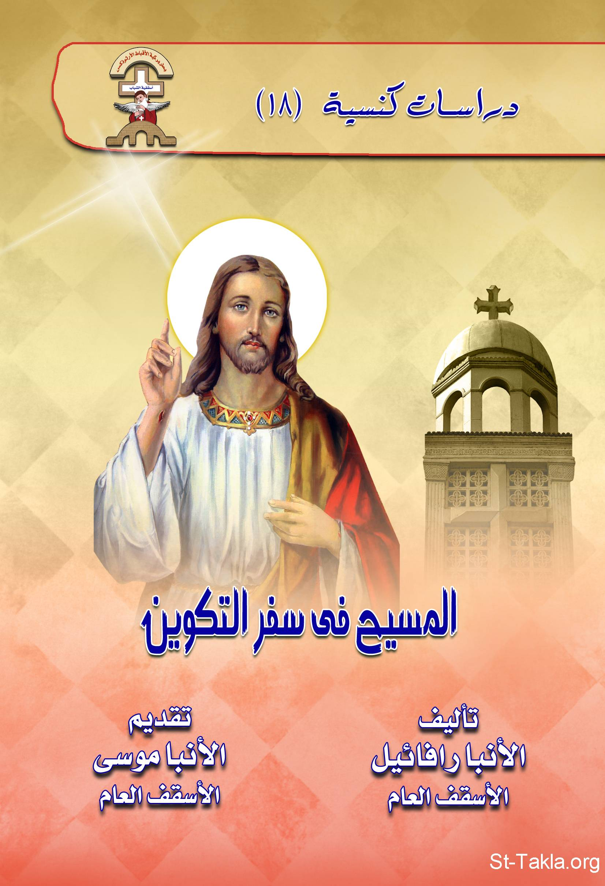

# المسيح في سفر التكوين

**المؤلف / Author:** الأنبا رافائيل الأسقف العام لكنائس وسط القاهرة
**المصدر / Source:** [st-takla.org](https://st-takla.org/books/anba-raphael/christ-in-genesis/index.html)
**الموضوعات / Topics:** —

📘 **[Download EPUB / تحميل الكتاب](christ-in-genesis.epub)**

## نبذة

نشكر نيافة الحبر الجليل الأنبا رافائيل الأسقف العام لكنائس وسط القاهرة على السماح لنا في موقع الأنبا تكلا هيمانوت بوضع هذا الكتاب هنا. وهو من سلسلة "دراسات كنسيَّة" (18).

## الفصول / Chapters (27)

1. [تقديم](chapters/01-introduction/)
2. [مقدمة: مسيحنا فوق الزمان](chapters/02-preface/)
3. [المسيح الخالق](chapters/03-creator/)
4. [اليوم السابع](chapters/04-seventh-day/)
5. [النفخة المقدسة](chapters/05-breath-of-life/)
6. [صورة الله](chapters/06-gods-image/)
7. [آدم الجديد](chapters/07-first-adam/)
8. [أول وعد: نسل المرأة يسحق رأس الحية](chapters/08-first-promise/)
9. [المسيح إلهنا يحمل عنا العقوبة](chapters/09-damnation/)
10. [أول ذبيحة: ذبيحة هابيل](chapters/10-abel-sacrifice/)
11. [شجرة الحياة](chapters/11-tree-of-life/)
12. [الابن الأول: هابيل](chapters/12-abel/)
13. [أخنوخ البار](chapters/13-enoch/)
14. [آدم الجديد.. نوح البار](chapters/14-noah/)
15. [برج بابل والعنصرة](chapters/15-babel-tower/)
16. [إبراهيم الرأس](chapters/16-abraham-patriarch/)
17. [ملكي صادق](chapters/17-melchizedek/)
18. [الظهور لإبراهيم](chapters/18-abraham-apparition/)
19. [إبراهيم وسارة وهاجر](chapters/19-abraham-wives/)
20. [عهد الختان](chapters/20-circumcission-promise/)
21. [قصة ذبح إسحاق](chapters/21-isaac-sacrifice/)
22. [زواج إسحاق](chapters/22-isaac-marriage/)
23. [السيد المسيح في حياة أبينا يعقوب](chapters/23-jacob/)
24. [يوسف الصديق](chapters/24-joseph/)
25. [بركة يعقوب لأبنائه](chapters/25-jacob-sons/)
26. [نزول يعقوب وأسرته إلى مصر](chapters/26-jacob-egypt/)
27. [خاتمة](chapters/27-epilogue/)

---
*هذا الكتاب مجاني للنشر والتوزيع لخلاص كل نفس. This book is free to share and distribute for the salvation of every soul.*
