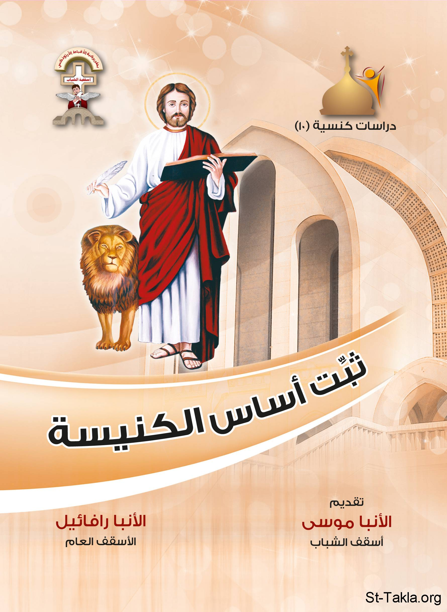

# ثبت أساس الكنيسة: رأي في اللاطائفية

**المؤلف / Author:** الأنبا رافائيل الأسقف العام لكنائس وسط القاهرة
**المصدر / Source:** [st-takla.org](https://st-takla.org/books/anba-raphael/church/index.html)
**الموضوعات / Topics:** —

📘 **[Download EPUB / تحميل الكتاب](church.epub)**

## نبذة

نشكر نيافة الحبر الجليل الأنبا رافائيل الأسقف العام لكنائس وسط القاهرة على السماح لنا في موقع الأنبا تكلا هيمانوت بوضع هذا الكتاب هنا. وهو من سلسلة "دراسات كنسيَّة" (10).

## الفصول / Chapters (19)

1. [إهداء - كتاب رأي في اللاطائفية: ثبت أساس الكنيسة](chapters/01-dedication/)
2. [تقديم للأنبا موسى أسقف الشباب - كتاب رأي في اللاطائفية: ثبت أساس الكنيسة](chapters/02-preface/)
3. [المقدمة: لماذا هذا الكتاب؟ - كتاب رأي في اللاطائفية: ثبت أساس الكنيسة](chapters/03-intro/)
4. [السيد المسيح والعقيدة - كتاب رأي في اللاطائفية: ثبت أساس الكنيسة](chapters/04-jesus/)
5. [هل اهتم السيد المسيح بالفكر العقيدي في تعليمه؟ - كتاب رأي في اللاطائفية: ثبت أساس الكنيسة](chapters/05-creed/)
6. [تعاليم السيد المسيح عن الخلاص - كتاب رأي في اللاطائفية: ثبت أساس الكنيسة](chapters/06-salvation/)
7. [تعاليم السيد المسيح عن العقائد - كتاب رأي في اللاطائفية: ثبت أساس الكنيسة](chapters/07-dogma/)
8. [تعاليم السيد المسيح في اللاهوتيات - كتاب رأي في اللاطائفية: ثبت أساس الكنيسة](chapters/08-divinity/)
9. [موضوعات أخرى شرحها السيد المسيح - كتاب رأي في اللاطائفية: ثبت أساس الكنيسة](chapters/09-subjects/)
10. [الآباء الرسل والعقيدة - كتاب رأي في اللاطائفية: ثبت أساس الكنيسة](chapters/10-apostles/)
11. [تعليم الآباء الرسل بخصوص أسرار الكنيسة - كتاب رأي في اللاطائفية: ثبت أساس الكنيسة](chapters/11-sacraments/)
12. [بولس الرسول والفكر العقيدي - كتاب رأي في اللاطائفية: ثبت أساس الكنيسة](chapters/12-paul/)
13. [الكنيسة والفكر العقيدي - كتاب رأي في اللاطائفية: ثبت أساس الكنيسة](chapters/13-church/)
14. [الليتورﭽيا والعقيدة - كتاب رأي في اللاطائفية: ثبت أساس الكنيسة](chapters/14-liturgical/)
15. [موقف الآباء من العقيدة - كتاب رأي في اللاطائفية: ثبت أساس الكنيسة](chapters/15-fathers/)
16. [العقيدة والسلوك - كتاب رأي في اللاطائفية: ثبت أساس الكنيسة](chapters/16-behavior/)
17. [بسطاء كالحمام - كتاب رأي في اللاطائفية: ثبت أساس الكنيسة](chapters/17-simple/)
18. [ما هو الحق؟ - كتاب رأي في اللاطائفية: ثبت أساس الكنيسة](chapters/18-right/)
19. [خاتمة - كتاب رأي في اللاطائفية: ثبت أساس الكنيسة](chapters/19-epilogue/)

---
*هذا الكتاب مجاني للنشر والتوزيع لخلاص كل نفس. This book is free to share and distribute for the salvation of every soul.*
