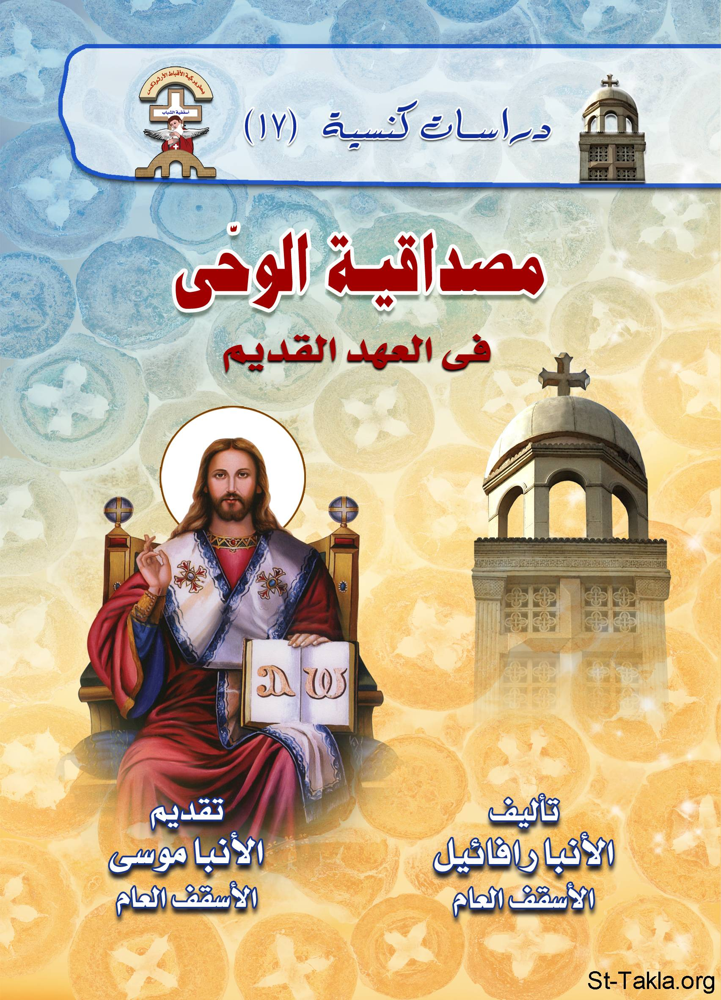

# مصداقية الوحي في العهد القديم

**المؤلف / Author:** الأنبا رافائيل الأسقف العام لكنائس وسط القاهرة
**المصدر / Source:** [st-takla.org](https://st-takla.org/books/anba-raphael/credibility-of-revelation/index.html)
**الموضوعات / Topics:** —

📘 **[Download EPUB / تحميل الكتاب](credibility-of-revelation.epub)**

## نبذة

نشكر نيافة الحبر الجليل الأنبا رافائيل الأسقف العام لكنائس وسط القاهرة على السماح لنا في موقع الأنبا تكلا هيمانوت بوضع هذا الكتاب هنا. وهو من سلسلة "دراسات كنسيَّة" (17).

## الفصول / Chapters (13)

1. [تقديم](chapters/01-introduction/)
2. [مقدمة: الوحي في العهد القديم](chapters/02-preface/)
3. [السيد المسيح يُكمِّل العهد القديم](chapters/03-christ-completes/)
4. [موقف السيد المسيح من أسفار العهد القديم](chapters/04-old-testament/)
5. [شهادة أسفار العهد القديم](chapters/05-testimony/)
6. [العهد الجديد يشهد للعهد القديم](chapters/06-new-testament/)
7. [السيد المسيح يشهد للعهد القديم](chapters/07-christ-testifies/)
8. [شخصيات من العهد القديم يشهد السيد المسيح لوجودها تاريخيًا](chapters/08-characters/)
9. [استخدام السيد المسيح لآيات من العهد القديم](chapters/09-verses/)
10. [أحداث في العهد القديم يشهد السيد المسيح لصحتها تاريخيًا](chapters/10-events/)
11. [شهادة السيد المسيح للناموس والأنبياء](chapters/11-law-prophets/)
12. [العهد القديم يشهد للسيد المسيح](chapters/12-jesus/)
13. [الكنيسة الأولى استخدمت أسفار العهد القديم](chapters/13-first-church/)

---
*هذا الكتاب مجاني للنشر والتوزيع لخلاص كل نفس. This book is free to share and distribute for the salvation of every soul.*
