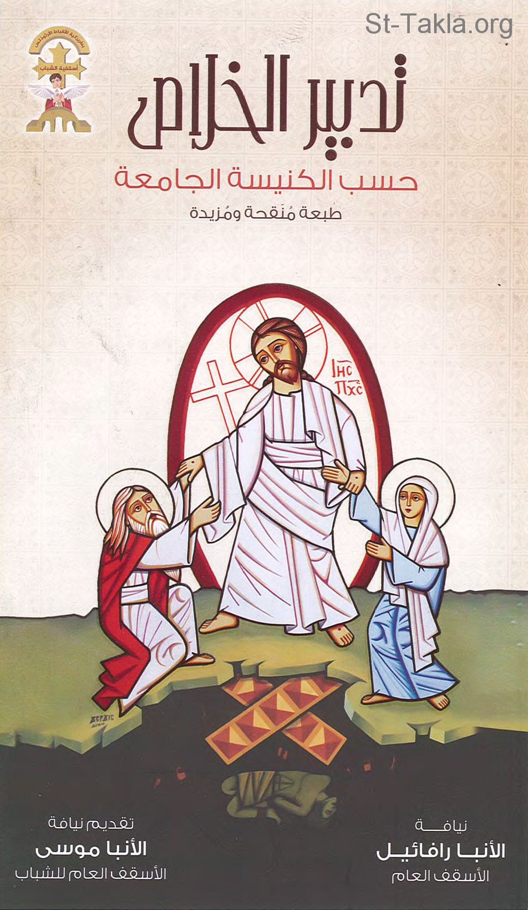

# تدبير الخلاص حسب الكنيسة الجامعة

**المؤلف / Author:** الأنبا رافائيل الأسقف العام لكنائس وسط القاهرة
**المصدر / Source:** [st-takla.org](https://st-takla.org/books/anba-raphael/economy-of-salvation/index.html)
**الموضوعات / Topics:** —

📘 **[Download EPUB / تحميل الكتاب](economy-of-salvation.epub)**

## نبذة

نشكر نيافة الحبر الجليل الأنبا رافائيل الأسقف العام لكنائس وسط القاهرة على السماح لنا في موقع الأنبا تكلا هيمانوت بوضع هذا الكتاب هنا.

## الفصول / Chapters (76)

1. [إهداء](chapters/01-dedication/)
2. [مقدمة](chapters/02-introduction/)
3. [تقديم](chapters/03-presentation/)
4. [شكر وتقدير](chapters/04-thanks/)
5. [نبذة مختصرة عن البحث](chapters/05-overview/)
6. [مقدمة البحث](chapters/06-chapter1-research/)
7. [هدف البحث الرد على المشاكل اللاهوتية التفسيرية الحديثة](chapters/07-response/)
8. [غرض البحث](chapters/08-purpose/)
9. [هل الكنيسة القبطية الأرثوذكسية قد حفظت حتى اليوم، ما تَسَلَّمَتْهُ من الكنيسة الجامعة الواحدة، منذ تأسيس الكنيسة بحلول الروح القدس في يوم الخمسين إلى ما قبل الانشقاق سنة 451 م. في خلقيدونية؟](chapters/09-did-church-preserve-teachings/)
10. [محدودية البحث](chapters/10-limits/)
11. [الخلاصة](chapters/11-conclusion/)
12. [خلفيات توضيحية](chapters/12-backgrounds/)
13. [التسلسل التاريخي للفكر المسيحي](chapters/13-christian-thought/)
14. [إيمان الكنيسة راسخ](chapters/14-fixed-faith/)
15. [الآباء المعتبرون أعمدة في الكنيسة القبطية الأرثوذكسية: الآباء الرسوليون، آباء ما قبل نيقية، آباء نيقية، آباء ما بعد نيقية](chapters/15-church-pillars/)
16. [الإيمان سر لا يمكن احتواؤه](chapters/16-faith-is-a-mystery/)
17. [الإطار النظري للبحث](chapters/17-theoretical-framework/)
18. [قضية الخَلْق من العدم](chapters/18-creation-from-nothing/)
19. [مَنْ هو الإنسان؟](chapters/19-who-is-man/)
20. [وحدة الجنس البشري](chapters/20-unity-of-the-human-race/)
21. [السقوط](chapters/21-the-fall/)
22. [خلاصة الفصل الأول](chapters/22-chapter1-summary/)
23. [عرض لأبحاث سابقة](chapters/23-chapter2-previous-research/)
24. [دراسات في الكنيسة القبطية الأرثوذكسية](chapters/24-coptic-studies/)
25. [دراسات في الكنيسة البيزنطية](chapters/25-byzantine-studies/)
26. [الخطية الأصلية](chapters/26-chapter3-the-original-sin/)
27. [قضية علاقة الجنس البشري بخطية آدم، وهل تأثَّر بخطيته أم بنتائجها فقط أي الموت والفساد، أم لم يتأثر على الإطلاق](chapters/27-sin-of-adam/)
28. [كيف تعاملت الكنيسة الجامعة الأولى مع قضية وراثة خطية آدم؟](chapters/28-early-universal-church/)
29. [مصطلح الخطية الأصلية](chapters/29-original-sin/)
30. [مصطلح الخطية القديمة أو الأولى أو الأصلية أو الجدية في كتابات الآباء](chapters/30-term-patrology/)
31. [فكرة وراثة الخطية الأصلية بعيدًا عن اللفظ نفسه](chapters/31-inheriting-original-sin/)
32. [براهين أخرى للإيمان بوراثة خطية آدم](chapters/32-other-proofs/)
33. [معمودية الأطفال من براهين الإيمان بوراثة خطية آدم](chapters/33-infant-baptism/)
34. [السيد المسيح شابهنا في كل شيء ماعدا الخطية، من براهين الإيمان بوراثة خطية آدم](chapters/34-jesus-christ-is-like-us/)
35. [السيد المسيح أخذ شبه جسد الخطية، من براهين الإيمان بوراثة خطية آدم](chapters/35-jesus-christ-took-on-likeness/)
36. [الحية النحاسية، من براهين الإيمان بوراثة خطية آدم](chapters/36-brass-serpent/)
37. [شهادة ليتورجية الكنيسة، من براهين الإيمان بوراثة خطية آدم](chapters/37-church-liturgy/)
38. [مشكلة ترجمة (رومية 5): بإنسان واحد دخلت الخطية.. إذ أخطأ الجميع.. بمعصية الإنسان الواحد جعل الكثيرون خطاة](chapters/38-romans-5/)
39. [تدبير الخلاص](chapters/39-chapter4-the-plan-of-salvation/)
40. [ملخص عقيدتنا في تدبير الخلاص](chapters/40-doctrine-salvation/)
41. [أعمال المسيح الخلاصية: أوجه ما عمله المسيح معنا وفينا](chapters/41-christ-salvation/)
42. [مفاعيل التجسد والفداء](chapters/42-the-effects-of-christ-works/)
43. [إعلان محبة الله للبشر من مفاعيل التجسد والفداء](chapters/43-declaring-gods-love/)
44. [المسيح علّم البشرية عن الآب (المسيح المعلم)](chapters/44-christ-the-teacher/)
45. [صار المسيح هو الوسيط لدى الآب وشفيع البشرية](chapters/45-christ-mediator/)
46. [صار المسيح هو رأس وبكر وجذر جديد للبشر ونائب وشفيع كفاري وسابق لأجلنا](chapters/46-christ-head-firstborn-new-root/)
47. [تحمل المسيح العقوبة الإلهية عوضًا عن البشر](chapters/47-christ-punishment/)
48. [موت المسيح نيابة عن البشر](chapters/48-christs-death/)
49. [هزيمة الموت من مفاعيل التجسد والفداء](chapters/49-defeating-death/)
50. [تسديد الديْن الذي كان علينا بواسطة المسيح](chapters/50-paying-the-debt/)
51. [شفاء الطبيعة البشرية من مفاعيل التجسد والفداء](chapters/51-healing-human-nature/)
52. [استعادة الصورة الإلهية في الإنسان من مفاعيل التجسد والفداء](chapters/52-restoring-the-divine-image/)
53. [استعادة التبني لله الآب من مفاعيل التجسد والفداء](chapters/53-restoring-adoption-to-god/)
54. [المسيح أعطانا أن نكون شركاء الطبيعة الإلهية](chapters/54-partakers-of-the-divine-nature/)
55. [نتائج هذه الدراسة](chapters/55-chapter5-results-of-this-study/)
56. [تعليم الكنيسة القبطية الأرثوذكسية هو نفس تعليم الكنيسة الواحدة الجامعة بخصوص وراثة خطية آدم وفهم تدبير الخلاص الذي قام به السيد المسيح](chapters/56-coptic-orthodox-church-faith/)
57. [عقيدة "وراثة خطية آدم" عقيدة أساسية لفهم تدبير السيد المسيح في خلاص الجنس البشري](chapters/57-understanding-econommy/)
58. [عمل السيد المسيح في تدبير الخلاص متعدد الاتجاهات والنتائج](chapters/58-multiple-results/)
59. [عرض ملخص للإجابة على الأسئلة الفرعية لهذا البحث](chapters/59-answers/)
60. [هل ورثنا خطية آدم أم نتائجها فقط (أي الموت والفساد فقط)؟](chapters/60-inherit-sin-and-consequences/)
61. [فكرة الفرق بين اللاهوت الشرقي، واللاهوت الغربي، ومتى نشأ هذا الاختلاف، وكيف كان الشرق (القسطنطينية) والغرب (روما) في شركة معًا حتى القرن الحادي عشر الميلادي (سنة 1054 م.)؟](chapters/61-eastern-western-theology/)
62. [هل الموت الذي وقع على آدم ونسله، كان نتيجة، أم عقوبة من الله؟ وهل الله أصلًا يعاقب الأشرار؟ وهل خلق الجحيم، وجهنم؟ أم هي مجرد حالة نفسية نتيجة الانفصال عن الله وعن مجده؟](chapters/62-is-death-result-or-punishment/)
63. [لو لم يخطئ آدم، هل كان سيتجسد الابن الوحيد؟](chapters/63-incarnation/)
64. [هل من الخطأ أن نقول (مات المسيح عنا) ونستخدم بدلًا منها (مات لأجلنا)؟ وما الفرق؟ وهل فعلًا فكرة أن المسيح مات عنا، وبدلًا عنا، وعوضًا عنا، هي فكرة غربية، لا يقبلها آباء الشرق؟](chapters/64-christ-died-for-us/)
65. [ما معنى الفادي؟ والفدية؟ والثمن الذي دُفِعَ في شرائنا؟ وَلِمَنْ دُفِع هذا الثمن؟ وما هو الدّين الذي كان علينا؟ وكيف سدده الرب يسوع بصليبه؟ وما معنى "ٱلَّذِي بِرُوحٍ أَزَلِيٍّ قَدَّمَ نَفْسَهُ لِلهِ" (عب 9: 14)؟](chapters/65-redeemer-ransom/)
66. [هل فعلًا تَبَنَّى الغرب النظرية القضائية في شرح تدبير الخلاص؟ ولم يقبلها آباء الشرق؟ هل لم تَرِد كلمة العدل في كتابات الآباء الشرقيين على الإطلاق كما يدّعون؟ هل خَلَت كتابات آباء الغرب من شرح البُعد الشفائي لصليب المسيح وخلاصه الثمين؟](chapters/66-judicial-vs-healing-theories/)
67. [هل كل البشر صُلبوا مع المسيح في الجلجثة؟ وما المقصود بـ(موت الجميع قد تم في جسد الرب)؟ وما معنى "«قَدْ دُسْتُ ٱلْمِعْصَرَةَ وَحْدِي، وَمِنَ ٱلشُّعُوبِ لَمْ يَكُنْ مَعِي أَحَدٌ" (إش 63: 3)؟](chapters/67-were-all-humans-crucified/)
68. [هل كل البشر قاموا معه؟ وصعدوا معه وجلسوا معه عن يمين الآب؟ بما فيهم غير المؤمنين، والملحدين، والأشرار؟ هل كلنا صعدنا معه، أم أنه أصعد باكورتنا إلى السماء؟](chapters/68-did-all-humans-rise/)
69. [ماذا يقصد الآباء بتركيزهم على تعبير (جسده الخاص، وهيكله الخاص، وأداته)؟](chapters/69-his-own-body/)
70. [ما معنى وحدتنا في المسيح؟ هل أن نصير الله؟ أم آلهة مثله تمامًا؟ أم متألهين؟ أم ماذا؟](chapters/70-unity-in-christ/)
71. [ماذا يُقصد بتجميع الكل في المسيح؟](chapters/71-gathering-all-in-christ/)
72. [ما قيمة ذبائح العهد القديم؟ وهل لها صلة ما بذبيحة السيد المسيح على الصليب؟](chapters/72-old-testament-sacrifices/)
73. [ما معنى "وَبِدُونِ سَفْكِ دَمٍ لَا تَحْصُلُ مَغْفِرَةٌ!" (عب 9: 22)؟ ولماذا سفك الدم؟ ولماذا الموت أصلًا كوسيلة للغفران؟](chapters/73-blood-and-forgiveness/)
74. [كيف نفهم أعمال المسيح الخلاصية؟](chapters/74-understanding-gods-works/)
75. [التوصيات](chapters/75-chapter6-recommendations/)
76. [قائمة المراجع](chapters/76-references/)

---
*هذا الكتاب مجاني للنشر والتوزيع لخلاص كل نفس. This book is free to share and distribute for the salvation of every soul.*
