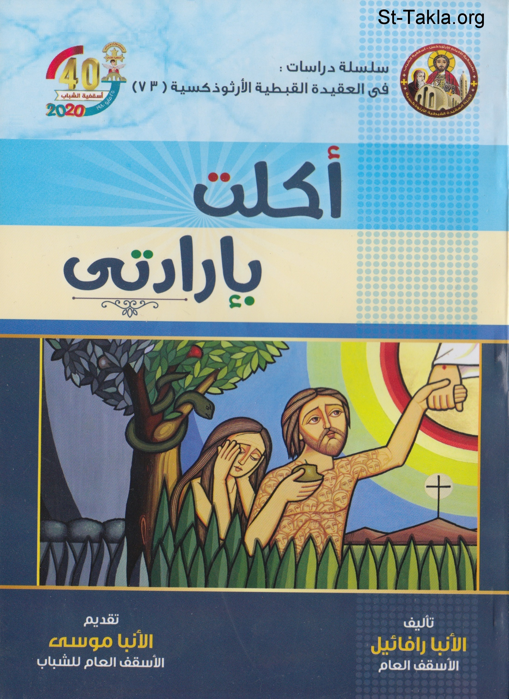

# أكلت بإرادتي

**المؤلف / Author:** الأنبا رافائيل الأسقف العام لكنائس وسط القاهرة
**المصدر / Source:** [st-takla.org](https://st-takla.org/books/anba-raphael/i-willingly-ate/index.html)
**الموضوعات / Topics:** —

📘 **[Download EPUB / تحميل الكتاب](i-willingly-ate.epub)**

## نبذة

نشكر نيافة الحبر الجليل الأنبا رافائيل الأسقف العام لكنائس وسط القاهرة على السماح لنا في موقع الأنبا تكلا هيمانوت بوضع هذا الكتاب هنا.

## الفصول / Chapters (17)

1. [تقديم](chapters/01-foreword/)
2. [تمهيد](chapters/02-preface/)
3. [كيف نفهم إيماننا](chapters/03-faith/)
4. [مصادر التعليم الكنسي](chapters/04-teaching-sources/)
5. [الكتاب المقدس: من مصادر التعليم الكنسي](chapters/05-bible/)
6. [آباء الكنيسة: من مصادر التعليم الكنسي](chapters/06-patrology/)
7. [الليتورجيا: من مصادر التعليم الكنسي](chapters/07-liturgy/)
8. [قوانين المجامع المسكونية والمحلية التي تعترف بها الكنيسة: من مصادر التعليم الكنسي](chapters/08-councils/)
9. [قضية خطية أبينا آدم](chapters/09-original-sin/)
10. [قوانين مجمع قرطاجنة المحلي حول خطية آدم](chapters/10-council-of-carthage/)
11. [قوانين مجمع أفسس المسكوني حول خطية آدم](chapters/11-council-of-ephesus/)
12. [ماذا يعني الحكم على شخص بالحرم الكنسي؟](chapters/12-excommunication/)
13. [باقي مصادر التعليم الكنسي](chapters/13-teaching/)
14. [في آدم خُلقنا](chapters/14-created-in-adam/)
15. [في آدم أخطأنا](chapters/15-sinned-in-adam/)
16. [في المسيح نتبرر بالنعمة](chapters/16-vindication-in-jesus/)
17. [خلاصة الإيمان المسيحي](chapters/17-summary/)

---
*هذا الكتاب مجاني للنشر والتوزيع لخلاص كل نفس. This book is free to share and distribute for the salvation of every soul.*
