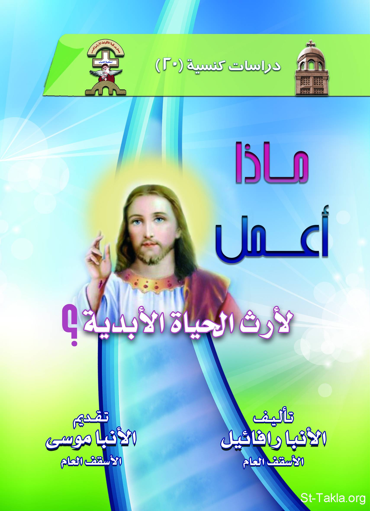

# ماذا أعمل لأرث الحياة الأبدية؟

**المؤلف / Author:** الأنبا رافائيل الأسقف العام لكنائس وسط القاهرة
**المصدر / Source:** [st-takla.org](https://st-takla.org/books/anba-raphael/inherit-eternal-life/index.html)
**الموضوعات / Topics:** —

📘 **[Download EPUB / تحميل الكتاب](inherit-eternal-life.epub)**

## نبذة

نشكر نيافة الحبر الجليل الأنبا رافائيل الأسقف العام لكنائس وسط القاهرة على السماح لنا في موقع الأنبا تكلا هيمانوت بوضع هذا الكتاب هنا. وهو من سلسلة "دراسات كنسيَّة" (20).

## الفصول / Chapters (10)

1. [تقديم - كتاب ماذا أعمل لأرث الحياة الأبدية](chapters/01-introduction/)
2. [مقدمة - كتاب ماذا أعمل لأرث الحياة الأبدية](chapters/02-preface/)
3. [الرجاء في الأبدية - كتاب ماذا أعمل لأرث الحياة الأبدية](chapters/03-entrnity/)
4. [مفهوم ضمان الملكوت وعدم هلاك المؤمن - كتاب ماذا أعمل لأرث الحياة الأبدية](chapters/04-concept/)
5. [أمثلة لمؤمنين حقيقيين هلكوا - كتاب ماذا أعمل لأرث الحياة الأبدية](chapters/05-perish/)
6. [إذا كان المؤمن الحقيقي ضامنًا للسماء، فلماذا أعطيت لنا وصايا في الإنجيل؟ - كتاب ماذا أعمل لأرث الحياة الأبدية](chapters/06-why-commandments/)
7. [حروب الشياطين والجهاد الروحي - كتاب ماذا أعمل لأرث الحياة الأبدية](chapters/07-satanic-wars/)
8. [أهمية الأعمال للخلاص الأبدي - كتاب ماذا أعمل لأرث الحياة الأبدية](chapters/08-works/)
9. [ماذا إذًا..؟! كيف أخْلُص؟ - كتاب ماذا أعمل لأرث الحياة الأبدية](chapters/09-salvation/)
10. [ختام الأمر كله - كتاب ماذا أعمل لأرث الحياة الأبدية](chapters/10-epilogue/)

---
*هذا الكتاب مجاني للنشر والتوزيع لخلاص كل نفس. This book is free to share and distribute for the salvation of every soul.*
