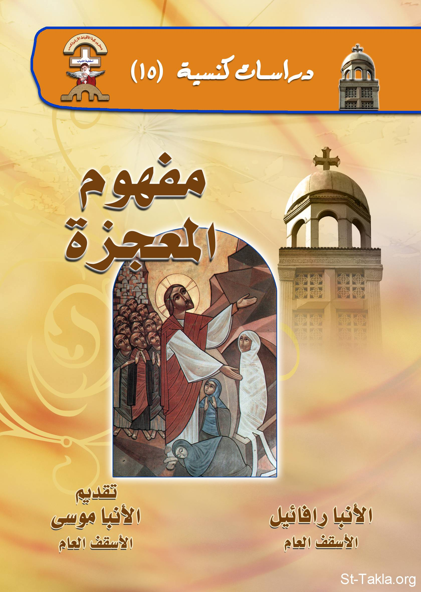

# مفهوم المعجزة

**المؤلف / Author:** الأنبا رافائيل الأسقف العام لكنائس وسط القاهرة
**المصدر / Source:** [st-takla.org](https://st-takla.org/books/anba-raphael/miracle/index.html)
**الموضوعات / Topics:** —

📘 **[Download EPUB / تحميل الكتاب](miracle.epub)**

## نبذة

نشكر نيافة الحبر الجليل الأنبا رافائيل الأسقف العام لكنائس وسط القاهرة على السماح لنا في موقع الأنبا تكلا هيمانوت بوضع هذا الكتاب هنا. وهو من سلسلة "دراسات كنسيَّة" (15).

## الفصول / Chapters (12)

1. [الهدف من المعجزة](chapters/01-introduction/)
2. [الهدف من المعجزة](chapters/02-preface/)
3. [ماهيَّة المعجزة](chapters/03-essence/)
4. [الله وحده هو صانع المعجزة](chapters/04-god-only/)
5. [القديسون والمعجزات](chapters/05-saints/)
6. [الهدف من المعجزة](chapters/06-target/)
7. [علاقة المعجزة بالإيمان](chapters/07-faith/)
8. [الشيطان والمعجزات](chapters/08-satan/)
9. [هل المعجزة علامة القداسة وصحة الإيمان؟](chapters/09-sign/)
10. [هل يجوز التباهي بالمعجزة والإعلان عنها؟](chapters/10-boastfulness/)
11. [المعجزة الحقيقية](chapters/11-jesus-the-true-miracle/)
12. [الختام](chapters/12-conclusion/)

---
*هذا الكتاب مجاني للنشر والتوزيع لخلاص كل نفس. This book is free to share and distribute for the salvation of every soul.*
