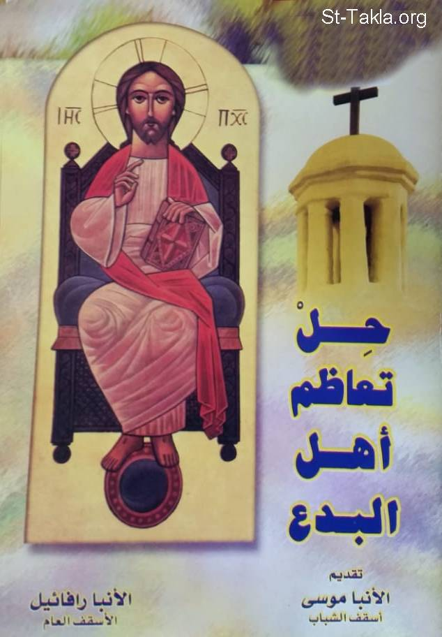

# حل تعاظم أهل البدع

**المؤلف / Author:** الأنبا رافائيل الأسقف العام لكنائس وسط القاهرة
**المصدر / Source:** [st-takla.org](https://st-takla.org/books/anba-raphael/vanity-of-heretics/index.html)
**الموضوعات / Topics:** —

📘 **[Download EPUB / تحميل الكتاب](vanity-of-heretics.epub)**

## نبذة

نشكر نيافة الحبر الجليل الأنبا رافائيل الأسقف العام لكنائس وسط القاهرة على السماح لنا في موقع الأنبا تكلا هيمانوت بوضع هذا الكتاب هنا.

## الفصول / Chapters (18)

1. [تقديم](chapters/01-introduction/)
2. [مواجهة أم مُهادنة](chapters/02-facing-vs-adulation/)
3. [ولينقضِ افتراق فساد البدع](chapters/03-revoked/)
4. [الهرطقات تعليم شيطاني](chapters/04-devil-teachings/)
5. [الهراطقة يحكمون على أنفسهم](chapters/05-judging-themselves/)
6. [لا بُد أن تأتي العثرات](chapters/06-stumbles/)
7. [امتحنوا الأرواح](chapters/07-test-the-spirits/)
8. [مواجهة الهراطقة أمر كتابي](chapters/08-biblical-command/)
9. [الآباء الرُسل في مواجهة الهراطقة](chapters/09-apostles/)
10. [الشكوك وفاعلوها أبطلهم](chapters/10-doubts/)
11. [خطأ وجود منهجين (علنًا وسرًا)](chapters/11-two-faced/)
12. [خطأ المنهج الانعزالي](chapters/12-isolation-is-wrong/)
13. [خطأ القائد الأوحد وإدعاء النبوة](chapters/13-anti-christ/)
14. [بث روح الإحباط والفشل](chapters/14-frustration-spirit/)
15. [الغيبية والخرافات](chapters/15-metaphysical/)
16. [خطورة الروحانية الانفعالية](chapters/16-spiritual-excitement/)
17. [التكلم بالألسنة ورسائل الروح القدس](chapters/17-tongues/)
18. [نزول يعقوب وأسرته إلى مصر](chapters/18-church/)

---
*هذا الكتاب مجاني للنشر والتوزيع لخلاص كل نفس. This book is free to share and distribute for the salvation of every soul.*
