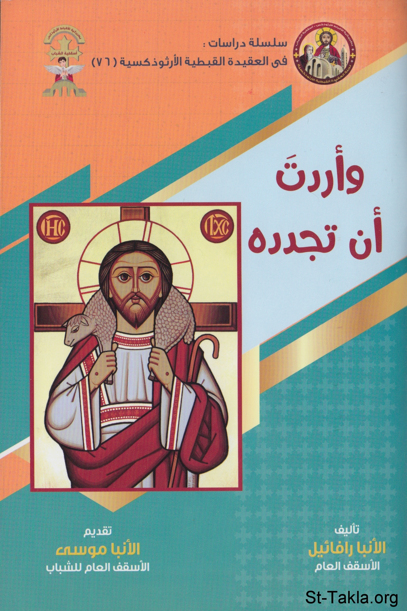

# وأردت أن تجدده

**المؤلف / Author:** الأنبا رافائيل الأسقف العام لكنائس وسط القاهرة
**المصدر / Source:** [st-takla.org](https://st-takla.org/books/anba-raphael/you-desired-to-renew-him/index.html)
**الموضوعات / Topics:** —

📘 **[Download EPUB / تحميل الكتاب](you-desired-to-renew-him.epub)**

## نبذة

نشكر نيافة الحبر الجليل الأنبا رافائيل الأسقف العام لكنائس وسط القاهرة على السماح لنا في موقع الأنبا تكلا هيمانوت بوضع هذا الكتاب هنا.

## الفصول / Chapters (24)

1. [تقديم](chapters/01-foreword/)
2. [مقدمة](chapters/02-introduction/)
3. [تمهيد](chapters/03-preface/)
4. [تفسير ما عمله المسيح](chapters/04-christ/)
5. [شروحات الآباء](chapters/05-patristic/)
6. [من هو الإنسان؟](chapters/06-man/)
7. [أوجه ما عمله المسيح معنا وفينا](chapters/07-christ-work/)
8. [مفاعيل التجسد والفداء](chapters/08-incarnation-redemption/)
9. [شفاء الطبيعة البشرية](chapters/09-human-nature/)
10. [الموت نيابة عن البشر](chapters/10-death/)
11. [هزيمة الموت](chapters/11-death-defeat/)
12. [تسديد الديْن الذي كان علينا](chapters/12-debt/)
13. [تحمل العقوبة الإلهية عوضًا عن البشر](chapters/13-punishment/)
14. [صار المسيح هو الوسيط لدى الآب وشفيع البشرية](chapters/14-intercession/)
15. [المسيح بكر البشر](chapters/15-jesus/)
16. [استعادة الصورة الإلهية في الإنسان](chapters/16-human-image/)
17. [استعادة التبني لله الآب](chapters/17-sonship/)
18. [أعطانا أن نكون شركاء الطبيعة الإلهية](chapters/18-partakers-of-the-divine-nature/)
19. [علمنا عن الآب فهو المسيح المعلم](chapters/19-christ-teacher/)
20. [إعلان محبة الله للبشر](chapters/20-gods-love/)
21. [الخلاصة](chapters/21-summary/)
22. [رفض الهرطقات والمبالغات المتطرفة](chapters/22-heresies/)
23. [دعوة للتصالح](chapters/23-reconciliation/)
24. [خاتمة: مبادئ لفهم عمل المسيح](chapters/24-epilogue/)

---
*هذا الكتاب مجاني للنشر والتوزيع لخلاص كل نفس. This book is free to share and distribute for the salvation of every soul.*
