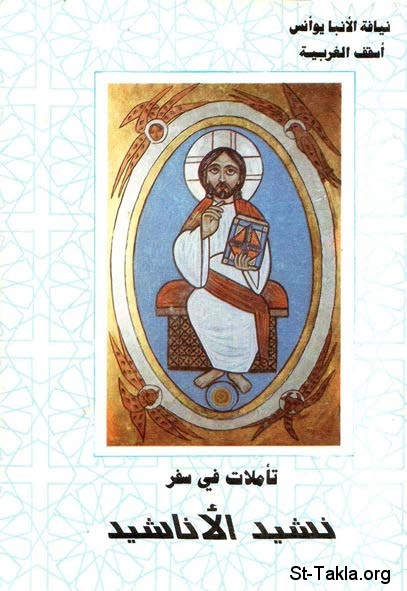

# تأملات في سفر نشيد الأنشاد

**المؤلف / Author:** الأنبا يوأنس أسقف الغربية
**المصدر / Source:** [st-takla.org](https://st-takla.org/Full-Free-Coptic-Books/FreeCopticBooks-010-Late-Bishop-Youannes/001-Nashid-El-Anshad/SongofSongs-000-index.html)
**الموضوعات / Topics:** —

📘 **[Download EPUB / تحميل الكتاب](nashid-el-anshad.epub)**

## نبذة

نشكر الأستاذ جرجس صالح (ابن شقيقة الأنبا يوأنس أسقف الغربية ) على السماح لنا في موقع الأنبا تكلا هيمانوت بوضع هذا الكتاب هنا.

## الفصول / Chapters (109)

1. [قصة هذا الكتاب](chapters/01-preface/)
2. [عنوان السفر وكاتبه](chapters/02-SongofSongs-001-Intro/)
3. [العلامة أوريجينوس وهذا السفر](chapters/03-SongofSongs-002-Intro-Origin/)
4. [ملخص لسفر نشيد الأناشيد](chapters/04-SongofSongs-003-Intro-Summary/)
5. [نشيد الأناشيد الذي لسليمان](chapters/05-SongofSongs-004-CH1-Song/)
6. [ليقبلني بقبلات فمه](chapters/06-SongofSongs-005-CH1-Kisses/)
7. [لأن حبك أطيب من الخمر](chapters/07-SongofSongs-006-CH1-Love/)
8. [لرائحة أدهانك الطيبة](chapters/08-SongofSongs-007-CH1-Smell/)
9. [لأن اسمك دهن مهراق](chapters/09-SongofSongs-008-CH1-Name/)
10. [لذلك أحبتك العذارى](chapters/10-SongofSongs-009-CH1-Virgins/)
11. [اجذبني وراءك فنجري](chapters/11-SongofSongs-010-CH1-Pull-Me/)
12. [أدخلني الملك إلى حجاله. نبتهج ونفرح بك. نذكر حبك أكثر من الخمر. بالحق يحبونك](chapters/12-SongofSongs-011-CH1-The-King/)
13. [أنا سوداء وجميلة يا بنات أورشليم، كخيام قيدار، كشقق سليمان](chapters/13-SongofSongs-012-CH1-Black-Beauty/)
14. [لا تنظرن إليَّ لكوني سوداء، لأن الشمس قد لوَّحتني](chapters/14-SongofSongs-013-CH1-Sun/)
15. [بنو أمي غضبوا عليَّ. جعلوني ناطورة الكروم](chapters/15-SongofSongs-014-CH1-Brothers/)
16. [أخبرني يا مَنْ تحبه نفسي](chapters/16-SongofSongs-015-CH1-Tell-Me/)
17. [يا من تحبه نفسي](chapters/17-SongofSongs-016-CH1-Beloved/)
18. [أين ترعى؟ أين تربض عند الظهيرة](chapters/18-SongofSongs-017-CH1-Where/)
19. [إن لم تعرفي أيتها الجميلة بين النساء](chapters/19-SongofSongs-018-CH1-Know/)
20. [فاخرجي على آثار العنم](chapters/20-SongofSongs-019-CH1-Traces/)
21. [وارعي جداءك](chapters/21-SongofSongs-020-CH1-Grazing/)
22. [عند مساكن الرعاة](chapters/22-SongofSongs-021-CH1-Homes/)
23. [لقد شبَّهتك يا حبيبتي بفرس في مركبات فرعون](chapters/23-SongofSongs-022-CH1-Horses/)
24. [ما أجمل خديك بسموط وعنقدك بقلائد](chapters/24-SongofSongs-023-CH1-Cheeks/)
25. [مادام الملك في مجلسه، أفاح نارديني رائحته](chapters/25-SongofSongs-024-CH1-Seat/)
26. [صرة المر، حبيبي لي، بين ثديي يبيت](chapters/26-SongofSongs-025-CH1-Pack/)
27. [طاقة فاغية. حبيبي لي في كروم عين جدي](chapters/27-SongofSongs-026-CH1-Grapes/)
28. [ها أنتِ جميلة. عيناكِ حمامتان](chapters/28-SongofSongs-027-CH1-Eyes/)
29. [ها أنت جميل يا حبيبي وحلو](chapters/29-SongofSongs-028-CH1-Beautiful/)
30. [سريرنا أخضر](chapters/30-SongofSongs-029-CH1-Bed/)
31. [جوائز بيتنا أرز وروافدنا سرو](chapters/31-SongofSongs-030-CH1-Our-House/)
32. [أنا نرجس شارون، سوسنة الأودية](chapters/32-SongofSongs-031-CH2-Sharon/)
33. [كالسوسنة بين الشوك، كذلك حبيبي بين البنات](chapters/33-SongofSongs-032-CH2-Thorns/)
34. [كالتفاح بين شجر الوعر، كذلك حبيبي بين البنين](chapters/34-SongofSongs-033-CH2-Apple/)
35. [تحت ظله اشتهيت أن أجلس](chapters/35-SongofSongs-034-CH2-Shades/)
36. [ثمرته حلوة لحلقي](chapters/36-SongofSongs-035-CH2-Fruits/)
37. [علمه فوقي محبة. فإني مريضة حبًا](chapters/37-SongofSongs-036-CH2-Wine/)
38. [شماله تحت رأسي، و يمينه تعانقني](chapters/38-SongofSongs-037-CH2-Head/)
39. [ألا تيقظن ولا تنبهن الحبيب حتى يشاء](chapters/39-SongofSongs-038-CH2-Sleep/)
40. [صوت حبيبي](chapters/40-SongofSongs-039-CH2-Voice/)
41. [هوذا آت طافرًا على الجبال](chapters/41-SongofSongs-040-CH2-Mountains/)
42. [هوذا واقف وراء حائطنا يتطلع من الكوى](chapters/42-SongofSongs-041-CH2-Window/)
43. [قومي يا حبيبتي يا جميلتي وتعالي. لأن الشتاء قد مضى والمطر مرّ وزال](chapters/43-SongofSongs-042-CH2-Come/)
44. [صوت اليمامة سُمِع في أرضنا](chapters/44-SongofSongs-043-CH2-Dove/)
45. [يا حمامتي](chapters/45-SongofSongs-044-CH2-Pigeon/)
46. [في محاجئ الصخر، في ستر المعاقل](chapters/46-SongofSongs-045-CH2-Rocks/)
47. [أريني وجهك. أسمعيني صوتك. لأن صوتك لطيف ووجهك جميل](chapters/47-SongofSongs-046-CH2-Face/)
48. [خذوا لنا الثعالب الصغار المفسدة الكروم](chapters/48-SongofSongs-047-CH2-Foxes/)
49. [حبيبي ليَّ، وأنا له](chapters/49-SongofSongs-048-CH2-Beloved-1/)
50. [الراعي بين السوسن](chapters/50-SongofSongs-049-CH2-Grazer/)
51. [إلى أن يفيح النهار وتنهزم الظلال](chapters/51-SongofSongs-050-CH2-Day/)
52. [طلبت من تحبه نفسي.. بالنسبة للكنيسة](chapters/52-SongofSongs-051-CH3-Asked-Church/)
53. [طلبت من تحبه نفسي.. بالنسبة للنفس البشرية](chapters/53-SongofSongs-052-CH3-Asked-Soul/)
54. [من هذه الطالعة من البرية](chapters/54-SongofSongs-053-CH3-Who/)
55. [كأعمدة من دخان](chapters/55-SongofSongs-054-CH3-Smoke/)
56. [معطرة بالمر واللبان وبكل أذرة التاجر](chapters/56-SongofSongs-055-CH3-Scented/)
57. [هوذا تخت سليمان حوله ستون جبارًا](chapters/57-SongofSongs-056-CH3-Solomon/)
58. [اخرجن يا بنات صهيون وانظرن الملك سليمان بالتاج](chapters/58-SongofSongs-057-CH4-Girls/)
59. [ها أنتِ جميلة يا حبيبتي](chapters/59-SongofSongs-058-CH4-Beauty/)
60. [عيناكِ حمامتان من تحت نقابك](chapters/60-SongofSongs-059-CH4-Veil/)
61. [شعرك كقطيع معز رابض على جبل جلعاد](chapters/61-SongofSongs-060-CH4-Hair/)
62. [كل واحدة مُتْئِم، وليس فيهن عقيم](chapters/62-SongofSongs-061-CH4-Teeth/)
63. [شفتاك كسلكة من القرمز](chapters/63-SongofSongs-062-CH4-Lips/)
64. [خدك كفلقة رمانة تحت نقابك](chapters/64-SongofSongs-063-CH4-Cheeks/)
65. [عنقك كبرج داود المبني للأسلحة](chapters/65-SongofSongs-064-CH4-Neck/)
66. [ثدياك كخشفتي ظبية، توأمين يرعيان بين السوسن](chapters/66-SongofSongs-065-CH4-Bosom/)
67. [إلى أن يفيح النهار وتنهزم ظلال الليل](chapters/67-SongofSongs-066-CH4-Day/)
68. [كلك جميل يا حبيبتي، ليس فيكِ عيبة](chapters/68-SongofSongs-067-CH4-All/)
69. [هلمي معي من لبنان يا عروس](chapters/69-SongofSongs-068-CH4-Lebanon/)
70. [قد سبيت قلبي يا أختي العروس](chapters/70-SongofSongs-069-CH4-Heart/)
71. [ما أحسن حبك يا أختي العروس. كم محبتك أطيب من الخمر](chapters/71-SongofSongs-070-CH4-Best/)
72. [شفتاك يا عروس تقطران شهدًا](chapters/72-SongofSongs-071-CH4-Honey/)
73. [أختي العروس جنة مغلقة](chapters/73-SongofSongs-072-CH4-Sister/)
74. [أختي العروس عين مقفلة، ينبوع مختوم](chapters/74-SongofSongs-073-CH4-Sealed/)
75. [أغراسك فردوس رمان مع أثمار نفيسة](chapters/75-SongofSongs-074-CH4-Plants/)
76. [ينبوع جنات، بئر مياه حية وسيول من لبنان](chapters/76-SongofSongs-075-CH4-Paradise-1/)
77. [قد دخلت جنتي يا أختي العروس](chapters/77-SongofSongs-076-CH5-Paradise-2/)
78. [أنا نائمة وقلبي مستيقظ. صوت حبيبي قارعًا. افتحي لي](chapters/78-SongofSongs-077-CH5-Sleeping/)
79. [حبيبي مدّ يده من الكوّة، فأنَّت عليه أحشائي](chapters/79-SongofSongs-078-CH5-Window/)
80. [فتحت لحبيبي، لكن حبيبي تحوَّل وعبر](chapters/80-SongofSongs-079-CH5-Opened/)
81. [حبيبي أبيض وأحمر. مُعْلَمٌ بين ربوة](chapters/81-SongofSongs-080-CH5-White-n-Red/)
82. [رأسه ذهب إبريز. قصصه مُسترسلة حالِكة كالغراب](chapters/82-SongofSongs-081-CH5-Head/)
83. [عيناه كالحمام على مجاري المياه](chapters/83-SongofSongs-082-CH5-Eyes/)
84. [خدّاه كخميلة الطيب، وأتلام رياحين ذكية](chapters/84-SongofSongs-083-CH5-Cheeks/)
85. [يداه حلقتان من ذهب، مرصَّعتان بالزبرجد](chapters/85-SongofSongs-084-CH5-Hands/)
86. [ساقاه عمودا رخام، مؤسَّستان على قاعدتين من إبريز](chapters/86-SongofSongs-085-CH5-Legs/)
87. [حلقه حلاوة، وكلّه مشتهيات. هذا حبيبي](chapters/87-SongofSongs-086-CH5-CH5-Gorge/)
88. [أين ذهب حبيبك أيتها الجميلة بين النساء](chapters/88-SongofSongs-087-CH6-Where/)
89. [أنتِ جميلة يا حبيبتي كتِرصة. حسنة كأورشليم](chapters/89-SongofSongs-088-CH6-Army/)
90. [شعرك كقطيع المعز الرابض في جلعاد](chapters/90-SongofSongs-089-CH6-Hair/)
91. [ستون ملكة، وثمانون سرية وعذارى بلا عدد](chapters/91-SongofSongs-090-CH6-Queens/)
92. [من هي المشرقة مثل الصباح، جميلة كالقمر، طاهرة كالشمس؟ مُرهبة كجيش بألوية](chapters/92-SongofSongs-091-CH6-Moon/)
93. [ارجعي أرجعي يا شولميث](chapters/93-SongofSongs-092-CH6-Down/)
94. [ما أجمل رجليك بالنعلين يا بنات الكريم](chapters/94-SongofSongs-093-CH7-Feet/)
95. [سرتك كأس مدوَّرة لا يعوزها شراب ممزوج](chapters/95-SongofSongs-094-CH7-Navel/)
96. [ثدياك كخشفتين توأمي ظبية. عنقك كبرج من عاج](chapters/96-SongofSongs-095-CH7-Bosom/)
97. [أنفك كبرج لبنان الناظر تجاه دمشق](chapters/97-SongofSongs-096-CH7-Nose/)
98. [رأسك عليك مثل الكرمل، وشعر رأسك كأرجوان](chapters/98-SongofSongs-097-CH7-Head/)
99. [ما أجملك وما أحلاك أيتها الحبيبة باللذات](chapters/99-SongofSongs-098-CH7-Best/)
100. [أنا لحبيبي وإليَّ اشتياقه](chapters/100-SongofSongs-099-CH7-For-Him/)
101. [تعالَ يا حبيبي لنخرج إلى الحقل](chapters/101-SongofSongs-100-CH7-Come/)
102. [اللفاح يفوح رائحة، وعند أبوابنا كل النفائس من جديدة وقديمة](chapters/102-SongofSongs-101-CH7-Scent/)
103. [ليتك كأخ لي، الرّاضِع ثديي أمي](chapters/103-SongofSongs-102-CH8-Brother/)
104. [شماله تحت رأسي، ويمينه تعانقني](chapters/104-SongofSongs-103-CH8-His-Left/)
105. [من هذه الطالعة من البرية مستندة على حبيبها](chapters/105-SongofSongs-104-CH8-Who/)
106. [تحت شجر التفاح شوّقتُك. هناك خَطَبَتْ لك أمُّك](chapters/106-SongofSongs-105-CH8-Apple-Trees/)
107. [اجعلني كخاتم على قلبك. لأن المحبة قوية كالموت](chapters/107-SongofSongs-106-CH8-Ring/)
108. [أنا سور وثدياي كبرجين](chapters/108-SongofSongs-107-CH8-Sister/)
109. [كان لسليمان كرم في بعل هامون](chapters/109-SongofSongs-108-CH8-Garden/)

---
*هذا الكتاب مجاني للنشر والتوزيع لخلاص كل نفس. This book is free to share and distribute for the salvation of every soul.*
