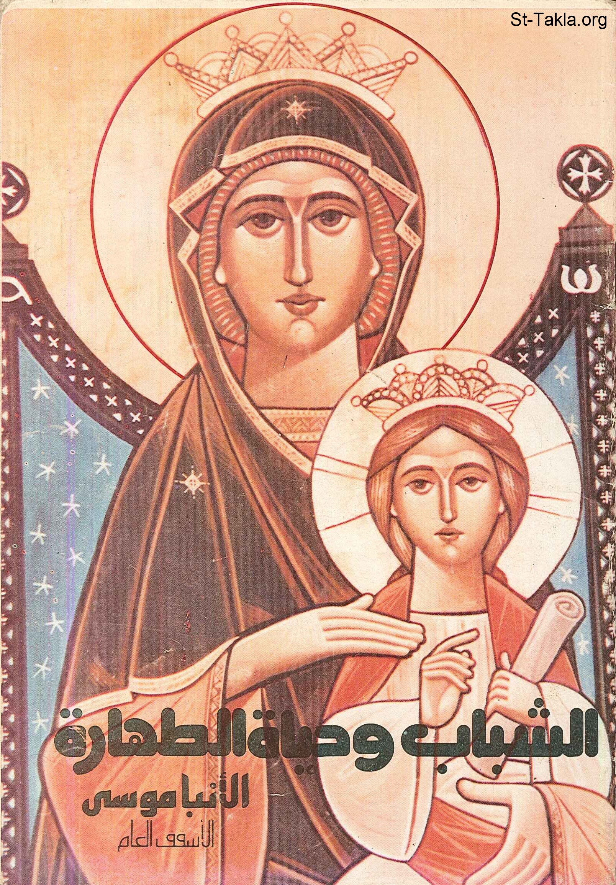

# الشباب وحياة الطهارة

**المؤلف / Author:** الأنبا موسى أسقف الشباب
**المصدر / Source:** [st-takla.org](https://st-takla.org/Full-Free-Coptic-Books/FreeCopticBooks-009-Bishop-Moussa/002-Al-Shabab-Wa-Hayat-Al-Tahara/Youth-n-Purity-00-index.html)
**الموضوعات / Topics:** —

📘 **[Download EPUB / تحميل الكتاب](al-shabab-wa-hayat-al-tahara.epub)**

## نبذة

نشكر أسقفية الشباب على السماح لنا في موقع الأنبا تكلا هيمانوت بوضع هذا الكتاب هنا

## الفصول / Chapters (24)

1. [الشباب وحياة الطهارة](chapters/01-Youth-n-Purity-01-Intro/)
2. [لماذا الجنس؟ ومتى ينحرف؟](chapters/02-Youth-n-Purity-02-Why-El-Gens/)
3. [لماذا خلق الله الجنس؟](chapters/03-Youth-n-Purity-03-Why-God-Created-Sex/)
4. [لماذا ينحرف الجنس؟](chapters/04-Youth-n-Purity-04-Why-Sex-Deviates/)
5. [الذاتية من أسباب انحراف الجنس](chapters/05-Youth-n-Purity-05-Deviation-1-Al-Thateya/)
6. [المادية من أسباب انحراف الجنس](chapters/06-Youth-n-Purity-06-Deviation-2-Al-Madeya/)
7. [الفراغ من أسباب انحراف الجنس](chapters/07-Youth-n-Purity-07-Deviation-3-Al-Faragh/)
8. [التوتر من أسباب إنحراف الجنس](chapters/08-Youth-n-Purity-08-Deviation-4-Al-Tawator/)
9. [ضمانات حياة الطهارة](chapters/09-Youth-n-Purity-09-Guarantees/)
10. [الحقائق العظمى حول الطهارة](chapters/10-Youth-n-Purity-10-Facts/)
11. [الضمانات الأكيدة للطهارة](chapters/11-Youth-n-Purity-11-Sure-Guarantees/)
12. [عمل النعمة](chapters/12-Youth-n-Purity-12-Guarantees-1-3amal-Al-Ne3ma/)
13. [روح الرجاء](chapters/13-Youth-n-Purity-13-Guarantees-2-Roo7-Al-Raga2/)
14. [الحياة المليئة](chapters/14-Youth-n-Purity-14-Guarantees-3-Al-Haya-Al-Malee2a/)
15. [الصفاء النفسي](chapters/15-Youth-n-Purity-15-Guarantees-4-A-Safa2-Al-Nafsy/)
16. [الحياة الأمينة](chapters/16-Youth-n-Purity-16-Guarantees-5-Al-Haya-Al-Ameena/)
17. [اختيار شريك الحياة](chapters/17-Youth-n-Purity-17-Choosing-Life-Partner/)
18. [توقيت أختيار شريك الحياة](chapters/18-Youth-n-Purity-18-Choosing-1-When/)
19. [سمات الاختلاط السليم](chapters/19-Youth-n-Purity-19-Choosing-2-Mixing/)
20. [أسلوب أختيار شريك الحياة](chapters/20-Youth-n-Purity-20-Choosing-3-How/)
21. [أهداف الزواج المسيحي](chapters/21-Youth-n-Purity-21-Choosing-4-Point-of-Marriage/)
22. [مبادئ عامة في أختيار شريكة أو شريك الحياة](chapters/22-Youth-n-Purity-22-Choosing-5-Rules-in-Matrimony/)
23. [استمرار الزواج المسيحي](chapters/23-Youth-n-Purity-23-Choosing-6-Continuity/)
24. [خاتمة كتاب الشباب وحياة الطهارة](chapters/24-Youth-n-Purity-24-Outro/)

---
*هذا الكتاب مجاني للنشر والتوزيع لخلاص كل نفس. This book is free to share and distribute for the salvation of every soul.*
