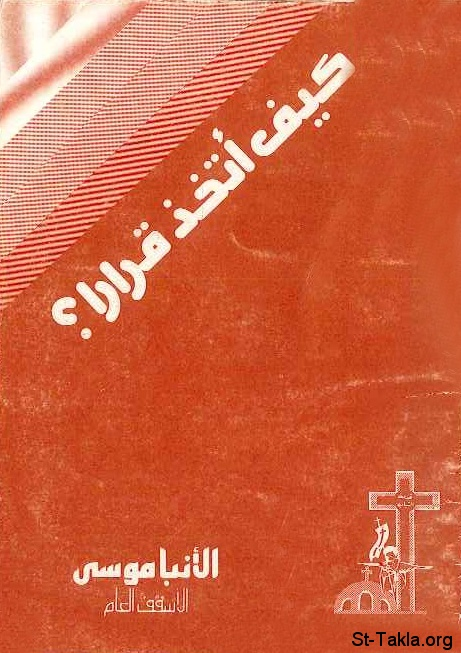

# كيف أتخذ قرارا؟

**المؤلف / Author:** الأنبا موسى أسقف الشباب
**المصدر / Source:** [st-takla.org](https://st-takla.org/Full-Free-Coptic-Books/FreeCopticBooks-009-Bishop-Moussa/001-Kayfa-Atakheth-Kararan/How-to-Take-A-Decision-00-index.html)
**الموضوعات / Topics:** —

📘 **[Download EPUB / تحميل الكتاب](kayfa-atakheth-kararan.epub)**

## نبذة

نشكر أسقفية الشباب على السماح لنا في موقع الأنبا تكلا هيمانوت بوضع هذا الكتاب هنا

## الفصول / Chapters (11)

1. [مقدمة كتاب كيف أتخذ قرارًا؟](chapters/01-How-to-Take-A-Decision-01-Intro/)
2. [أهمية اتخاذ القرار - كتاب كيف أتخذ قرارًا؟](chapters/02-How-to-Take-A-Decision-02-Importance-of-Taking-Decisions/)
3. [سمات الحكمة الإلهية - كتاب كيف أتخذ قرارًا؟](chapters/03-How-to-Take-A-Decision-03-God-s-Wisdom/)
4. [خطورة الحكمة البشرية - كتاب كيف أتخذ قرارًا؟](chapters/04-How-to-Take-A-Decision-04-Man-s-Wisdom/)
5. [القوى الإنسانية المشتركة في اتخاذ القرار - كتاب كيف أتخذ قرارًا؟](chapters/05-How-to-Take-A-Decision-05-Powers-Contributing/)
6. [مثال في اتخاذ قرار اختيار شريكة الحياة - كتاب كيف أتخذ قرارًا؟](chapters/06-How-to-Take-A-Decision-06-Ex-Choosing-Life-Partner/)
7. [يجب أن تكون قوى اتخاذ القرار متناسقة ومترابطة - كتاب كيف أتخذ قرارًا؟](chapters/07-How-to-Take-A-Decision-07-Harmony/)
8. [مظلة الصلاة - كتاب كيف أتخذ قرارًا؟](chapters/08-How-to-Take-A-Decision-08-Prayer/)
9. [ضوابط اتخاذ القرار: الروح القدس، الأب الروحي، الحوار - كتاب كيف أتخذ قرارًا؟](chapters/09-How-to-Take-A-Decision-09-Restrains/)
10. [كيف أميز مشيئة الله؟](chapters/10-How-to-Take-A-Decision-10-God-s-Will/)
11. [إذن كيف أعرف مشيئة الله؟ - كتاب كيف أتخذ قرارًا؟](chapters/11-How-to-Take-A-Decision-11-How-to-See-God-s-Will/)

---
*هذا الكتاب مجاني للنشر والتوزيع لخلاص كل نفس. This book is free to share and distribute for the salvation of every soul.*
