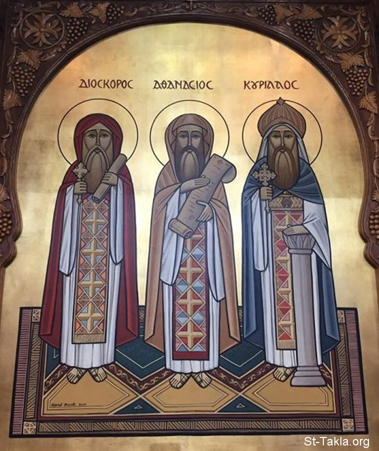

# أقوال القديس أثناسيوس الرسولي 1

**المؤلف / Author:** Church Fathers
**المصدر / Source:** [st-takla.org](https://st-takla.org/Full-Free-Coptic-Books/FreeCopticBooks-015-Church-Fathers-Sayings/001-St-Athanasius/Asanasios-Quotes-000-index-01.html)
**الموضوعات / Topics:** —

📘 **[Download EPUB / تحميل الكتاب](st-athanasius.epub)**

## الفصول / Chapters (32)

1. [أقوال البابا القديس أثناسيوس الرسولي عن صلاح الله في خلق الإنسان - أقوال آباء](chapters/01-Asanasios-Quotes-001-Creation/)
2. [أقوال البابا القديس أثناسيوس الرسولي عن أن الإنسان يجلب على ذاته الموت والفساد - أقوال آباء](chapters/02-Asanasios-Quotes-002-Death-1/)
3. [أقوال البابا القديس أثناسيوس الرسولي عن مشكلة في موت الإنسان وحياته - أقوال آباء](chapters/03-Asanasios-Quotes-003-Death-2/)
4. [أقوال البابا القديس أثناسيوس الرسولي عن أن التوبة لا تصلح ولا تكفي بعد الخطأ - أقوال آباء](chapters/04-Asanasios-Quotes-004-Repentance/)
5. [أقوال البابا القديس أثناسيوس الرسولي عن تجسد الله الكلمة لخلاصنا من الخطية - أقوال آباء](chapters/05-Asanasios-Quotes-005-Incarnation/)
6. [أقوال البابا القديس أثناسيوس الرسولي عن أن الخلاص لم يكن ممكنًا بغير الله - أقوال آباء](chapters/06-Asanasios-Quotes-006-Salvation/)
7. [أقوال البابا القديس أثناسيوس الرسولي عن أن الله نزل إلى مستوانا ليعرفنا بلاهوته - أقوال آباء](chapters/07-Asanasios-Quotes-007-Level/)
8. [أقوال البابا القديس أثناسيوس الرسولي عن: لنفرح بعريسنا الغالي - أقوال آباء](chapters/08-Asanasios-Quotes-008-Happiness/)
9. [أقوال البابا القديس أثناسيوس الرسولي عن: أما يكفي أن يموت موتًا عاديًا؟ هل من ضرورة لعار الصليب؟ - أقوال آباء](chapters/09-Asanasios-Quotes-009-Why-Cross/)
10. [أقوال البابا القديس أثناسيوس الرسولي عن قوة رسم علامة الصليب - أقوال آباء](chapters/10-Asanasios-Quotes-010-Crossing/)
11. [أقوال البابا القديس أثناسيوس الرسولي عن مفهوم الصلب مع المسيح - أقوال آباء](chapters/11-Asanasios-Quotes-011-Crucified-with-God-1/)
12. [أقوال البابا القديس أثناسيوس الرسولي عن: لِنُصْلَب معه عمليًا - أقوال آباء](chapters/12-Asanasios-Quotes-012-Crucified-with-God-2/)
13. [أقوال البابا القديس أثناسيوس الرسولي عن: لنحمل سِمات المصلوب - أقوال آباء](chapters/13-Asanasios-Quotes-013-Crucified-Jesus/)
14. [أقوال البابا القديس أثناسيوس الرسولي عن مفهوم الكنيسة الأولى حول القيامة والفصح - أقوال آباء](chapters/14-Asanasios-Quotes-014-Resurrection-1/)
15. [أقوال البابا القديس أثناسيوس الرسولي عن تأكيد إبطال الأعياد اليهودية - أقوال آباء](chapters/15-Asanasios-Quotes-015-Feasts/)
16. [أقوال البابا القديس أثناسيوس الرسولي عن تعليق الأذهان بالذبيحة والفداء - أقوال آباء](chapters/16-Asanasios-Quotes-016-Sacrifice/)
17. [أقوال البابا القديس أثناسيوس الرسولي عن مفهوم عيد القيامة - أقوال آباء](chapters/17-Asanasios-Quotes-017-Resurrection-2/)
18. [أقوال البابا القديس أثناسيوس الرسولي عن أن يسوع هو العيد الحقيقي - أقوال آباء](chapters/18-Asanasios-Quotes-018-Jesus-is-the-Feast/)
19. [أقوال البابا القديس أثناسيوس الرسولي عن تذكرنا عمل الله معنا بالشكر والتسبيح - أقوال آباء](chapters/19-Asanasios-Quotes-019-Thanking/)
20. [أقوال البابا القديس أثناسيوس الرسولي عن أنه بالعيد نتوق إلى العيد السماوي - أقوال آباء](chapters/20-Asanasios-Quotes-020-Heaven-1/)
21. [أقوال البابا القديس أثناسيوس الرسولي عن أن عيد قيامة الرب لأجل تشجيعنا - أقوال آباء](chapters/21-Asanasios-Quotes-021-Resurrection-3/)
22. [أقوال البابا القديس أثناسيوس الرسولي عن كيف نُعَيِّد بعيد القيامة المجيد - أقوال آباء](chapters/22-Asanasios-Quotes-022-Resurrection-How/)
23. [أقوال البابا القديس أثناسيوس الرسولي عن ماذا نرُش في احتفالنا بعيد القيامة - أقوال آباء](chapters/23-Asanasios-Quotes-023-Resurrection-Spraying/)
24. [أقوال البابا القديس أثناسيوس الرسولي عن مَنْ الذي يُعَيِّد بعيد القيامة؟ - أقوال آباء](chapters/24-Asanasios-Quotes-024-Resurrection-Who/)
25. [أقوال البابا القديس أثناسيوس الرسولي عن مَنْ الذي يقودنا إلى الجماعة السماوية - أقوال آباء](chapters/25-Asanasios-Quotes-025-Heaven-2/)
26. [أقوال البابا القديس أثناسيوس الرسولي عن: جاءنا العيد المقدس الذي للقيامة - أقوال آباء](chapters/26-Asanasios-Quotes-026-Resurrection-4/)
27. [أقوال البابا القديس أثناسيوس الرسولي عن: القيامة وحياة الفرح - أقوال آباء](chapters/27-Asanasios-Quotes-027-Happiness/)
28. [أقوال البابا القديس أثناسيوس الرسولي عن علامات الملكوت - أقوال آباء](chapters/28-Asanasios-Quotes-028-Heaven-3/)
29. [أقوال البابا القديس أثناسيوس الرسولي عن: لماذا اختص الروح القدس بالشركة؟ - أقوال آباء](chapters/29-Asanasios-Quotes-029-Holy-Spirit/)
30. [أقوال البابا القديس أثناسيوس الرسولي عن رشم علامة الصليب - أقوال آباء](chapters/30-Asanasios-Quotes-030-St-Anthony/)
31. [أقوال البابا القديس أثناسيوس الرسولي عن خصائص الحب و حبنا لأخوتنا الفقراء - أقوال آباء](chapters/31-Asanasios-Quotes-031-Poor/)
32. [أقوال البابا القديس أثناسيوس الرسولي عن علاج الغضب - أقوال آباء](chapters/32-Asanasios-Quotes-032-Anger/)

---
*هذا الكتاب مجاني للنشر والتوزيع لخلاص كل نفس. This book is free to share and distribute for the salvation of every soul.*
