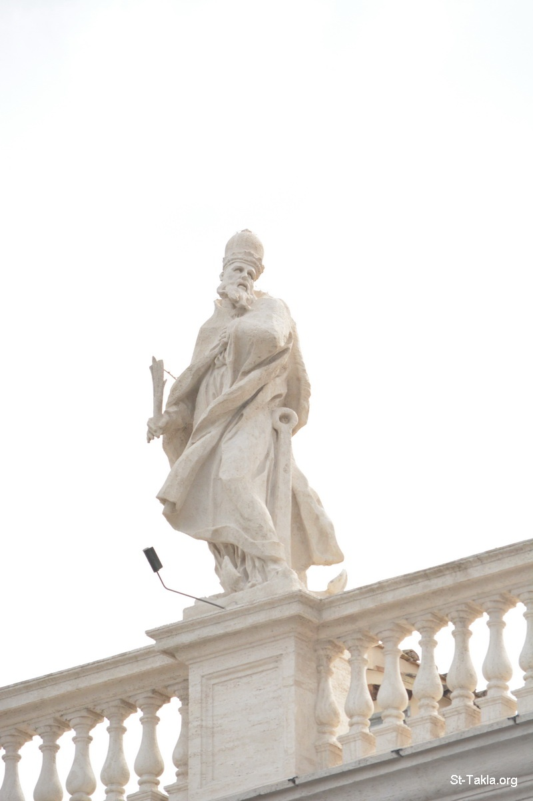

# أقوال القديس كليمنضس الروماني

**المؤلف / Author:** Church Fathers
**المصدر / Source:** [st-takla.org](https://st-takla.org/Full-Free-Coptic-Books/FreeCopticBooks-015-Church-Fathers-Sayings/007-St-Clement-of-Rome/Eklymondos-El-Romany-Quotes-000-index-01.html)
**الموضوعات / Topics:** —

📘 **[Download EPUB / تحميل الكتاب](st-clement-of-rome.epub)**

## الفصول / Chapters (1)

1. [أقوال القديس اكليمنضس الروماني عن حب جماعة المؤمنين الذين هم جسد المسيح - أقوال آباء](chapters/01-Eklymondos-El-Romany-Quotes-001-Love/)

---
*هذا الكتاب مجاني للنشر والتوزيع لخلاص كل نفس. This book is free to share and distribute for the salvation of every soul.*
