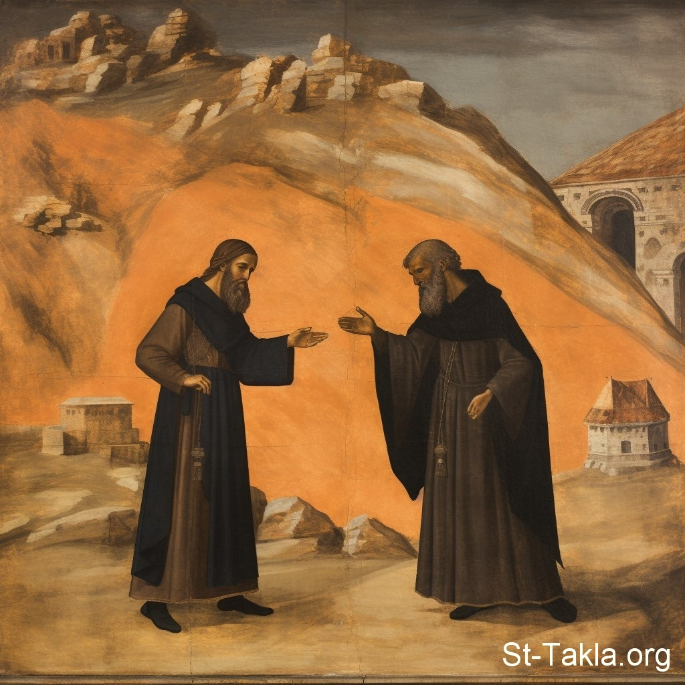

# أقوال القديس أنبا يوسف

**المؤلف / Author:** Church Fathers
**المصدر / Source:** [st-takla.org](https://st-takla.org/Full-Free-Coptic-Books/FreeCopticBooks-015-Church-Fathers-Sayings/009-St-Joseph/Youssef-Quotes-000-index-01.html)
**الموضوعات / Topics:** —

📘 **[Download EPUB / تحميل الكتاب](st-joseph.epub)**

## الفصول / Chapters (2)

1. [أقوال القديس الأب يوسف عن خصائص الحب](chapters/01-Youssef-Quotes-001-Love/)
2. [أقوال القديس الأب يوسف عن الصداقة الناجحة - أقوال آباء](chapters/02-Youssef-Quotes-002-Friendship/)

---
*هذا الكتاب مجاني للنشر والتوزيع لخلاص كل نفس. This book is free to share and distribute for the salvation of every soul.*
